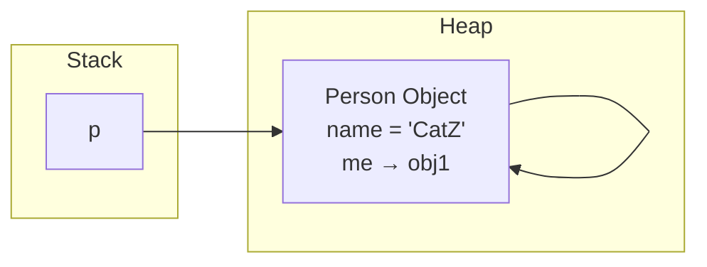
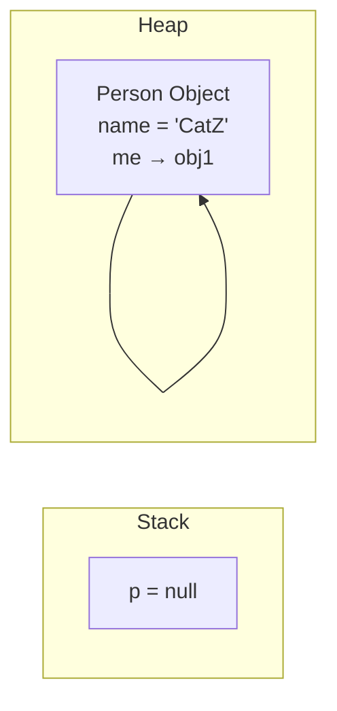

# Bài 2.8 – Object Reference & Garbage Collection

## 1. Tóm tắt ý tưởng chính của lời giải

Bài toán xây dựng lớp `Person` gồm:

- `name` (String)
- `me` (Person) – tham chiếu đến một đối tượng Person khác

Mục tiêu:

- Hiểu cơ chế tham chiếu trong Java
- Hiểu self-reference (tham chiếu vòng)
- Hiểu cách Garbage Collection hoạt động

---

### Phân tích đoạn code chính

```java
Person p = new Person("CatZ");
p.setMe(p);
System.err.println(p.getMe().getName());
p = null;
```

---

## 2. Phân tích bộ nhớ & Garbage Collection

### Có bao nhiêu đối tượng được tạo?

Chỉ có **1 đối tượng Person** trong Heap.

`me` không tạo object mới — chỉ trỏ đến object đã tồn tại.

---

## Trạng thái bộ nhớ

### 🔹 Trước khi `p = null`



Giải thích:

- Biến `p` trên Stack trỏ đến object trong Heap.
- Thuộc tính `me` bên trong object trỏ lại chính nó (self-reference).

---

### 🔹 Sau khi `p = null`



Giải thích:

- Không còn biến nào trên Stack trỏ đến object.
- Object chỉ tự tham chiếu chính nó.
- Object trở thành **unreachable từ GC Root**.

---

## Garbage Collection hoạt động như thế nào?

Java Garbage Collector:

- Không dựa vào số lượng tham chiếu nội bộ.
- Dựa vào khả năng truy cập từ GC Root (Stack, static variables...).

Trong trường hợp này:

- Object vẫn tự tham chiếu.
- Nhưng không còn reachable từ Stack.
- Vì vậy nó đủ điều kiện bị thu gom.

Lưu ý:
- GC không xóa ngay lập tức.
- GC chạy khi JVM thấy cần giải phóng bộ nhớ.

---

## Object có thể truy cập lại không?

Không.

Sau khi:

```java
p = null;
```

- Không còn cách nào truy cập object đó.
- Object trở thành "eligible for GC".

---

## 3. Ý nghĩa bài học

Bài này giúp hiểu rõ:

- Java truyền tham chiếu như thế nào
- Self-reference không ngăn GC
- GC dựa trên reachability, không dựa trên vòng tham chiếu
- Phân biệt Stack và Heap

Đây là kiến thức nền tảng khi:

- Thiết kế cấu trúc dữ liệu có vòng
- Debug memory leak
- Làm việc với hệ thống lớn

---

## 4. Cách chạy chương trình

1. **Cấp quyền thực thi cho script:**
   ```bash
   chmod +x run.sh
   ```

2. **Chạy chương trình:**
   ```bash
   ./run.sh
   ```
