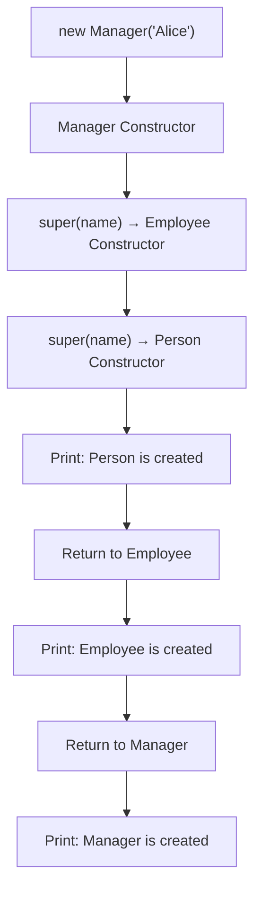

# Bài 1 – The Constructor Chain

## 1. Tóm tắt ý tưởng chính của lời giải

Bài tập minh họa **constructor chain (chuỗi constructor)** trong Java khi sử dụng kế thừa (inheritance).

Hệ thống gồm 3 lớp:

```
Person
   ↑
Employee
   ↑
Manager
```

- `Employee` kế thừa `Person`
- `Manager` kế thừa `Employee`

Khi tạo một đối tượng `Manager`, Java sẽ gọi constructor theo thứ tự từ lớp cha đến lớp con.

---

## Thiết kế các lớp

### Lớp Person

```java
class Person {
    String name, dob;

    public Person(String name) {
        this.name = name;
        System.out.println("1. Person is created");
    }
}
```

Thuộc tính:
- `name`
- `dob`

Constructor nhận tham số `name`.

---

### Lớp Employee

```java
class Employee extends Person {
    double salary;

    public Employee(String name) {
        super(name);
        System.out.println("2. Employee is created");
    }
}
```

- Kế thừa từ `Person`
- Constructor gọi `super(name)` để gọi constructor của lớp cha.

---

### Lớp Manager

```java
class Manager extends Employee {
    String department;

    public Manager(String name) {
        super(name);
        System.out.println("3. Manager is created");
    }
}
```

- Kế thừa từ `Employee`
- Constructor gọi `super(name)` để tiếp tục chuỗi constructor.

---

## Hàm main

```java
Manager m = new Manager("Alice");
```

Chỉ một dòng lệnh tạo đối tượng `Manager`.

---

## Kết quả khi chạy chương trình

Output:

```
1. Person is created
2. Employee is created
3. Manager is created
```

Điều này xảy ra vì:

1. Java gọi constructor lớp cha trước.
2. Sau khi constructor cha hoàn thành, constructor lớp con mới chạy.

---

## Cơ chế Constructor Chain



Thứ tự thực tế:

```
Person → Employee → Manager
```

---

## Phần nâng cao – Vì sao phải dùng super(...)

Ban đầu đề bài yêu cầu:

```
Manager m = new Manager();
```

Nếu lớp `Person` **không có constructor mặc định**, ví dụ:

```java
public Person(String name)
```

thì Java sẽ **không thể tự động gọi `super()`**.

Khi đó lớp con sẽ báo lỗi:

```
Constructor Person() is undefined
```

---

## Cách sửa lỗi

Ta phải gọi constructor của lớp cha bằng `super(...)`.

Ví dụ:

```java
public Employee(String name) {
    super(name);
}
```

và

```java
public Manager(String name) {
    super(name);
}
```

`super(name)` sẽ gọi constructor của lớp cha.

---

## Ý nghĩa bài học

Bài này giúp hiểu rõ:

- Cơ chế kế thừa trong Java
- Constructor chain
- Cách hoạt động của `super(...)`
- Thứ tự khởi tạo object trong hệ thống kế thừa

Đây là kiến thức quan trọng khi thiết kế hệ thống OOP nhiều tầng.

---

## 2. Cách chạy chương trình

1. **Cấp quyền thực thi cho script:**
   ```bash
   chmod +x run.sh
   ```

2. **Chạy chương trình:**
   ```bash
   ./run.sh
   ```