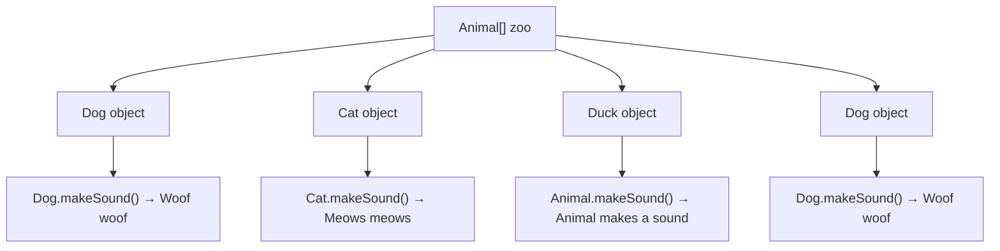

# Bài 2 – The Polymorphic Zoo

## 1. Tóm tắt ý tưởng chính của lời giải

Bài tập minh họa **tính đa hình (Polymorphism)** trong Java thông qua hệ thống các lớp động vật.

Hệ thống gồm các lớp:

```
Animal
 ├── Dog
 ├── Cat
 └── Duck
```

- `Dog` và `Cat` **override** phương thức `makeSound()`.
- `Duck` **không override**, nên sử dụng phương thức của lớp cha.

---

## Thiết kế các lớp

### Lớp Animal

```java
class Animal {
    public void makeSound() {
        System.out.println("Animal makes a sound");
    }
}
```

Đây là lớp cha (superclass).

Phương thức `makeSound()` định nghĩa âm thanh mặc định cho động vật.

---

### Lớp Dog

```java
class Dog extends Animal {
    @Override
    public void makeSound() {
        System.out.println("Woof woof");
    }
}
```

Dog ghi đè phương thức `makeSound()` để tạo âm thanh riêng.

---

### Lớp Cat

```java
class Cat extends Animal {
    @Override
    public void makeSound() {
        System.out.println("Meows meows");
    }
}
```

Cat cũng ghi đè `makeSound()`.

---

### Lớp Duck

```java
class Duck extends Animal {
}
```

Duck **không override** phương thức `makeSound()`.

Do đó Duck sẽ dùng phương thức của lớp `Animal`.

---

## Thực hành trong hàm main

Tạo một mảng động vật:

```java
Animal[] zoo = new Animal[4];
```

Gán các phần tử:

```java
zoo[0] = new Dog();
zoo[1] = new Cat();
zoo[2] = new Duck();
zoo[3] = new Dog();
```

Duyệt mảng bằng vòng lặp:

```java
for (Animal a : zoo) {
    a.makeSound();
}
```

---

## Kết quả chương trình

Output:

```
Woof woof
Meows meows
Animal makes a sound
Woof woof
```

---

## Giải thích vì sao Duck kêu như vậy

`Duck` không override phương thức `makeSound()`.

Do đó khi gọi:

```
zoo[2].makeSound()
```

Java sẽ tìm phương thức theo thứ tự:

1. Tìm trong lớp `Duck`
2. Không thấy → tìm trong lớp cha `Animal`

Vì vậy Duck sử dụng:

```
Animal.makeSound()
```

→ In ra:

```
Animal makes a sound
```

---

## Minh họa cơ chế đa hình



Mặc dù kiểu của mảng là `Animal[]`, nhưng **phương thức được gọi phụ thuộc vào object thực tế**.

Đây chính là **Runtime Polymorphism**.

---

## Ý nghĩa bài học

Bài này minh họa các khái niệm quan trọng của OOP:

- Inheritance (Kế thừa)
- Method Overriding
- Polymorphism
- Dynamic Method Dispatch

Đặc biệt:

Java quyết định gọi phương thức **tại runtime**, dựa trên **kiểu object thực tế**, không phải kiểu biến.

---

## 2. Cách chạy chương trình

1. **Cấp quyền thực thi cho script:**
   ```bash
   chmod +x run.sh
   ```

2. **Chạy chương trình:**
   ```bash
   ./run.sh
   ```