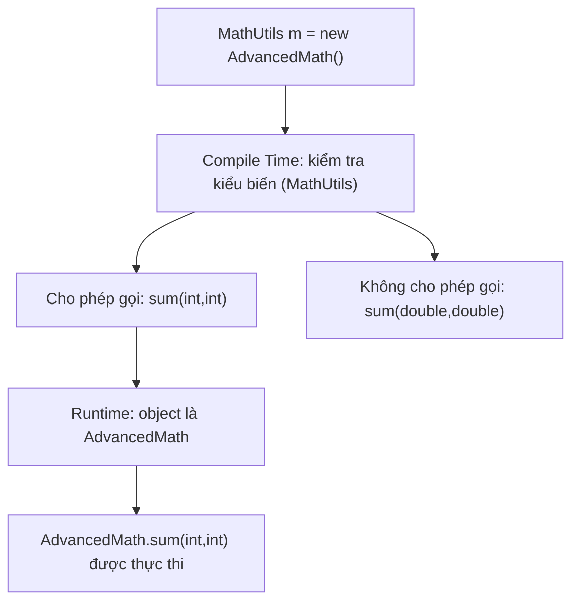

# Bài 3 – The Math Challenge (Overloading vs Overriding)

## 1. Tóm tắt ý tưởng chính của lời giải

Bài tập này minh họa sự khác biệt giữa:

- **Method Overriding** (ghi đè phương thức)
- **Method Overloading** (nạp chồng phương thức)

Thông qua hai lớp:

```
MathUtils
   ↑
AdvancedMath
```

Trong đó:

- `AdvancedMath` kế thừa `MathUtils`
- Ghi đè phương thức `sum(int, int)`
- Nạp chồng thêm phương thức `sum(double, double)`

---

## Thiết kế lớp

### Lớp MathUtils

```java
class MathUtils {

    public int sum(int a, int b) {
        return a + b;
    }
}
```

Phương thức:

```
sum(int, int)
```

Trả về tổng hai số nguyên.

---

### Lớp AdvancedMath

```java
class AdvancedMath extends MathUtils {

    @Override
    public int sum(int a, int b) {
        return a + b + 10;
    }

    public double sum(double a, double b) {
        return (a + b + 10);
    }
}
```

Bao gồm:

1. **Overriding**

```
sum(int, int)
```

Logic thay đổi:

```
a + b + 10
```

2. **Overloading**

```
sum(double, double)
```

Cùng tên phương thức nhưng **khác kiểu tham số**.

---

## Thực hành trong main

```java
MathUtils m = new AdvancedMath();
System.out.println(m.sum(5, 5)); // (A)
```

### Kết quả dòng (A)

Output:

```
20
```

Giải thích:

- Biến `m` có kiểu **MathUtils**
- Nhưng object thực tế là **AdvancedMath**

Java sử dụng **Dynamic Method Dispatch (runtime polymorphism)**.

Do đó phương thức được gọi là:

```
AdvancedMath.sum(int, int)
```

Tính toán:

```
5 + 5 + 10 = 20
```

---

## Câu hỏi (B)

```java
System.out.println(m.sum(5.5, 5.5));
```

### Có lỗi biên dịch không?

**Có.**

Compiler sẽ báo lỗi:

```
cannot find symbol
method sum(double,double)
```

---

## Tại sao lại lỗi?

Biến:

```
MathUtils m
```

Kiểu tham chiếu là **MathUtils**.

Trình biên dịch chỉ kiểm tra các phương thức có trong **MathUtils**.

Trong `MathUtils` chỉ có:

```
sum(int, int)
```

Không có:

```
sum(double, double)
```

Vì vậy compiler không cho phép gọi.

---

## Minh họa cơ chế Overriding vs Overloading



---

## Cách gọi được hàm Overloaded

Có 2 cách:

### Cách 1: đổi kiểu biến

```java
AdvancedMath m = new AdvancedMath();
System.out.println(m.sum(5.5, 5.5));
```

---

### Cách 2: ép kiểu

```java
MathUtils m = new AdvancedMath();
System.out.println(((AdvancedMath)m).sum(5.5, 5.5));
```

---

## Ý nghĩa bài học

Bài này giúp phân biệt rõ:

### Overriding

- Quyết định **runtime**
- Phụ thuộc vào **object thực tế**

### Overloading

- Quyết định **compile time**
- Phụ thuộc vào **kiểu biến**

| Đặc điểm | Overriding | Overloading |
|--------|-------------|-------------|
| Quyết định | Runtime | Compile time |
| Phụ thuộc | Object | Variable type |
| Kế thừa | Bắt buộc | Không bắt buộc |

---

## 2. Cách chạy chương trình

1. **Cấp quyền thực thi cho script:**
   ```bash
   chmod +x run.sh
   ```

2. **Chạy chương trình:**
   ```bash
   ./run.sh
   ```
