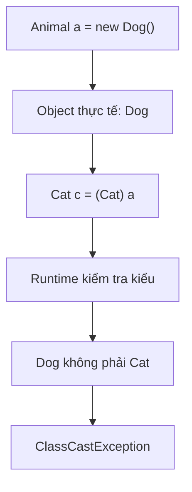

# Bài 4 – Bẫy ép kiểu (Downcasting Trap)

## 1. Tóm tắt ý tưởng chính của lời giải

Bài tập minh họa:

- **Upcasting** (ép kiểu lên) – an toàn
- **Downcasting** (ép kiểu xuống) – nguy hiểm
- Lỗi runtime phổ biến: **ClassCastException**

Thông qua hệ thống kế thừa:

```
Animal
 ├── Dog
 ├── Cat
 └── Duck
```

---

## Bước 1 – Upcasting (An toàn)

```java
Animal a = new Dog();
```

Giải thích:

- `Dog` là lớp con của `Animal`
- Java cho phép gán object Dog vào biến kiểu Animal

Đây gọi là **Upcasting**.

Upcasting **luôn an toàn** vì:

```
Dog IS-A Animal
```

---

## Bước 2 – Downcasting (Nguy hiểm)

Đoạn code trong đề bài:

```java
Cat c = (Cat) a;
```

Biên dịch:

```
javac Main.java
```

**Không có lỗi compile.**

---

## Khi chạy chương trình

```
java Main
```

Sẽ xuất hiện lỗi:

```
Exception in thread "main" java.lang.ClassCastException
```

---

## Tại sao lỗi xảy ra?

Biến:

```
Animal a = new Dog();
```

Object thực tế là **Dog**.

Nhưng ta lại ép kiểu:

```
(Cat) a
```

Java cố gắng biến **Dog thành Cat**.

Điều này **không hợp lệ** vì:

```
Dog ≠ Cat
```

Do đó runtime phát sinh:

```
ClassCastException
```

---

## Cơ chế lỗi Downcasting



---

## Cách sửa lỗi – dùng instanceof

Để tránh lỗi runtime, ta cần kiểm tra kiểu object trước khi ép kiểu.

```java
Animal a = new Dog();

if (a instanceof Cat) {
    Cat c = (Cat) a;
    c.makeSound();
} else {
    System.out.println("Đây không phải là Mèo!");
}
```

---

## Ý nghĩa của instanceof

`instanceof` kiểm tra:

```
Object có thuộc kiểu đó hay không
```

Ví dụ:

```
a instanceof Cat
```

Nếu `a` thực sự là Cat → trả về `true`.

Nếu không → `false`.

---

## Kết quả chương trình sau khi sửa

Output:

```
Đây không phải là Mèo!
```

Chương trình chạy an toàn, không bị exception.

---

## Ý nghĩa bài học

Bài này giúp hiểu rõ:

### Upcasting
- An toàn
- Không cần ép kiểu

```
Animal a = new Dog();
```

---

### Downcasting
- Có thể nguy hiểm
- Có thể gây **ClassCastException**

```
Cat c = (Cat) a;
```

---

### Quy tắc an toàn khi Downcasting

Luôn kiểm tra:

```java
if (obj instanceof ClassName)
```

trước khi ép kiểu.

---

## Kiến thức OOP rút ra

- Inheritance
- Upcasting
- Downcasting
- Runtime type checking
- ClassCastException
- instanceof operator

---

## 2. Cách chạy chương trình

1. **Cấp quyền thực thi cho script:**
   ```bash
   chmod +x run.sh
   ```

2. **Chạy chương trình:**
   ```bash
   ./run.sh
   ```