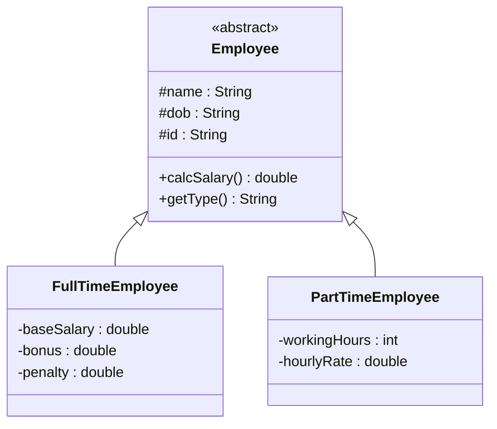

# Bài 5 – Hệ thống tính lương Payroll System

## 1. Tóm tắt ý tưởng chính của lời giải

Bài toán yêu cầu xây dựng hệ thống tính lương cho nhân viên trong công ty phần mềm.

Có hai loại nhân viên:

1. **Full-time Employee**
2. **Part-time Employee**

Mỗi loại có **công thức tính lương khác nhau**, do đó hệ thống được thiết kế bằng:

- **Abstract Class**
- **Inheritance**
- **Polymorphism**

Nhờ đó chương trình có thể lưu nhiều loại nhân viên trong cùng một mảng `Employee[]`.

---

# Phân tích thiết kế

## Lớp trừu tượng Employee

Lớp `Employee` là lớp cha chứa thông tin chung của mọi nhân viên. :contentReference[oaicite:4]{index=4}

```java
abstract class Employee {

    protected String name;
    protected String dob;
    protected String id;

    public Employee(String name, String dob, String id) {
        this.name = name;
        this.dob = dob;
        this.id = id;
    }

    public abstract double calcSalary();

    public abstract String getType();
}
```

### Thuộc tính chung

```
name
dob
id
```

### Phương thức trừu tượng

```
calcSalary()
getType()
```

Các lớp con sẽ phải **override** hai phương thức này.

---

# Lớp FullTimeEmployee

Đại diện cho nhân viên làm việc toàn thời gian. :contentReference[oaicite:5]{index=5}

### Thuộc tính

```
baseSalary
bonus
penalty
```

### Công thức lương

```
salary = baseSalary + (bonus - penalty)
```

### Implementation

```java
@Override
public double calcSalary() {
    return baseSalary + (bonus - penalty);
}
```

---

# Lớp PartTimeEmployee

Đại diện cho nhân viên làm việc bán thời gian. :contentReference[oaicite:6]{index=6}

### Thuộc tính

```
workingHours
hourlyRate
```

### Công thức lương

```
salary = workingHours * hourlyRate
```

### Implementation

```java
@Override
public double calcSalary() {
    return workingHours * hourlyRate;
}
```

---

# Sơ đồ lớp hệ thống



---

# Xử lý Input

Chương trình đọc số lượng nhân viên:

```
n
```

Sau đó đọc từng dòng dữ liệu.

Ví dụ:

```
F "Nguyễn Văn A" 1500 200 50
```

### Ý nghĩa

```
F → FullTimeEmployee
Nguyễn Văn A → name
1500 → baseSalary
200 → bonus
50 → penalty
```

Hoặc:

```
P "Trần Thị B" 80 10
```

### Ý nghĩa

```
P → PartTimeEmployee
Trần Thị B → name
80 → workingHours
10 → hourlyRate
```

---

# Phân tích cách parse dữ liệu

Tên nhân viên nằm trong dấu `" "`.

Chương trình lấy vị trí dấu ngoặc kép:

```java
int firstQuote = line.indexOf("\"");
int secondQuote = line.indexOf("\"", firstQuote + 1);
```

Sau đó tách phần số phía sau:

```java
String remain = line.substring(secondQuote + 2);
String[] nums = remain.split(" ");
```

---

# Áp dụng Polymorphism

Tất cả nhân viên được lưu trong mảng:

```java
Employee[] employees = new Employee[n];
```

Nhưng mỗi phần tử có thể là:

```
FullTimeEmployee
PartTimeEmployee
```

Khi gọi:

```
e.calcSalary()
```

Java sẽ tự động gọi đúng phương thức của từng object.

---

# In bảng lương

```java
for (Employee e : employees) {
    System.out.println(e.name + " - " + e.getType() + " - " + e.calcSalary());
}
```

---

# Ví dụ

## Input

```
3
F "Nguyễn Văn A" 1500 200 50
P "Trần Thị B" 80 10
F "Lê Văn C" 1400 100 50
```

---

## Output

```
Nguyễn Văn A - Full-Time - 1650.0
Trần Thị B - Part-Time - 800.0
Lê Văn C - Full-Time - 1450.0
```

---

# Ý nghĩa bài học

Bài này minh họa rõ các nguyên tắc OOP quan trọng.

### Abstraction

```
abstract class Employee
```

---

### Inheritance

```
FullTimeEmployee extends Employee
PartTimeEmployee extends Employee
```

---

### Polymorphism

Cùng một lời gọi:

```
calcSalary()
```

nhưng thực hiện logic khác nhau.

---

### Data parsing

Xử lý chuỗi input có dấu `" "`.

---

# Ưu điểm thiết kế

Hệ thống rất dễ mở rộng.

Nếu thêm:

```
ContractEmployee
Intern
Freelancer
```

chỉ cần:

```
extends Employee
override calcSalary()
```

không cần sửa code cũ.

---

## 3. Cách chạy chương trình

1. **Cấp quyền thực thi cho script:**
   ```bash
   chmod +x run.sh
   ```

2. **Chạy chương trình:**
   ```bash
   ./run.sh
   ```
