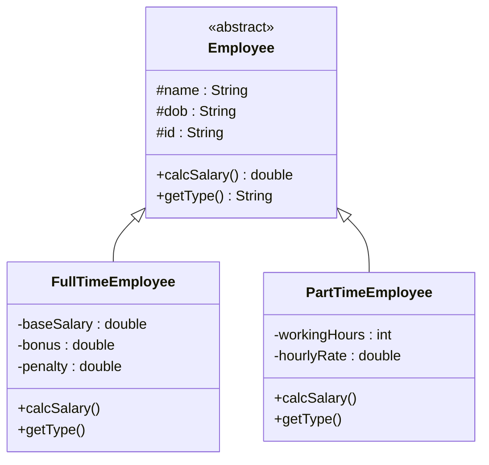

# Bài 5 – Payroll System

## 1. Tóm tắt ý tưởng chính của lời giải

Bài toán xây dựng hệ thống tính lương cho nhân viên của một công ty phần mềm.

Có hai loại nhân viên:

- **Full-time Employee**
- **Part-time Employee**

Mỗi loại có **cách tính lương khác nhau**. Vì vậy hệ thống được thiết kế bằng:

- **Abstract class**
- **Inheritance**
- **Polymorphism**

Mục tiêu là để hệ thống có thể xử lý nhiều loại nhân viên nhưng vẫn sử dụng cùng một cấu trúc chung.

---

# Thiết kế hệ thống

## Lớp trừu tượng Employee

Lớp `Employee` chứa các thông tin chung của mọi nhân viên:

```java
abstract class Employee {

    protected String name;
    protected String dob;
    protected String id;

    public Employee(String name, String dob, String id) {
        this.name = name;
        this.dob = dob;
        this.id = id;
    }

    public abstract double calcSalary();
    public abstract String getType();
}
```

### Thuộc tính chung

- `name` : Tên nhân viên
- `dob` : Ngày sinh
- `id` : Mã nhân viên

### Phương thức trừu tượng

```
calcSalary()
```

→ Tính lương (mỗi loại nhân viên tính khác nhau)

```
getType()
```

→ Trả về loại nhân viên

Lớp này **không thể tạo object trực tiếp** vì nó là abstract class.

---

# Lớp FullTimeEmployee

```java
public class FullTimeEmployee extends Employee {

    private double baseSalary, bonus, penalty;
}
```

### Thuộc tính

- `baseSalary`
- `bonus`
- `penalty`

### Công thức tính lương

```
Salary = baseSalary + (bonus - penalty)
```

### Implementation

```java
@Override
public double calcSalary() {
    return baseSalary + (bonus - penalty);
}
```

---

# Lớp PartTimeEmployee

```java
public class PartTimeEmployee extends Employee {

    private int workingHours;
    private double hourlyRate;
}
```

### Thuộc tính

- `workingHours`
- `hourlyRate`

### Công thức tính lương

```
Salary = workingHours * hourlyRate
```

### Implementation

```java
@Override
public double calcSalary() {
    return workingHours * hourlyRate;
}
```

---

# Sơ đồ lớp hệ thống



---

# Áp dụng Polymorphism

Trong `main`:

```java
Employee[] employees = new Employee[2];
```

Mặc dù mảng có kiểu `Employee[]`, nhưng có thể chứa:

```
FullTimeEmployee
PartTimeEmployee
```

Khi gọi:

```java
emp.calcSalary()
```

Java sẽ tự động gọi đúng phương thức của object thực tế.

Đây chính là **Runtime Polymorphism**.

---

# Thực hành trong main

```java
Employee[] employees = new Employee[2];

employees[0] = new FullTimeEmployee("Alice", "01/01/1990", "E001", 5000, 500, 200);
employees[1] = new PartTimeEmployee("Bob", "02/02/1995", "E002", 80, 20);
```

Sau đó in bảng lương:

```
Name: Alice
DOB: 01/01/1990
ID: E001
Type: Full-Time
Salary: 5300

Name: Bob
DOB: 02/02/1995
ID: E002
Type: Part-Time
Salary: 1600
```

---

# Ý nghĩa thiết kế

Hệ thống đạt được các nguyên tắc OOP quan trọng:

### Abstraction

Sử dụng `abstract class Employee`.

---

### Inheritance

```
FullTimeEmployee extends Employee
PartTimeEmployee extends Employee
```

---

### Polymorphism

Cùng một lời gọi:

```
emp.calcSalary()
```

nhưng thực hiện logic khác nhau.

---

### Encapsulation

Thông tin của mỗi loại nhân viên được quản lý riêng trong từng class.

---

# Ưu điểm của thiết kế

Hệ thống dễ mở rộng.

Ví dụ nếu thêm:

```
ContractEmployee
InternEmployee
Freelancer
```

chỉ cần:

```
extends Employee
```

mà **không cần sửa code cũ**.

Đây là nguyên tắc **Open/Closed Principle** trong OOP.

---

## 3. Cách chạy chương trình

1. **Cấp quyền thực thi cho script:**
   ```bash
   chmod +x run.sh
   ```

2. **Chạy chương trình:**
   ```bash
   ./run.sh
   ```
