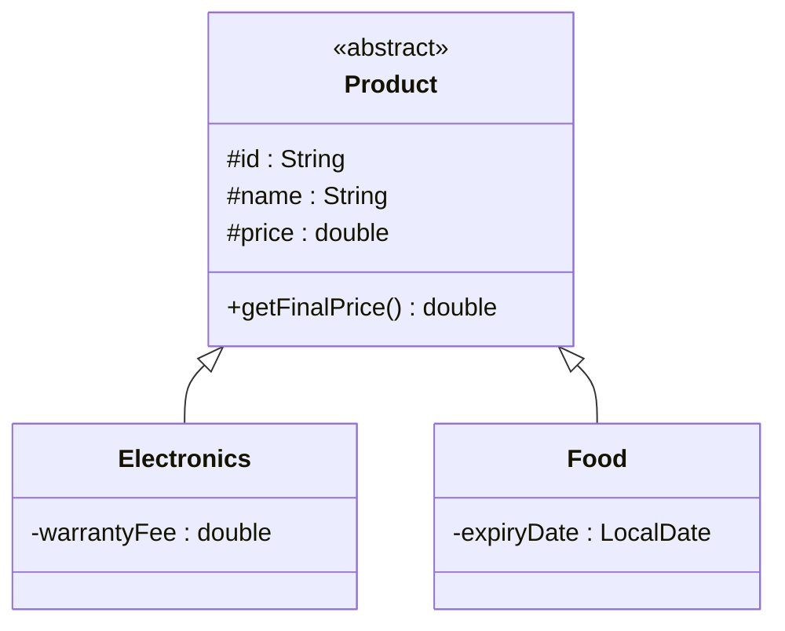

# Bài 6 – Cửa hàng trực tuyến

## 1. Tóm tắt ý tưởng chính của lời giải

Bài toán xây dựng hệ thống tính tiền cho đơn hàng chứa nhiều loại sản phẩm khác nhau.

Có hai loại sản phẩm:

1. **Electronics**
2. **Food**

Mỗi loại có **quy tắc tính giá khác nhau**, do đó chương trình được thiết kế bằng:

- **Abstract Class**
- **Inheritance**
- **Polymorphism**

Nhờ đó hệ thống có thể xử lý nhiều loại sản phẩm trong cùng một danh sách.

---

# Phân tích thiết kế

## Lớp trừu tượng Product

Lớp `Product` chứa thông tin chung của mọi sản phẩm. :contentReference[oaicite:5]{index=5}

```java
public abstract class Product {

    protected String id;
    protected String name;
    protected double price;

    public Product(String id, String name, double price) {
        this.id = id;
        this.name = name;
        this.price = price;
    }

    public abstract double getFinalPrice();
}
```

### Thuộc tính chung

```
id
name
price
```

### Phương thức

```
getFinalPrice()
```

Phương thức này được **override** trong các lớp con.

---

# Lớp Electronics

Đại diện cho sản phẩm điện tử. :contentReference[oaicite:6]{index=6}

### Thuộc tính

```
warrantyFee
```

### Công thức giá

```
Final Price = price * 1.1 + warrantyFee
```

Trong đó:

```
10% VAT
```

### Implementation

```java
@Override
public double getFinalPrice() {
    return price * 1.1 + warrantyFee;
}
```

---

# Lớp Food

Đại diện cho sản phẩm thực phẩm. :contentReference[oaicite:7]{index=7}

### Thuộc tính

```
expiryDate (LocalDate)
```

### Logic tính giá

- Nếu sản phẩm **còn dưới 7 ngày hết hạn** → giảm giá **20%**
- Nếu không → giữ nguyên giá

### Implementation

```java
LocalDate today = LocalDate.now();

if (expiryDate.minusDays(7).isBefore(today)) {
    return price * 0.8;
}
```

---

# Sơ đồ lớp hệ thống



---

# Xử lý Input

Chương trình đọc số lượng sản phẩm:

```
n
```

Sau đó đọc từng dòng dữ liệu.

Ví dụ:

```
E "Laptop" 1000 50
```

### Ý nghĩa

```
E → Electronics
Laptop → name
1000 → price
50 → warrantyFee
```

---

Ví dụ:

```
F "Milk" 30 2025-03-15
```

### Ý nghĩa

```
F → Food
Milk → name
30 → price
2025-03-15 → expiryDate
```

---

# Phân tích cách parse dữ liệu

Tên sản phẩm nằm trong dấu `" "`.

Chương trình tìm vị trí dấu ngoặc kép:

```java
int firstQuote = line.indexOf("\"");
int secondQuote = line.indexOf("\"", firstQuote + 1);
```

Sau đó tách phần dữ liệu phía sau:

```java
String remain = line.substring(secondQuote + 2);
String[] parts = remain.split(" ");
```

---

# Áp dụng Polymorphism

Tất cả sản phẩm được lưu trong mảng:

```
Product[] products
```

Mỗi phần tử có thể là:

```
Electronics
Food
```

Khi gọi:

```
p.getFinalPrice()
```

Java sẽ tự động gọi phương thức đúng của từng object.

---

# In kết quả

```java
for (Product p : products) {
    double finalPrice = p.getFinalPrice();
    total += finalPrice;

    String typeName =
        (p instanceof Electronics) ? "Electronics" : "Food";

    System.out.println(p.name + " - " + typeName + " - " + finalPrice);
}
```

---

# Ví dụ

## Input

```
3
E "Laptop" 1000 50
F "Milk" 30 2025-03-15
F "Bread" 20 2025-03-05
```

---

## Output

```
Laptop - Electronics - 1150.0
Milk - Food - 30.0
Bread - Food - 16.0
Total = 1196.0
```

---

# Ý nghĩa bài học

Bài này minh họa rõ các nguyên tắc OOP quan trọng.

### Abstraction

```
abstract class Product
```

---

### Inheritance

```
Electronics extends Product
Food extends Product
```

---

### Polymorphism

Cùng một lời gọi:

```
getFinalPrice()
```

nhưng mỗi loại sản phẩm tính giá khác nhau.

---

### Data Parsing

Xử lý chuỗi input có dấu `" "`.

---

# Ưu điểm thiết kế

Hệ thống dễ mở rộng.

Ví dụ nếu thêm:

```
Clothing
Furniture
Book
```

chỉ cần:

```
extends Product
override getFinalPrice()
```

không cần sửa code cũ.

---

## 3. Cách chạy chương trình

1. **Cấp quyền thực thi cho script:**
   ```bash
   chmod +x run.sh
   ```

2. **Chạy chương trình:**
   ```bash
   ./run.sh
   ```
