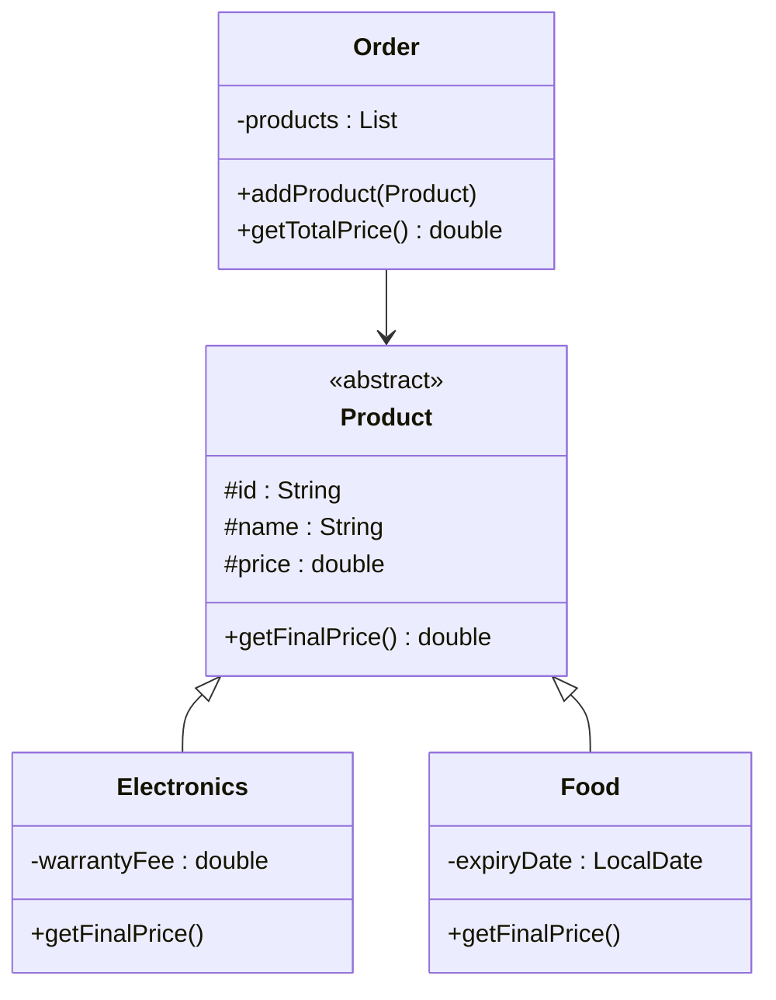

# Bài 6 – Cửa hàng trực tuyến (Online Store)

## 1. Tóm tắt ý tưởng chính của lời giải

Bài toán xây dựng module tính tiền cho một đơn hàng chứa nhiều loại sản phẩm khác nhau.

Có hai loại sản phẩm:

1. **Electronics (điện tử)**  
   - Giá bán = giá gốc + 10% VAT + phí bảo hành

2. **Food (thực phẩm)**  
   - Không có thuế
   - Nếu sản phẩm sắp hết hạn (còn dưới 7 ngày) → giảm giá 20%

Hệ thống được thiết kế bằng các nguyên tắc OOP:

- Abstraction
- Inheritance
- Polymorphism
- Encapsulation

---

# Thiết kế lớp

## Lớp trừu tượng Product

Lớp cha chứa các thông tin chung của mọi sản phẩm. :contentReference[oaicite:5]{index=5}

```java
public abstract class Product {

    protected String id;
    protected String name;
    protected double price;

    public Product(String id, String name, double price) {
        this.id = id;
        this.name = name;
        this.price = price;
    }

    public abstract double getFinalPrice();
}
```

### Thuộc tính chung

- `id` : mã sản phẩm
- `name` : tên sản phẩm
- `price` : giá gốc

### Phương thức

```
getFinalPrice()
```

→ được override trong các lớp con để tính giá cuối cùng.

---

# Lớp Electronics

Lớp đại diện cho sản phẩm điện tử. :contentReference[oaicite:6]{index=6}

### Thuộc tính riêng

```
warrantyFee
```

### Công thức giá

```
Final Price = price * 1.1 + warrantyFee
```

- 10% VAT
- cộng phí bảo hành

### Implementation

```java
@Override
public double getFinalPrice() {
    return price * 1.1 + warrantyFee;
}
```

---

# Lớp Food

Lớp đại diện cho thực phẩm. :contentReference[oaicite:7]{index=7}

### Thuộc tính riêng

```
LocalDate expiryDate
```

### Logic tính giá

- Nếu còn **< 7 ngày hết hạn** → giảm 20%
- Nếu không → giữ nguyên giá

### Implementation

```java
LocalDate today = LocalDate.now();

if (expiryDate.minusDays(7).isBefore(today)) {
    return price * 0.8;
}
```

Sử dụng thư viện:

```
java.time.LocalDate
```

để xử lý ngày tháng.

---

# Lớp Order

Lớp quản lý danh sách sản phẩm trong đơn hàng. :contentReference[oaicite:8]{index=8}

```java
private List<Product> products = new ArrayList<>();
```

Sử dụng **List<Product>** để chứa nhiều loại sản phẩm khác nhau.

### Thêm sản phẩm

```java
public void addProduct(Product product) {
    products.add(product);
}
```

### Tính tổng tiền

```java
public double getTotalPrice() {
    double total = 0;
    for (Product product : products) {
        total += product.getFinalPrice();
    }
    return total;
}
```

Nhờ **polymorphism**, mỗi loại sản phẩm sẽ tự tính giá theo logic riêng.

---

# Sơ đồ lớp hệ thống



---

# Áp dụng Polymorphism

Trong `Order`:

```
List<Product>
```

có thể chứa:

```
Electronics
Food
```

Khi gọi:

```
product.getFinalPrice()
```

Java sẽ tự động gọi đúng phương thức của object thực tế.

Ví dụ:

```
Electronics → tính VAT
Food → kiểm tra hạn sử dụng
```

---

# Thực hành trong main

Tạo đơn hàng và thêm sản phẩm. :contentReference[oaicite:9]{index=9}

```java
Order order = new Order();

Product laptop = new Electronics("E001", "Laptop", 1000, 100);
Product phone = new Electronics("E002", "Phone", 500, 50);
Product bread = new Food("F001", "Bread", 2, LocalDate.now().plusDays(5));
Product milk = new Food("F002", "Milk", 3, LocalDate.now().plusDays(10));

order.addProduct(laptop);
order.addProduct(phone);
order.addProduct(bread);
order.addProduct(milk);
```

Sau đó tính tổng tiền:

```java
System.out.println("Total Price: $" + order.getTotalPrice());
```

---

# Ví dụ tính toán

| Product | Price | Logic | Final |
|-------|------|------|------|
Laptop | 1000 | +10% VAT + 100 warranty | 1200 |
Phone | 500 | +10% VAT + 50 warranty | 600 |
Bread | 2 | giảm 20% | 1.6 |
Milk | 3 | không giảm | 3 |

---

# Ý nghĩa bài học

Bài này giúp hiểu rõ cách thiết kế hệ thống thực tế bằng OOP.

### Abstraction

```
abstract class Product
```

---

### Inheritance

```
Electronics extends Product
Food extends Product
```

---

### Polymorphism

```
product.getFinalPrice()
```

mỗi loại sản phẩm tính khác nhau.

---

### Encapsulation

Mỗi loại sản phẩm quản lý logic riêng.

---

# Ưu điểm thiết kế

Hệ thống rất dễ mở rộng.

Ví dụ thêm:

```
Book
Clothing
Furniture
```

chỉ cần:

```
extends Product
```

không cần sửa code cũ.

---

## 3. Cách chạy chương trình

1. **Cấp quyền thực thi cho script:**
   ```bash
   chmod +x run.sh
   ```

2. **Chạy chương trình:**
   ```bash
   ./run.sh
   ```
