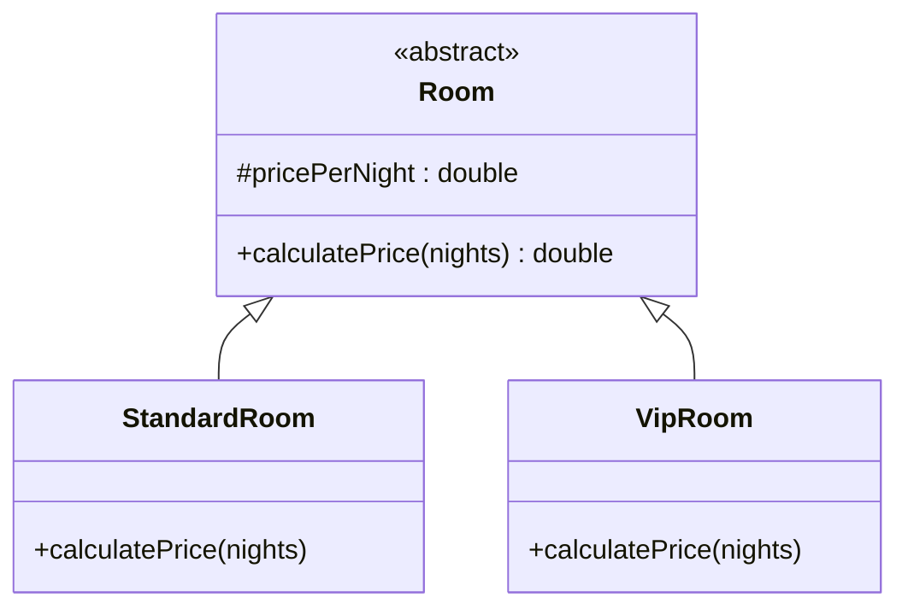

# Bài 7 – Hệ thống quản lý khách sạn

## 1. Tóm tắt ý tưởng chính của lời giải

Bài toán yêu cầu xây dựng hệ thống tính tiền phòng khách sạn với hai loại phòng:

1. **Standard Room**
   - Giá: 500.000đ / đêm
   - Nếu ở **trên 3 đêm** → giảm **5% tổng tiền**

2. **VIP Room**
   - Giá: 2.000.000đ / đêm
   - Không giảm giá dù ở bao lâu
   - Đã bao gồm dịch vụ ăn sáng

Hệ thống được thiết kế theo hướng **OOP** để dễ mở rộng và quản lý logic tính tiền.

Các nguyên tắc áp dụng:

- Abstraction
- Inheritance
- Polymorphism
- Encapsulation

---

# Thiết kế hệ thống

## Lớp trừu tượng Room

Lớp `Room` là lớp cha chứa thông tin chung của tất cả các loại phòng. :contentReference[oaicite:4]{index=4}

```java
public abstract class Room {

    protected double pricePerNight;

    public Room(double pricePerNight) {
        this.pricePerNight = pricePerNight;
    }

    public abstract double calculatePrice(int nights);
}
```

### Thuộc tính

```
pricePerNight
```

→ giá phòng cho mỗi đêm.

### Phương thức trừu tượng

```
calculatePrice(int nights)
```

→ mỗi loại phòng sẽ có cách tính giá khác nhau.

---

# Lớp StandardRoom

Lớp đại diện cho phòng Standard. :contentReference[oaicite:5]{index=5}

### Giá cơ bản

```
500.000đ / đêm
```

### Chính sách giảm giá

Nếu khách ở **hơn 3 đêm**:

```
giảm 5% tổng tiền
```

### Implementation

```java
@Override
public double calculatePrice(int nights) {

    double total = pricePerNight * nights;

    if (nights > 3) {
        return total * 0.95;
    } else {
        return total;
    }
}
```

---

# Lớp VipRoom

Lớp đại diện cho phòng VIP. :contentReference[oaicite:6]{index=6}

### Giá phòng

```
2.000.000đ / đêm
```

### Chính sách

- Không giảm giá
- Bao gồm ăn sáng

### Implementation

```java
@Override
public double calculatePrice(int nights) {
    return pricePerNight * nights;
}
```

---

# Sơ đồ lớp hệ thống



---

# Áp dụng Polymorphism

Trong chương trình:

```
Room room = null;
```

Biến `room` có thể chứa:

```
StandardRoom
VipRoom
```

Khi gọi:

```
room.calculatePrice(nights)
```

Java sẽ tự động gọi đúng phương thức của object thực tế.

---

# Thực hành trong chương trình

Người dùng nhập:

```
room type
number of nights
```

Ví dụ:

```
Enter room type (standard/vip): standard
Enter number of nights: 4
```

Tính tiền:

```
4 × 500000 = 2000000
Giảm 5% → 1.900.000
```

---

# Ví dụ kết quả

### Standard Room – 2 đêm

```
2 × 500000 = 1.000.000
```

### Standard Room – 4 đêm

```
4 × 500000 = 2.000.000
Giảm 5% → 1.900.000
```

### VIP Room – 4 đêm

```
4 × 2.000.000 = 8.000.000
```

---

# Ý nghĩa bài học

Bài này minh họa rõ cách thiết kế hệ thống nghiệp vụ bằng OOP.

### Abstraction

```
abstract class Room
```

---

### Inheritance

```
StandardRoom extends Room
VipRoom extends Room
```

---

### Polymorphism

```
room.calculatePrice()
```

mỗi loại phòng có cách tính khác nhau.

---

### Encapsulation

Logic tính giá được đóng gói trong từng class.

---

# Ưu điểm của thiết kế

Hệ thống dễ mở rộng.

Ví dụ thêm loại phòng:

```
DeluxeRoom
SuiteRoom
FamilyRoom
```

Chỉ cần:

```
extends Room
```

không cần sửa code cũ.

---

## 3. Cách chạy chương trình

1. **Cấp quyền thực thi cho script:**
   ```bash
   chmod +x run.sh
   ```

2. **Chạy chương trình:**
   ```bash
   ./run.sh
   ```
