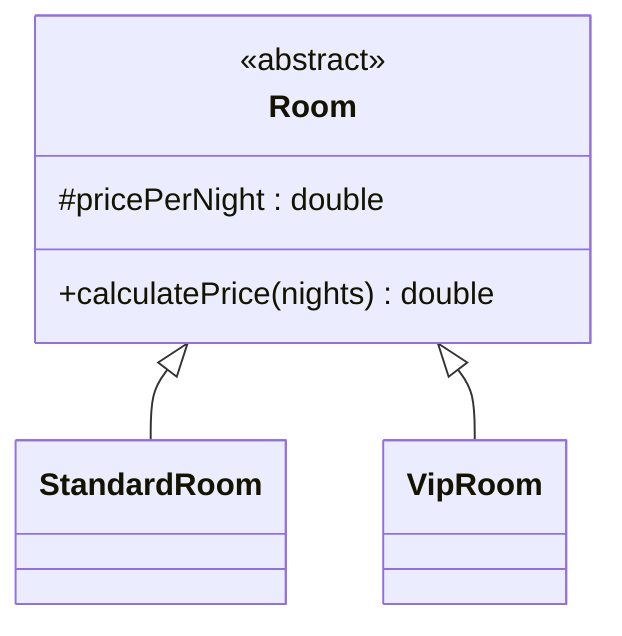

# Bài 7 – Quản lý khách sạn

## 1. Tóm tắt ý tưởng chính của lời giải

Bài toán xây dựng hệ thống tính tiền thuê phòng trong khách sạn.

Khách sạn có 2 loại phòng:

1. **Standard**
2. **VIP**

Mỗi loại phòng có **quy tắc tính tiền khác nhau**, vì vậy hệ thống được thiết kế bằng:

- **Abstract Class**
- **Inheritance**
- **Polymorphism**

Nhờ đó chương trình có thể xử lý nhiều loại phòng bằng cùng một interface.

---

# Phân tích thiết kế

## Lớp trừu tượng Room

Lớp `Room` là lớp cha chứa thông tin chung của tất cả các loại phòng. :contentReference[oaicite:4]{index=4}

```java
public abstract class Room {

    protected double pricePerNight;

    public Room(double pricePerNight) {
        this.pricePerNight = pricePerNight;
    }

    public abstract double calculatePrice(int nights);
}
```

### Thuộc tính

```
pricePerNight
```

→ Giá thuê mỗi đêm.

### Phương thức

```
calculatePrice(int nights)
```

→ Tính tổng tiền thuê phòng.

Phương thức này sẽ được **override** trong các lớp con.

---

# Lớp StandardRoom

Đại diện cho phòng **Standard**. :contentReference[oaicite:5]{index=5}

### Giá phòng

```
500000đ / đêm
```

### Chính sách

Nếu khách ở **hơn 3 đêm**:

```
giảm 5% tổng tiền
```

### Implementation

```java
@Override
public double calculatePrice(int nights) {

    double total = pricePerNight * nights;

    if (nights > 3) {
        return total * 0.95;
    } else {
        return total;
    }
}
```

---

# Lớp VipRoom

Đại diện cho phòng **VIP**. :contentReference[oaicite:6]{index=6}

### Giá phòng

```
2000000đ / đêm
```

### Chính sách

- Không giảm giá
- Đã bao gồm ăn sáng

### Implementation

```java
@Override
public double calculatePrice(int nights) {
    return pricePerNight * nights;
}
```

---

# Sơ đồ lớp hệ thống



---

# Xử lý Input

Chương trình đọc dữ liệu từ bàn phím.

Ví dụ:

```
S 3
```

### Ý nghĩa

```
S → Standard Room
3 → số đêm
```

Hoặc:

```
V 2
```

### Ý nghĩa

```
V → VIP Room
2 → số đêm
```

---

# Tạo object tương ứng

Chương trình sử dụng `switch` để xác định loại phòng. :contentReference[oaicite:7]{index=7}

```java
switch (type) {
    case 'S' -> room = new StandardRoom(500000);
    case 'V' -> room = new VipRoom(2000000);
}
```

---

# Áp dụng Polymorphism

Biến:

```
Room room;
```

có thể chứa:

```
StandardRoom
VipRoom
```

Khi gọi:

```
room.calculatePrice(nights)
```

Java sẽ tự động gọi đúng phương thức của object thực tế.

---

# Ví dụ

## Input

Case 1

```
S 3
```

### Tính toán

```
3 × 500000 = 1500000
```

### Output

```
1500000
```

---

## Input

Case 2

```
S 4
```

### Tính toán

```
4 × 500000 = 2000000
giảm 5% → 1900000
```

### Output

```
1900000
```

---

## Input

Case 3

```
V 2
```

### Tính toán

```
2 × 2000000 = 4000000
```

### Output

```
4000000
```

---

# Ý nghĩa bài học

Bài này minh họa các nguyên tắc OOP quan trọng.

### Abstraction

```
abstract class Room
```

---

### Inheritance

```
StandardRoom extends Room
VipRoom extends Room
```

---

### Polymorphism

Cùng một lời gọi:

```
calculatePrice()
```

nhưng mỗi loại phòng có logic khác nhau.

---

# Ưu điểm thiết kế

Hệ thống rất dễ mở rộng.

Ví dụ thêm:

```
DeluxeRoom
FamilyRoom
SuiteRoom
```

chỉ cần:

```
extends Room
override calculatePrice()
```

không cần sửa code cũ.

---

## 3. Cách chạy chương trình

1. **Cấp quyền thực thi cho script:**
   ```bash
   chmod +x run.sh
   ```

2. **Chạy chương trình:**
   ```bash
   ./run.sh
   ```
