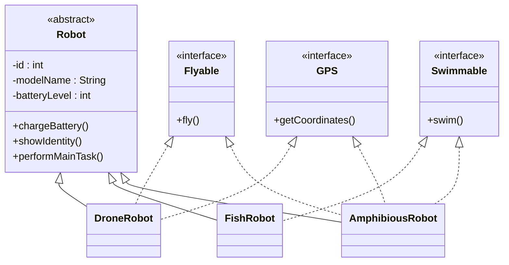

# Bài 8 – Abstract Class & Interface (Robot Factory)

## 1. Tóm tắt ý tưởng chính của lời giải

Bài toán mô phỏng hệ thống robot trong một nhà máy sản xuất.  

Các robot có **cấu trúc cơ bản giống nhau**, nhưng **kỹ năng khác nhau** như:

- Bay
- Bơi
- Định vị GPS

Để thiết kế hệ thống linh hoạt, chương trình sử dụng:

- **Abstract Class** để định nghĩa cấu trúc chung của robot
- **Interface** để định nghĩa các kỹ năng (behaviors)
- **Inheritance + Polymorphism** để triển khai các loại robot khác nhau

---

# Thiết kế lớp Robot

Lớp `Robot` là **abstract class** chứa các thuộc tính chung. :contentReference[oaicite:8]{index=8}

```java
public abstract class Robot {

    private final int id;
    private final String modelName;
    private int batteryLevel;

    public Robot(int id, String modelName) {
        this.id = id;
        this.modelName = modelName;
        this.batteryLevel = 100;
    }

    public void chargeBattery() {
        this.batteryLevel = 100;
    }

    public void showIdentity() {
        System.out.println("Robot ID: " + id + ", Model: " + modelName);
    }

    public abstract void performMainTask();
}
```

### Thuộc tính

```
id
modelName
batteryLevel
```

### Phương thức

- `chargeBattery()` → sạc pin lên 100%
- `showIdentity()` → hiển thị danh tính robot
- `performMainTask()` → nhiệm vụ chính (abstract)

---

# Thiết kế các Interface (Kỹ năng)

## Flyable

```java
public interface Flyable {
    void fly();
}
```

Robot có thể bay.

---

## Swimmable

```java
public interface Swimmable {
    void swim();
}
```

Robot có thể bơi.

---

## GPS

```java
public interface GPS {
    void getCoordinates();
}
```

Robot có khả năng định vị.

---

# Các loại Robot

## DroneRobot

Robot bay và có GPS. :contentReference[oaicite:9]{index=9}

```java
public class DroneRobot extends Robot implements Flyable, GPS
```

Kỹ năng:

- bay
- định vị

---

## FishRobot

Robot hoạt động dưới nước. :contentReference[oaicite:10]{index=10}

```java
public class FishRobot extends Robot implements Swimmable
```

Kỹ năng:

- bơi

---

## AmphibiousRobot

Robot đa địa hình. :contentReference[oaicite:11]{index=11}

```java
public class AmphibiousRobot extends Robot
        implements Flyable, Swimmable, GPS
```

Kỹ năng:

- bay
- bơi
- định vị

---

# Sơ đồ lớp hệ thống



---

# Áp dụng Polymorphism

Trong `main`, tạo danh sách robot. :contentReference[oaicite:12]{index=12}

```java
List<Robot> robots = new ArrayList<>();
robots.add(new DroneRobot(1, "SkyEyeY"));
robots.add(new FishRobot(2, "AquaBotX"));
robots.add(new AmphibiousRobot(3, "AmphiX"));
```

Duyệt danh sách:

```java
for (Robot r : robots) {
    r.performMainTask();
}
```

Java sẽ tự động gọi đúng phương thức của từng loại robot.

---

# Downcasting và instanceof

Ví dụ lấy robot đầu tiên:

```
Robot r1 = robots.get(0);
```

Kiểm tra nếu robot có khả năng bay:

```java
if (r1 instanceof Flyable) {
    Flyable f = (Flyable) r1;
    f.fly();
}
```

Ý nghĩa:

- `instanceof` kiểm tra kỹ năng robot
- Downcasting cho phép sử dụng các phương thức đặc biệt của interface

---

# Ví dụ kết quả

```
Drone is performing aerial surveillance.
Fish robot exploring underwater.
Amphibious robot performing multi-terrain mission.

Drone is flying.
Drone GPS coordinates acquired.

Fish robot swimming.

Amphibious robot flying.
```

---

# Phần mở rộng

## Java có cho phép kế thừa nhiều lớp không?

Ví dụ:

```
class DroneRobot extends Robot, ElectronicDevice
```

→ **Không hợp lệ**

Java **không cho phép multiple inheritance giữa các class**.

---

## Giải pháp

Chuyển `ElectronicDevice` thành **interface**.

Ví dụ:

```
interface ElectronicDevice {
    void turnOn();
}
```

Sau đó:

```
class DroneRobot extends Robot
        implements Flyable, GPS, ElectronicDevice
```

Java cho phép một class:

```
extends 1 class
implements nhiều interface
```

---

# Ý nghĩa bài học

Bài này giúp hiểu rõ các khái niệm quan trọng của OOP:

### Abstract Class

Dùng để định nghĩa cấu trúc chung.

---

### Interface

Dùng để mô tả **kỹ năng / behavior**.

---

### Multiple Interface Implementation

Một robot có thể có nhiều kỹ năng.

---

### Polymorphism

Một danh sách `Robot` có thể chứa nhiều loại robot khác nhau.

---

### Downcasting + instanceof

Cho phép kiểm tra và sử dụng kỹ năng đặc biệt của robot.

---

## 3. Cách chạy chương trình

1. **Cấp quyền thực thi cho script:**
   ```bash
   chmod +x run.sh
   ```

2. **Chạy chương trình:**
   ```bash
   ./run.sh
   ```
