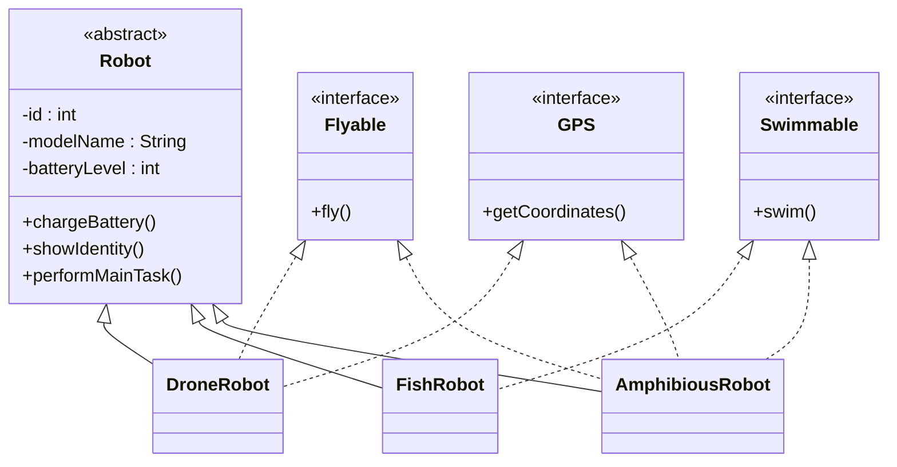

# Bài 8 – Abstract Class and Interface (Robot Factory)

## 1. Tóm tắt ý tưởng chính của lời giải

Bài toán mô phỏng hệ thống robot trong nhà máy sản xuất.  
Các robot có **cấu trúc cơ bản giống nhau**, nhưng lại có **kỹ năng (behavior) khác nhau** như:

- Bay
- Bơi
- Định vị GPS

Để thiết kế hệ thống linh hoạt và dễ mở rộng, chương trình sử dụng:

- **Abstract Class** để định nghĩa cấu trúc chung của robot
- **Interface** để mô tả các kỹ năng
- **Inheritance và Polymorphism** để xử lý nhiều loại robot khác nhau

---

# Thiết kế lớp Robot

Lớp `Robot` là **abstract class** chứa thông tin chung của mọi robot. :contentReference[oaicite:8]{index=8}

```java
public abstract class Robot {

    private final int id;
    private final String modelName;
    private int batteryLevel;

    public Robot(int id, String modelName) {
        this.id = id;
        this.modelName = modelName;
        this.batteryLevel = 100;
    }

    public String getModelName() {
        return modelName;
    }

    public void chargeBattery() {
        batteryLevel = 100;
    }

    public final void showIdentity() {
        System.out.println("Robot ID: " + id + ", Model: " + modelName);
    }

    public abstract void performMainTask();
}
```

### Thuộc tính

```
id
modelName
batteryLevel
```

### Phương thức

| Method | Ý nghĩa |
|------|------|
chargeBattery() | Sạc pin robot lên 100% |
showIdentity() | Hiển thị thông tin robot (không cho override) |
performMainTask() | Nhiệm vụ chính của robot |

`showIdentity()` được khai báo **final** để đảm bảo lớp con không thay đổi hành vi này.

---

# Thiết kế các Interface

Các interface mô tả **kỹ năng của robot**.

---

## Flyable

:contentReference[oaicite:9]{index=9}

```java
public interface Flyable {
    void fly();
}
```

Robot có thể bay.

---

## Swimmable

:contentReference[oaicite:10]{index=10}

```java
public interface Swimmable {
    void swim();
}
```

Robot có thể bơi.

---

## GPS

:contentReference[oaicite:11]{index=11}

```java
public interface GPS {
    void getCoordinates();
}
```

Robot có thể xác định vị trí.

---

# Các loại Robot

## DroneRobot

Robot bay và có GPS. :contentReference[oaicite:12]{index=12}

```java
public class DroneRobot extends Robot implements Flyable, GPS
```

Kỹ năng:

```
Flyable
GPS
```

---

## FishRobot

Robot hoạt động dưới nước. :contentReference[oaicite:13]{index=13}

```java
public class FishRobot extends Robot implements Swimmable
```

Kỹ năng:

```
Swimmable
```

---

## AmphibiousRobot

Robot đa địa hình. :contentReference[oaicite:14]{index=14}

```java
public class AmphibiousRobot extends Robot
        implements Flyable, Swimmable, GPS
```

Kỹ năng:

```
Flyable
Swimmable
GPS
```

---

# Sơ đồ lớp hệ thống



---

# Xử lý Input

Chương trình đọc dữ liệu từ bàn phím.

Ví dụ:

```
3
DR 1 Drone-X
FR 2 Fish-A
AR 3 Amphibious-Z
```

### Ý nghĩa

| Code | Robot Type |
|----|----|
DR | DroneRobot |
FR | FishRobot |
AR | AmphibiousRobot |

---

# Tạo Robot tương ứng

Trong `main`, chương trình tạo robot theo loại. :contentReference[oaicite:15]{index=15}

```java
switch (type) {
    case "DR" -> robots.add(new DroneRobot(id, model));
    case "FR" -> robots.add(new FishRobot(id, model));
    case "AR" -> robots.add(new AmphibiousRobot(id, model));
}
```

---

# Áp dụng Polymorphism

Danh sách robot được lưu trong:

```
List<Robot> robots
```

Duyệt danh sách:

```java
for (Robot r : robots) {
    r.performMainTask();
}
```

Java sẽ tự động gọi đúng phương thức của từng loại robot.

---

# Downcasting và instanceof

Để robot thực hiện các kỹ năng riêng:

```java
if (r instanceof Flyable f) {
    f.fly();
}

if (r instanceof Swimmable s) {
    s.swim();
}

if (r instanceof GPS g) {
    g.getCoordinates();
}
```

Ý nghĩa:

```
instanceof → kiểm tra robot có kỹ năng đó hay không
Downcasting → gọi phương thức của interface
```

---

# Ví dụ

## Input

```
3
DR 1 Drone-X
FR 2 Fish-A
AR 3 Amphibious-Z
```

---

## Output

```
Drone-X performing main task
Drone-X flying
Drone-X getting coordinates

Fish-A performing main task
Fish-A swimming

Amphibious-Z performing main task
Amphibious-Z flying
Amphibious-Z swimming
Amphibious-Z getting coordinates
```

---

# Phần mở rộng

## Java có cho phép kế thừa 2 lớp không?

Ví dụ:

```
class DroneRobot extends Robot, ElectronicDevice
```

→ **Không hợp lệ**

Java **không cho phép multiple inheritance giữa các class**.

---

## Giải pháp

Chuyển `ElectronicDevice` thành **interface**.

Ví dụ:

```
interface ElectronicDevice {
    void turnOn();
}
```

Sau đó:

```
class DroneRobot extends Robot
        implements Flyable, GPS, ElectronicDevice
```

Java cho phép:

```
extends 1 class
implements nhiều interface
```

---

# Ý nghĩa bài học

Bài này minh họa nhiều nguyên tắc OOP quan trọng.

### Abstraction

Sử dụng abstract class để định nghĩa cấu trúc robot.

---

### Interface-based design

Robot có thể sở hữu nhiều kỹ năng.

---

### Polymorphism

Danh sách Robot có thể chứa nhiều loại robot khác nhau.

---

### Downcasting + instanceof

Cho phép sử dụng các kỹ năng riêng của robot một cách an toàn.

---

## 3. Cách chạy chương trình

1. **Cấp quyền thực thi cho script:**
   ```bash
   chmod +x run.sh
   ```

2. **Chạy chương trình:**
   ```bash
   ./run.sh
   ```
