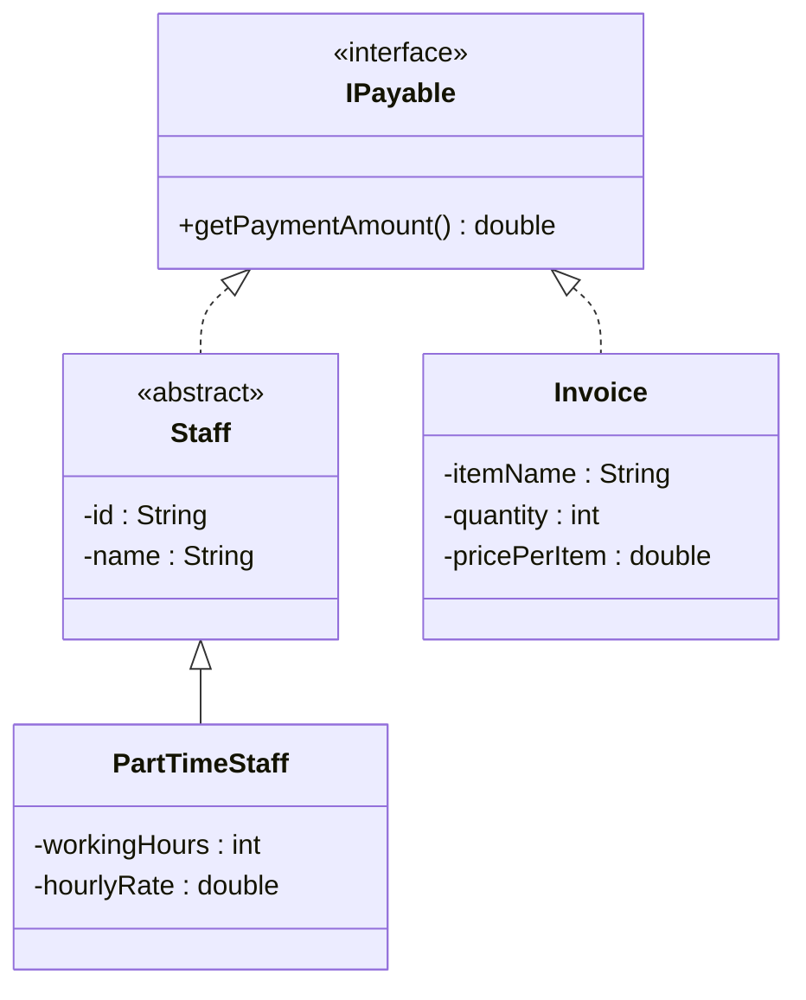

# Bài 9 – Tính tổng chi phí (Payment System)

## 1. Tóm tắt ý tưởng chính của lời giải

Bài toán yêu cầu tính **tổng số tiền công ty phải chi trả trong tháng**, bao gồm:

- Tiền lương nhân viên
- Tiền thanh toán hóa đơn

Hai loại đối tượng này **không có quan hệ kế thừa trực tiếp**, nhưng đều có điểm chung:

```
đều cần tính số tiền phải thanh toán
```

Vì vậy chương trình sử dụng **Interface `IPayable`** để gom tất cả các đối tượng có thể thanh toán vào cùng một hệ thống.

Các nguyên tắc OOP áp dụng:

- Interface
- Abstraction
- Inheritance
- Polymorphism

---

# Thiết kế Interface IPayable

Interface `IPayable` định nghĩa hành vi chung của mọi đối tượng có thể thanh toán. :contentReference[oaicite:5]{index=5}

```java
public interface IPayable {
    double getPaymentAmount();
}
```

Ý nghĩa:

Bất kỳ class nào implement `IPayable` đều phải định nghĩa:

```
getPaymentAmount()
```

---

# Lớp trừu tượng Staff

Lớp `Staff` đại diện cho nhân viên trong công ty. :contentReference[oaicite:6]{index=6}

```java
public abstract class Staff implements IPayable {

    private String id;
    private String name;

}
```

### Thuộc tính

```
id
name
```

### Vai trò

- Chứa thông tin chung của nhân viên
- Không cài đặt `getPaymentAmount()`
- Để các lớp con tự định nghĩa cách tính lương

---

# Lớp PartTimeStaff

Đại diện cho nhân viên bán thời gian. :contentReference[oaicite:7]{index=7}

### Thuộc tính

```
workingHours
hourlyRate
```

### Công thức tính lương

```
salary = workingHours * hourlyRate
```

### Implementation

```java
@Override
public double getPaymentAmount() {
    return workingHours * hourlyRate;
}
```

---

# Lớp Invoice

Đại diện cho hóa đơn cần thanh toán. :contentReference[oaicite:8]{index=8}

Lưu ý:

```
Invoice KHÔNG kế thừa Staff
```

Nó chỉ implement `IPayable`.

### Thuộc tính

```
itemName
quantity
pricePerItem
```

### Công thức

```
total = quantity * pricePerItem
```

### Implementation

```java
@Override
public double getPaymentAmount() {
    return quantity * pricePerItem;
}
```

---

# Sơ đồ lớp hệ thống



---

# Áp dụng Polymorphism

Trong chương trình:

```java
IPayable[] payableList = new IPayable[3];
```

Danh sách này có thể chứa:

```
PartTimeStaff
Invoice
```

Mặc dù hai class này **không cùng hệ kế thừa**, nhưng đều implement `IPayable`.

---

# Thực hành trong main

```java
payableList[0] = new PartTimeStaff("S01", "Alice", 80, 10);
payableList[1] = new PartTimeStaff("S02", "Bob", 100, 12);
payableList[2] = new Invoice("Laptop", 2, 900);
```

Tính tổng chi phí:

```java
double total = 0;

for (IPayable p : payableList) {
    total += p.getPaymentAmount();
}
```

---

# Ví dụ kết quả

### Nhân viên Alice

```
80 × 10 = 800
```

### Nhân viên Bob

```
100 × 12 = 1200
```

### Hóa đơn Laptop

```
2 × 900 = 1800
```

### Tổng chi phí

```
800 + 1200 + 1800 = 3800
```

Output:

```
Total payment this month: $3800
```

---

# Ý nghĩa bài học

Bài này minh họa một pattern thiết kế rất phổ biến trong OOP.

### Interface-based design

Thay vì ép các class vào cùng hệ kế thừa, ta dùng interface.

---

### Polymorphism

Danh sách `IPayable` có thể chứa nhiều loại object khác nhau.

---

### Loose Coupling

Hệ thống không phụ thuộc vào class cụ thể.

---

### Dễ mở rộng

Có thể thêm:

```
FullTimeStaff
Contractor
UtilityBill
EquipmentInvoice
```

Chỉ cần:

```
implements IPayable
```

không cần sửa code cũ.

---

## 3. Cách chạy chương trình

1. **Cấp quyền thực thi cho script:**
   ```bash
   chmod +x run.sh
   ```

2. **Chạy chương trình:**
   ```bash
   ./run.sh
   ```
