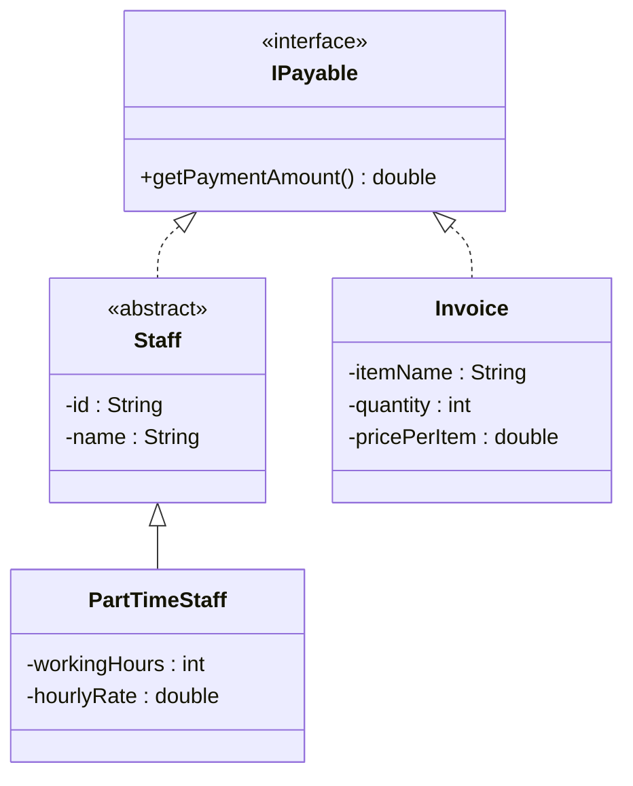

# Bài 9 – Tính tổng chi phí

## 1. Tóm tắt ý tưởng chính của lời giải

Bài toán yêu cầu tính **tổng số tiền mà công ty phải chi trả trong tháng**, bao gồm:

- Tiền lương nhân viên Part-time
- Tiền thanh toán hóa đơn (Invoice)

Hai loại đối tượng này **không có quan hệ kế thừa trực tiếp**, nhưng đều có điểm chung:

```
đều có thể tính số tiền cần thanh toán
```

Vì vậy chương trình sử dụng **Interface `IPayable`** để gom tất cả các đối tượng có thể thanh toán vào cùng một danh sách.

Các nguyên tắc OOP áp dụng:

- Interface
- Abstraction
- Inheritance
- Polymorphism

---

# Thiết kế Interface IPayable

Interface `IPayable` định nghĩa hành vi chung của mọi đối tượng có thể thanh toán. :contentReference[oaicite:5]{index=5}

```java
public interface IPayable {
    double getPaymentAmount();
}
```

Ý nghĩa:

Bất kỳ class nào implement `IPayable` đều phải định nghĩa:

```
getPaymentAmount()
```

---

# Lớp trừu tượng Staff

Lớp `Staff` đại diện cho nhân viên trong công ty. :contentReference[oaicite:6]{index=6}

```java
public abstract class Staff implements IPayable {

    private String id;
    private String name;

}
```

### Thuộc tính

```
id
name
```

### Vai trò

- Chứa thông tin chung của nhân viên
- Không cài đặt `getPaymentAmount()`
- Để các lớp con tự định nghĩa cách tính lương

---

# Lớp PartTimeStaff

Đại diện cho nhân viên làm việc bán thời gian. :contentReference[oaicite:7]{index=7}

### Thuộc tính

```
workingHours
hourlyRate
```

### Công thức lương

```
salary = workingHours * hourlyRate
```

### Implementation

```java
@Override
public double getPaymentAmount() {
    return workingHours * hourlyRate;
}
```

---

# Lớp Invoice

Đại diện cho hóa đơn cần thanh toán. :contentReference[oaicite:8]{index=8}

Lưu ý:

```
Invoice KHÔNG kế thừa Staff
```

Nó chỉ implement `IPayable`.

### Thuộc tính

```
itemName
quantity
pricePerItem
```

### Công thức

```
payment = quantity * pricePerItem
```

### Implementation

```java
@Override
public double getPaymentAmount() {
    return quantity * pricePerItem;
}
```

---

# Sơ đồ lớp hệ thống



---

# Xử lý Input

Chương trình đọc dữ liệu từ bàn phím.

Ví dụ:

```
3
S PT01 NguyenVanA 40 10
I Laptop 2 500
S PT02 TranThiB 20 12
```

### Ý nghĩa

| Code | Object |
|-----|------|
S | PartTimeStaff |
I | Invoice |

---

### PartTimeStaff format

```
S [id] [name] [workingHours] [hourlyRate]
```

Ví dụ:

```
S PT01 NguyenVanA 40 10
```

---

### Invoice format

```
I [itemName] [quantity] [pricePerItem]
```

Ví dụ:

```
I Laptop 2 500
```

---

# Áp dụng Polymorphism

Danh sách thanh toán được lưu trong:

```
IPayable[] payableList
```

Danh sách này có thể chứa:

```
PartTimeStaff
Invoice
```

Khi gọi:

```
p.getPaymentAmount()
```

Java sẽ tự động gọi đúng phương thức của từng object.

---

# In kết quả

```java
for (IPayable p : payableList) {

    double payment = p.getPaymentAmount();
    total += payment;

    if (p instanceof PartTimeStaff s) {
        System.out.println("PartTimeStaff " + s.getName() + " - Payment: " + payment);
    }

    if (p instanceof Invoice i) {
        System.out.println("Invoice " + i.getItemName() + " - Payment: " + payment);
    }
}
```

---

# Ví dụ

## Input

```
3
S PT01 NguyenVanA 40 10
I Laptop 2 500
S PT02 TranThiB 20 12
```

---

## Output

```
PartTimeStaff NguyenVanA - Payment: 400.0
Invoice Laptop - Payment: 1000.0
PartTimeStaff TranThiB - Payment: 240.0
Total Payment = 1640.0
```

---

# Ý nghĩa bài học

Bài này minh họa một pattern thiết kế rất phổ biến trong OOP.

### Interface-based design

Thay vì ép các class vào cùng hệ kế thừa, ta dùng interface.

---

### Polymorphism

Danh sách `IPayable` có thể chứa nhiều loại object khác nhau.

---

### Loose Coupling

Hệ thống không phụ thuộc vào class cụ thể.

---

### Dễ mở rộng

Có thể thêm:

```
FullTimeStaff
Contractor
UtilityBill
EquipmentInvoice
```

Chỉ cần:

```
implements IPayable
```

không cần sửa code cũ.

---

## 3. Cách chạy chương trình

1. **Cấp quyền thực thi cho script:**
   ```bash
   chmod +x run.sh
   ```

2. **Chạy chương trình:**
   ```bash
   ./run.sh
   ```
