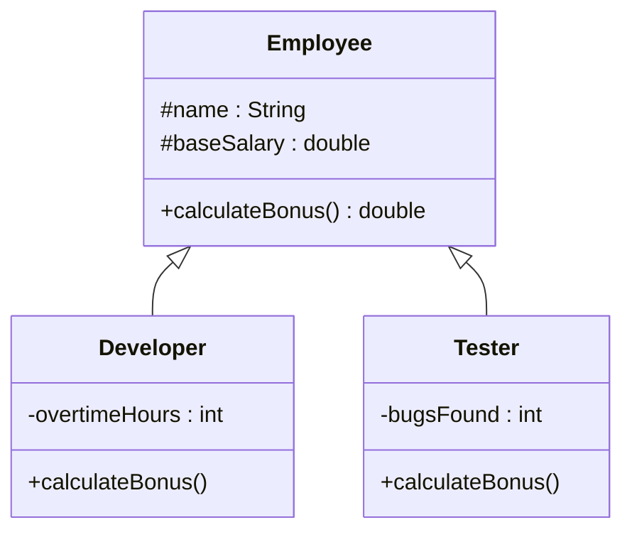

# Bài 10 – Quản lý nhân sự và tính thưởng

## 1. Tóm tắt ý tưởng chính của lời giải

Bài toán xây dựng hệ thống tính **thưởng cuối năm cho nhân viên trong công ty phần mềm**.

Có 3 loại nhân viên:

1. **Employee (nhân viên thường)**
2. **Developer**
3. **Tester**

Mỗi loại có **cách tính thưởng khác nhau**, vì vậy hệ thống được thiết kế bằng:

- Inheritance
- Method Overriding
- Polymorphism
- Runtime Type Checking (`instanceof`)

---

# Thiết kế lớp

## Lớp Employee

Lớp `Employee` là lớp cha chứa thông tin chung của tất cả nhân viên. :contentReference[oaicite:4]{index=4}

```java
public class Employee {

    protected String name;
    protected double baseSalary;

    public Employee(String name, double baseSalary) {
        this.name = name;
        this.baseSalary = baseSalary;
    }

    public double calculateBonus() {
        return baseSalary * 0.1;
    }
}
```

### Thuộc tính

```
name
baseSalary
```

### Công thức thưởng mặc định

```
bonus = 10% * baseSalary
```

---

# Lớp Developer

Lớp `Developer` kế thừa từ `Employee`. :contentReference[oaicite:5]{index=5}

### Thuộc tính riêng

```
overtimeHours
```

### Công thức thưởng

```
bonus = 10% * baseSalary + overtimeHours * 200000
```

### Implementation

```java
@Override
public double calculateBonus() {
    return baseSalary * 0.1 + overtimeHours * 200000;
}
```

---

# Lớp Tester

Lớp `Tester` kế thừa từ `Employee`. :contentReference[oaicite:6]{index=6}

### Thuộc tính riêng

```
bugsFound
```

### Công thức thưởng

```
bonus = 10% * baseSalary + bugsFound * 50000
```

### Implementation

```java
@Override
public double calculateBonus() {
    return baseSalary * 0.1 + bugsFound * 50000;
}
```

---

# Sơ đồ lớp hệ thống



---

# Xử lý Input

Chương trình đọc số lượng nhân viên:

```
n
```

Sau đó đọc từng dòng dữ liệu.

Ví dụ:

```
D TranThiB 12000000 10
```

### Ý nghĩa

```
D → Developer
TranThiB → name
12000000 → baseSalary
10 → overtimeHours
```

---

Ví dụ:

```
T LeVanC 9000000 20
```

### Ý nghĩa

```
T → Tester
LeVanC → name
9000000 → baseSalary
20 → bugsFound
```

---

Ví dụ:

```
E NguyenVanA 10000000
```

### Ý nghĩa

```
E → Employee thường
NguyenVanA → name
10000000 → baseSalary
```

---

# Áp dụng Polymorphism

Danh sách nhân viên được lưu trong:

```
ArrayList<Employee>
```

Danh sách này có thể chứa:

```
Employee
Developer
Tester
```

Khi gọi:

```
e.calculateBonus()
```

Java sẽ tự động gọi đúng phương thức của object thực tế.

---

# Phần nâng cao – Chính sách thưởng đặc biệt

Công ty có chính sách cuối năm:

| Loại nhân viên | Phần thưởng |
|---|---|
Developer | Khóa học AWS |
Tester | Tool Test mới |

Để kiểm tra loại nhân viên, chương trình dùng:

```
instanceof
```

### Implementation

```java
if (e instanceof Developer) {
    System.out.println("Tặng khóa học AWS");
}

if (e instanceof Tester) {
    System.out.println("Tặng tool Test");
}
```

---

# Ví dụ

## Input

```
5
E NguyenVanA 10000000
D TranThiB 12000000 10
T LeVanC 9000000 20
D PhamVanD 15000000 5
T HoangThiE 8000000 10
```

---

## Output

```
NguyenVanA - Bonus: 1000000.0
TranThiB - Bonus: 3200000.0
Tặng khóa học AWS
LeVanC - Bonus: 1900000.0
Tặng tool Test
PhamVanD - Bonus: 2500000.0
Tặng khóa học AWS
HoangThiE - Bonus: 1300000.0
Tặng tool Test
```

---

# Ý nghĩa bài học

Bài này minh họa nhiều nguyên tắc OOP quan trọng.

### Inheritance

```
Developer extends Employee
Tester extends Employee
```

---

### Method Overriding

Các lớp con định nghĩa lại:

```
calculateBonus()
```

---

### Polymorphism

Danh sách `ArrayList<Employee>` chứa nhiều loại object khác nhau.

---

### Runtime Type Checking

Sử dụng:

```
instanceof
```

để xác định loại object tại runtime.

---

# Ưu điểm thiết kế

Hệ thống rất dễ mở rộng.

Nếu sau này thêm:

```
Manager
Designer
DevOps
Intern
```

chỉ cần:

```
extends Employee
override calculateBonus()
```

không cần sửa code cũ.

---

## 3. Cách chạy chương trình

1. **Cấp quyền thực thi cho script:**
   ```bash
   chmod +x run.sh
   ```

2. **Chạy chương trình:**
   ```bash
   ./run.sh
   ```
