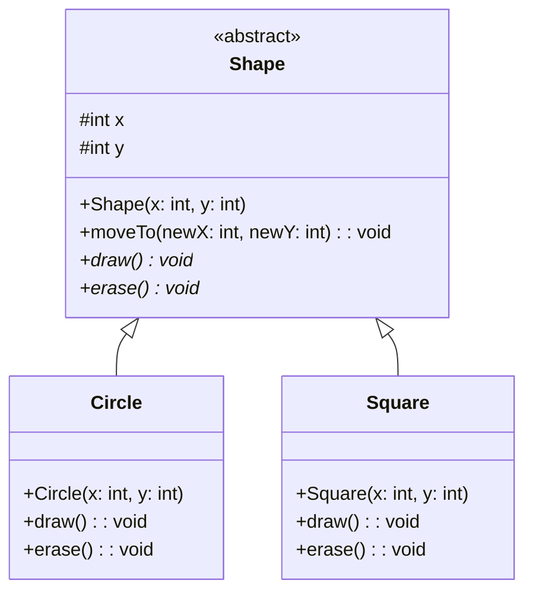
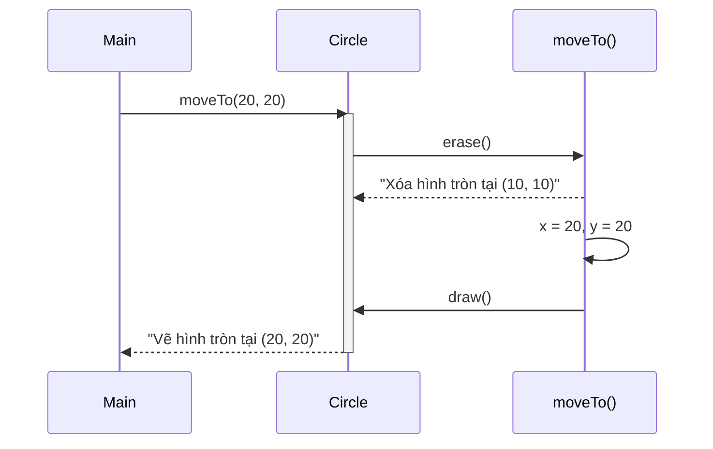

# Bài 1: The Template Shape

## Tóm tắt ý tưởng chính của lời giải

Bài toán sử dụng **Abstract Class** và **Template Method Pattern** để thiết kế hệ thống hình học:

- **Abstract Class `Shape`**: Định nghĩa khung sườn chung cho tất cả các hình với thuộc tính `x, y` và phương thức `moveTo()` có sẵn logic.
- **Các lớp con `Circle`, `Square`**: Chỉ cần hiện thực hóa `draw()` và `erase()` theo cách riêng của mình.

## Lý do lựa chọn hướng tiếp cận này

| Tiêu chí | Ưu điểm |
|----------|----------|
| **Tái sử dụng code** | Logic `moveTo()` được viết 1 lần trong lớp cha, tất cả lớp con đều thừa hưởng |
| **Đóng gói** | Thứ tự thực thi (Xóa → Cập nhật → Vẽ) được đảm bảo bởi lớp cha |
| **Mở rộng dễ dàng** | Muốn thêm hình mới (Triangle, Rectangle...) chỉ cần kế thừa và override 2 phương thức |
| **Tính đa hình** | Có thể sử dụng `Shape shape = new Circle(...)` để linh hoạt chuyển đổi kiểu |

### So sánh với cách tiếp cận khác

- **Nếu dùng Interface**: Không thể chứa logic `moveTo()`, phải lặp lại code ở mỗi lớp con.
- **Nếu không dùng Abstract**: Không bắt buộc lớp con hiện thực `draw()` và `erase()`, dễ gây lỗi.

## Cách chạy chương trình

1. **Cấp quyền thực thi cho script:**
   ```bash
   chmod +x run.sh
   ```

2. **Chạy chương trình:**
   ```bash
   ./run.sh
   ```

## Kết quả

```
Xóa hình tròn tại (10, 10)
Vẽ hình tròn tại (20, 20)
```

## Sơ đồ lớp (Mermaid)



## Luồng thực thi moveTo()



## Giải thích luồng chạy

Khi gọi `circle.moveTo(20, 20)`:

1. **erase()** được gọi đầu tiên → In ra vị trí cũ `(10, 10)`
2. Cập nhật `x = 20, y = 20`
3. **draw()** được gọi → In ra vị trí mới `(20, 20)`

Đây chính là **Template Method Pattern**: Lớp cha định nghĩa khung thuật toán, lớp con cài đặt các bước cụ thể.
