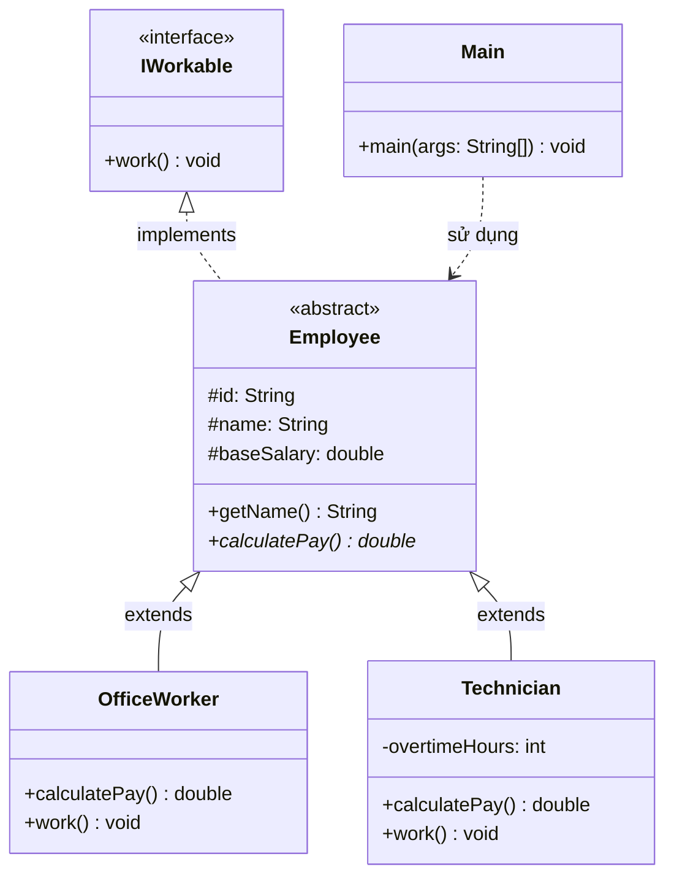
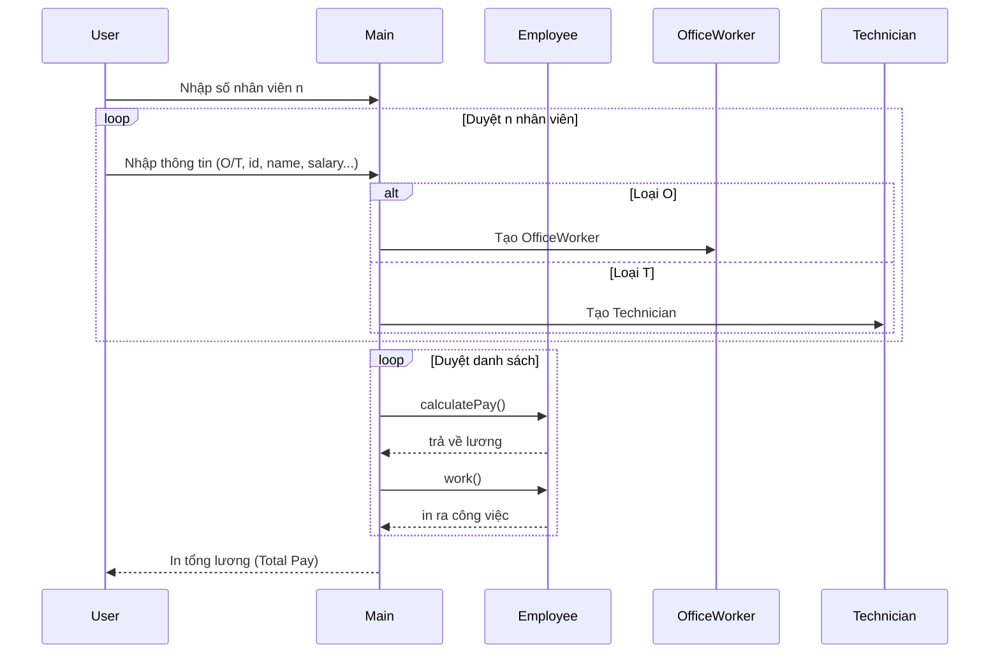

# Bài 3: Employee Management

## Tóm tắt ý tưởng chính

Bài toán sử dụng sự kết hợp giữa **Interface** và **Abstract Class** để xây dựng hệ thống quản lý nhân viên:

- **Interface `IWorkable`**: Định nghĩa hợp đồng chung cho tất cả nhân viên phải có khả năng làm việc (`work()`).
- **Abstract Class `Employee`**: Chứa các thuộc tính chung (`id`, `name`, `baseSalary`) và khai báo phương thức abstract `calculatePay()` để các lớp con tự tính lương theo cách riêng.
- **Lớp con** (`OfficeWorker`, `Technician`): Mỗi loại nhân viên có cách tính lương và công việc khác nhau, nhưng đều tuân theo interface chung.

Nhờ đó, chương trình xử lý danh sách nhân viên hỗn hợp một cách đồng nhất thông qua đa hình.

## Tại sao chọn hướng tiếp cận này?

| Tiêu chí | Interface + Abstract Class | Chỉ Abstract Class | Chỉ Interface |
|-----------|---------------------------|-------------------|---------------|
| Tái sử dụng code | ✅ Thuộc tính chung đặt ở Abstract Class | ✅ Có thể | ❌ Phải khai báo lại ở mọi lớp |
| Linh hoạt mở rộng | ✅ Thêm loại nhân viên mới dễ dàng | ✅ | ✅ |
| Kiểu dữ liệu chung | ✅ Có cả `Employee` và `IWorkable` | ✅ | ✅ |
| Tính an toàn kiểu | ✅ Kiểm tra tại compile time | ✅ | ✅ |

**Lý do chọn kết hợp Interface + Abstract Class:**

1. **Interface `IWorkable`** cho phép các lớp không cùng hệ thống Employee (sau này có thể mở rộng) cũng implement khả năng làm việc.
2. **Abstract Class `Employee`** gom code chung (thuộc tính, constructor, getter) tránh lặp lại ở mỗi lớp con.
3. Kết hợp cả hai vừa có tính linh hoạt của interface vừa có tính tái sử dụng của abstract class.

## Cấu trúc project

```
Bai03/
├── README.md
├── run.sh
└── src/
    ├── IWorkable.java      # Interface định nghĩa hành vi làm việc
    ├── Employee.java        # Abstract class cha
    ├── OfficeWorker.java    # Nhân viên văn phòng
    ├── Technician.java      # Kỹ thuật viên
    └── Main.java            # Chương trình chính
```

## Sơ đồ quan hệ (Mermaid)

### Class Diagram



### Sequence Diagram - Luồng xử lý chính



## Trả lời câu hỏi

> **Class Employee có bắt buộc phải implement hàm `work()` của interface không?**

**Không bắt buộc.**

Vì `Employee` là **abstract class**, nó có quyền "kế thừa" việc implement `work()` mà không cần cài đặt ngay. Khi đó, việc implement `work()` sẽ được đẩy xuống các lớp con cụ thể (`OfficeWorker`, `Technician`).

Nếu `Employee` là **class thường** (không có `abstract`), thì **bắt buộc** phải implement tất cả phương thức của interface, nếu không sẽ bị lỗi biên dịch.

Cụ thể trong bài này:
- `Employee implements IWorkable` nhưng **không** override `work()` → biên dịch thành công ✅
- `OfficeWorker extends Employee` → **phải** override `work()` (vì nó là class cụ thể) ✅
- `Technician extends Employee` → **phải** override `work()` ✅

## Input / Output

**Input:**
```
3
O E01 NguyenVanA 5000000
T E02 TranThiB 5000000 30
O E03 LeVanC 4500000
```

**Output:**
```
NguyenVanA - Pay: 5000000.0
Soạn thảo văn bản
TranThiB - Pay: 5600000.0
Lắp đặt thiết bị
LeVanC - Pay: 4500000.0
Soạn thảo văn bản
Total Pay = 15100000.0
```

## Cách chạy chương trình

1. **Cấp quyền thực thi cho script:**
   ```bash
   chmod +x run.sh
   ```
2. **Chạy chương trình:**
   ```bash
   ./run.sh
   ```
