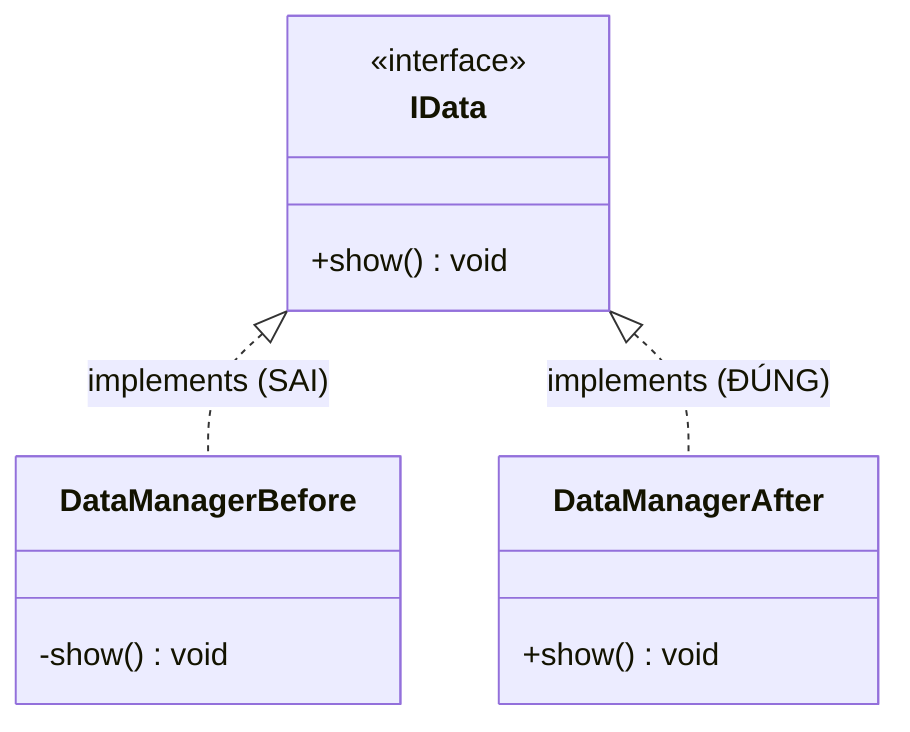
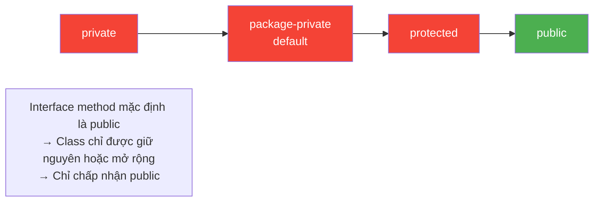

# Bài 4: The Access Modifier Trap

## Tóm tắt

Khi một class `implements` interface, các method override **không thể có quyền truy cập thấp hơn** so với method trong interface. Trong interface, method mặc định là `public abstract`. Nếu class ghi method mà thiếu `public` (mặc định thành package-private), Java sẽ báo lỗi biên dịch.

## Trả lời câu hỏi

**Lỗi gì xuất hiện khi biên dịch?**

```
error: show() in DataManager cannot implement show() in IData
    void show() {
         ^
  attempting to assign weaker access privileges; was public
1 error
```

**Giải thích:**

- Trong `interface IData`, method `void show()` mặc định là **`public abstract`**
- Trong `DataManager`, method `void show()` không có modifier nên mặc định là **package-private** (default access)
- Quy tắc Java: khi override/implements method, quyền truy cập chỉ được **giữ nguyên hoặc mở rộng**, không được **thu hẹp**
- `package-private` < `public` → vi phạm quy tắc → lỗi biên dịch
- **Cách sửa:** Thêm `public` vào method `show()` trong class `DataManager`

## Tiếp cận

Tách code thành 2 phiên bản để minh họa rõ ràng:
- `DataManagerBefore.java` — code lỗi (không có `public`)
- `DataManagerAfter.java` — code đã sửa (có `public`)

Script `run.sh` sẽ biên dịch phiên bản lỗi trước để hiện lỗi, sau đó biên dịch và chạy phiên bản đúng.

**Ưu điểm:** Dễ thấy trực tiếp lỗi và kết quả, không cần chạy thủ công nhiều bước.

## Quy tắc Access Modifier trong Interface/Class

| Modifier trong Interface | Modifier tối thiểu trong Class | Kết quả |
|---|---|---|
| `public` | `public` | Hợp lệ |
| `public` | package-private | **Lỗi** |
| `public` | `protected` | **Lỗi** |
| `public` | `private` | **Lỗi** |

## Sơ đồ Mermaid

### Quan hệ Interface - Class



### Quy trình biên dịch

```mermaid
flowchart TD
    A[Biên dịch DataManagerBefore] --> B{show() là package-private<br/>interface yêu cầu public?}
    B -->|Có| C[Lỗi: attempting to assign<br/>weaker access privileges]
    B -->|Không| D[Thành công]
    C --> E[Sửa: thêm public vào show()]
    E --> F[Biên dịch DataManagerAfter]
    F --> G[Chạy chương trình]
    G --> H[Output: Show Data]
```

### Mức độ Access Modifier



## Cách chạy chương trình

1. Cấp quyền thực thi cho script:
   ```bash
   chmod +x run.sh
   ```

2. Chạy chương trình:
   ```bash
   ./run.sh
   ```

**Kết quả mong đợi:**
```
--- Truoc khi sua: (KHONG co public) ---
error: show() in DataManagerBefore cannot implement show() in IData
  attempting to assign weaker access privileges; was public
1 error

--- Sau khi sua: (CO public) ---
Show Data
```
