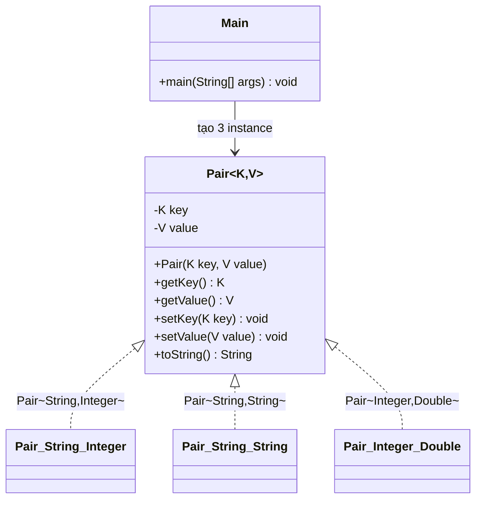
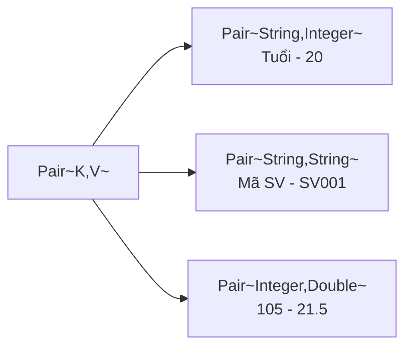

# Bài 5: The Generic Pair

## Ý tưởng chính

Sử dụng **Generic Class** `Pair<K, V>` để tạo một cặp giá trị (key-value) với kiểu dữ liệu linh hoạt, được xác định tại thời điểm khai báo. Compiler kiểm tra kiểu dữ liệu **tại compile-time**, giúp phát hiện lỗi sớm thay vì runtime.

## Lý do chọn Generic

| Cách tiếp cận | Vấn đề |
|---|---|
| `Object` cho tất cả | Phải ép kiểu thủ công, dễ gây `ClassCastException` ở runtime |
| Tạo nhiều class riêng (`StringIntPair`, `StringStringPair`,...) | Lặp code, khó maintain |
| **Generic `Pair<K, V>`** | An toàn kiểu, tái sử dụng, ít code |

**Ưu điểm chính:**
- **Type safety**: Sai kiểu → compiler báo lỗi ngay khi viết code
- **Code reuse**: Một class dùng cho mọi tổ hợp kiểu
- **Không casting**: Không cần ép kiểu khi lấy giá trị

## Trả lời câu hỏi: Thử nghiệm lỗi

Dòng `// pair1.setValue("abc");` sẽ gây **compile error** vì `pair1` là `Pair<String, Integer>`, method `setValue()` chỉ chấp nhận `Integer`, không chấp nhận `String`.

```
error: incompatible types: String cannot be converted to Integer
        pair1.setValue("abc");
                       ^
```

Đây chính là lợi ích của Generic: lỗi được phát hiện **ngay khi biên dịch**, không phải chờ đến lúc chạy chương trình.

## Sơ đồ cấu trúc





## Cách chạy chương trình

1. Cấp quyền thực thi cho script:
```bash
chmod +x run.sh
```

2. Chạy chương trình:
```bash
./run.sh
```

## Kết quả

```
Tuổi - 20
Mã SV - SV001
105 - 21.5
```
