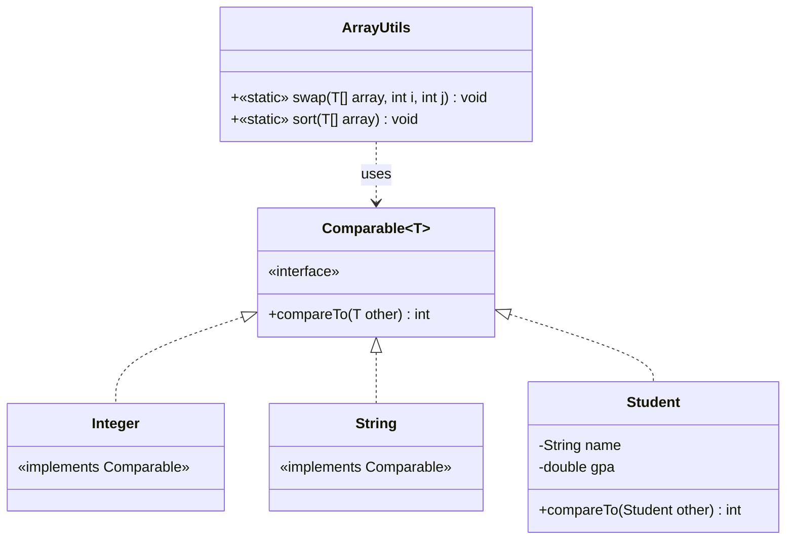

# Bài 6: The Universal Sorter

## Tóm tắt ý tưởng chính

Sử dụng **Generic** (`<T>`) trong Java để viết thuật toán Bubble Sort **một lần**, chạy được cho **mọi kiểu dữ liệu** có khả năng so sánh (`Comparable`).

- `<T>` — cho phép phương thức hoạt động với bất kỳ kiểu đối tượng nào.
- `<T extends Comparable<T>>` — ràng buộc `T` phải implements `Comparable`, đảm bảo gọi được `compareTo()`.

## Lý do chọn Generic + Bubble Sort

| Tiêu chí | Cách tiếp cận này | Cách khác (viết riêng cho từng kiểu) |
|---|---|---|
| Tái sử dụng code | Viết 1 lần, dùng cho Integer, String, Student, ... | Viết lại cho mỗi kiểu |
| An toàn kiểu | Compile-time kiểm tra | Dễ lỗi khi copy-paste |
| Dễ mở rộng | Thêm kiểu mới chỉ cần `implements Comparable` | Phải viết thêm hàm sort |

**Ưu điểm chính:**
- **DRY** (Don't Repeat Yourself): Logic sort chỉ viết 1 lần.
- **Type safety**: Lỗi so sánh bị bắt ở compile-time, không phải runtime.
- **Open for extension**: Muốn sort `Employee`, `Product`, ... chỉ cần implements `Comparable`.

## Cấu trúc chương trình



## Luồng hoạt động của Bubble Sort

```mermaid
flowchart TD
    A[Bắt đầu] --> B[i = 0]
    B --> C{i < n - 1?}
    C -- Không --> K[Kết thúc]
    C -- Có --> D[j = 0]
    D --> E{j < n - i - 1?}
    E -- Không --> F[i++]
    F --> C
    E -- Có --> G{arr[j] > arr[j+1]?}
    G -- Có --> H[swap arr[j], arr[j+1]]
    G -- Không --> I[j++]
    H --> I
    I --> E
```

## Cách chạy chương trình

1. Cấp quyền thực thi cho script:
   ```bash
   chmod +x run.sh
   ```

2. Chạy chương trình:
   ```bash
   ./run.sh
   ```

## Kết quả

```
1 2 3 5
C++ Java Python
Binh(2.8) An(3.5) Chi(3.9)
```
