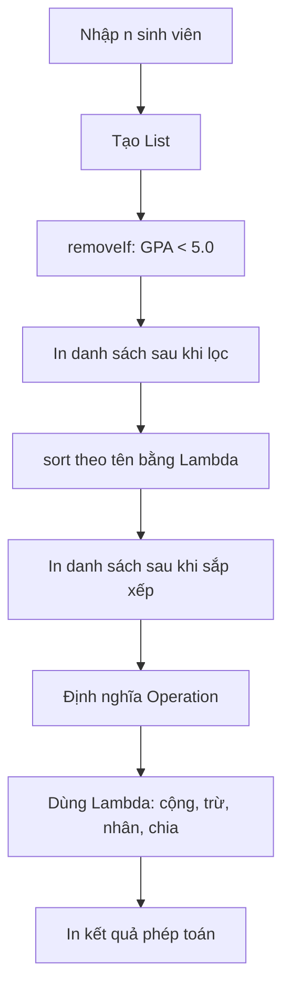
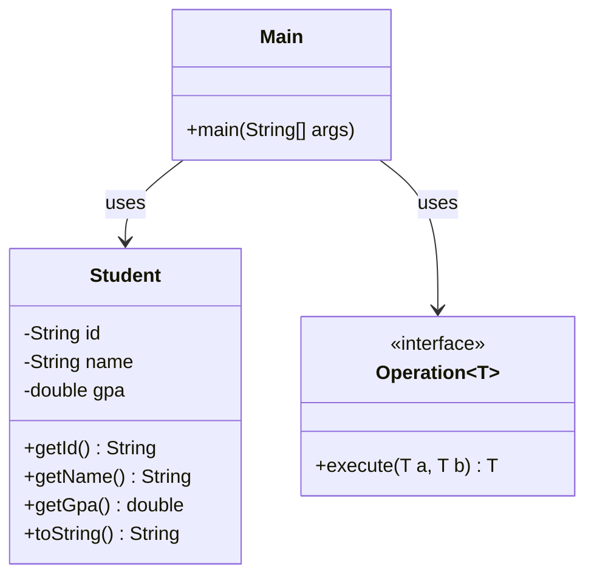
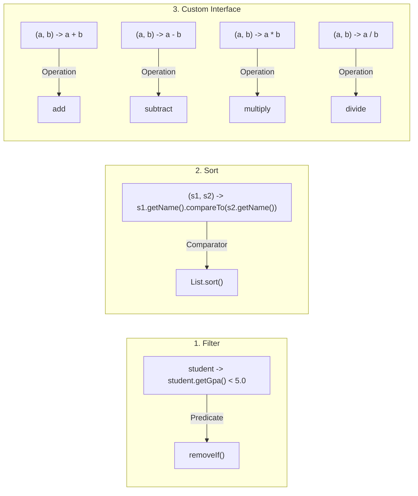

# Bài 7: Lambda Revolution

## Tóm tắt ý tưởng chính

Bài tập minh hoạ 3 cách sử dụng **Lambda Expression** trong Java:

1. **Filter** - Dùng `removeIf()` với Predicate lambda để lọc phần tử khỏi List
2. **Sort** - Dùng `List.sort()` với Comparator lambda để sắp xếp tuỳ biến
3. **Custom Functional Interface** - Tự định nghĩa interface generic `Operation<T>` rồi dùng lambda gán hành vi

Lambda giúp thay thế anonymous class rườm rà bằng cú pháp ngắn gọn, tăng tính đọc và bảo trì code.

## Lý do chọn hướng tiếp cận này

| Cách tiếp cận | Ưu điểm |
|---|---|
| `removeIf()` + lambda | Thay thế vòng lặp `for` + `if` thủ công, code gọn hơn, ít lỗi |
| `List.sort()` + lambda | Thay thế anonymous `Comparator`, không cần tạo class riêng |
| `@FunctionalInterface` | Đảm bảo interface chỉ có 1 abstract method, an toàn cho lambda |

**So sánh với cách cũ:**
```java
// Cách cũ: Anonymous class
Collections.sort(students, new Comparator<Student>() {
    public int compare(Student s1, Student s2) {
        return s1.getName().compareTo(s2.getName());
    }
});

// Cách mới: Lambda
students.sort((s1, s2) -> s1.getName().compareTo(s2.getName()));
```

## Cấu trúc bài giải

```
Bai07/
├── src/
│   ├── Student.java        # Lớp Student (id, name, gpa)
│   ├── Operation.java      # Functional Interface generic
│   └── Main.java           # Chương trình chính
├── run.sh                  # Script chạy chương trình
├── input.txt               # Dữ liệu mẫu
└── README.md
```

## Luồng chương trình



## Quan hệ các lớp



## Lambda trong bài



## Cách chạy chương trình

1. Cấp quyền thực thi cho script:
```bash
chmod +x run.sh
```

2. Chạy chương trình:
```bash
./run.sh
```

Sau đó nhập dữ liệu theo định dạng:
```
4
S01 NguyenVanA 7.5
S02 TranThiB 4.5
S03 LeVanC 8.0
S04 PhamVanD 5.0
```

## Kết quả

```
After removing GPA < 5.0:
S01 NguyenVanA 7.5
S03 LeVanC 8.0
S04 PhamVanD 5.0
After sorting by name:
S03 LeVanC 8.0
S01 NguyenVanA 7.5
S04 PhamVanD 5.0
```
