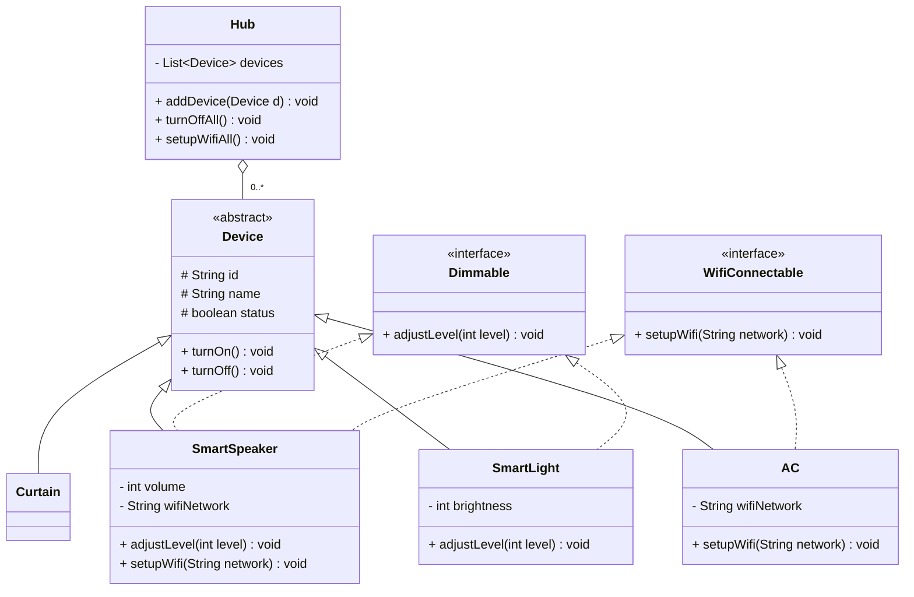

# Bài 8: Hệ thống nhà thông minh

## 1. Tóm tắt ý tưởng chính của lời giải

Bài toán yêu cầu quản lý nhiều loại thiết bị có **hành vi chung** (bật/tắt) nhưng **khả năng riêng** (điều chỉnh mức độ, kết nối Wifi).

Để thiết kế hệ thống linh hoạt và dễ mở rộng, chương trình sử dụng:

- **Abstract Class** để định nghĩa cấu trúc chung của thiết bị
- **Interface** để mô tả các khả năng riêng biệt
- **Polymorphism** và **instanceof** để xử lý danh sách thiết bị hỗn hợp

---

## 2. Lý do lựa chọn hướng tiếp cận này

### Phân biệt Abstract Class và Interface trong bài này

| Abstract Class `Device` | Interface `Dimmable` / `WifiConnectable` |
|---|---|
| Dữ liệu chung: id, name, status | Không chứa dữ liệu, chỉ khai báo phương thức |
| Hành vi chung: turnOn(), turnOff() | Khả năng riêng: adjustLevel(), setupWifi() |
| Tất cả thiết bị **đều có** | Chỉ **một số** thiết bị có |
| Quan hệ **"is-a"**: SmartLight **là** Device | Quan hệ **"can-do"**: SmartLight **có thể** điều chỉnh mức độ |

### Ưu điểm so với cách khác

- **Thay vì dùng cờ boolean `hasWifi` trong Device**: Vi phạm OCP — mỗi khả năng mới phải sửa class gốc. Dùng interface thì chỉ cần `implements`.
- **Thay vì dùng một class Device duy nhất với mọi thuộc tính**: Curtain không có Wifi nhưng vẫn chứa field wifi, gây lãng phí.
- **Dễ mở rộng**: Muốn thêm "Thiết bị có thể hẹn giờ" → tạo interface `Schedulable` → implement vào class cần, không sửa code cũ.

### Trả lời câu hỏi: Khi nào dùng Abstract Class, khi nào dùng Interface?

| Dùng **Abstract Class** khi... | Dùng **Interface** khi... |
|---|---|
| Các subclass **chia sẻ dữ liệu chung** (id, name, status) | Cần mô tả **khả năng** mà nhiều class không liên quan đều có |
| Cần **code reuse** — logic bật/tắt giống nhau cho mọi thiết bị | Cần **đa kế thừa hành vi** — SmartSpeaker vừa Dimmable vừa WifiConnectable |
| Có **quan hệ "is-a"** rõ ràng | Có **quan hệ "can-do"** |

> **Quy tắc thumb**: Abstract class = "Tôi **là** cái gì đó" (is-a). Interface = "Tôi **có thể làm** cái gì đó" (can-do).

---

## 3. Sơ đồ lớp hệ thống



---

## 4. Thiết kế các lớp

### Abstract Class: `Device`

Chứa thông tin và hành vi chung của **mọi** thiết bị.

| Thuộc tính | Ý nghĩa |
|---|---|
| `id` | Mã định danh |
| `name` | Tên thiết bị |
| `status` | Trạng thái bật/tắt |

| Phương thức | Ý nghĩa |
|---|---|
| `turnOn()` | Bật thiết bị |
| `turnOff()` | Tắt thiết bị |

### Interface: `Dimmable`

Mô tả khả năng **điều chỉnh mức độ** (độ sáng, âm lượng).

| Phương thức | Ý nghĩa |
|---|---|
| `adjustLevel(int level)` | Điều chỉnh mức độ (0-100) |

Thiết bị implement: **SmartLight**, **SmartSpeaker**

### Interface: `WifiConnectable`

Mô tả khả năng **kết nối Wifi**.

| Phương thức | Ý nghĩa |
|---|---|
| `setupWifi(String network)` | Kết nối mạng Wifi |

Thiết bị implement: **AC**, **SmartSpeaker**

### Bảng tổng hợp thiết bị

| Thiết bị | Kế thừa | Implements |
|---|---|---|
| SmartLight | Device | Dimmable |
| AC | Device | WifiConnectable |
| SmartSpeaker | Device | Dimmable, WifiConnectable |
| Curtain | Device | — |

---

## 5. Xử lý Input

Chương trình đọc dữ liệu từ bàn phím.

```
4
L 01 LivingRoomLight
AC 02 BedroomAC
S 03 SmartSpeaker
C 04 WindowCurtain
```

| Code | Thiết bị |
|---|---|
| L | SmartLight (Đèn thông minh) |
| AC | AC (Máy lạnh) |
| S | SmartSpeaker (Loa thông minh) |
| C | Curtain (Rèm cửa tự động) |

---

## 6. Output

```
Turn Off All Devices:
LivingRoomLight turned off
BedroomAC turned off
SmartSpeaker turned off
WindowCurtain turned off
Setup Wifi:
BedroomAC connected to wifi
SmartSpeaker connected to wifi
```

### Giải thích logic xử lý

**Turn Off All**: Duyệt toàn bộ danh sách `List<Device>`, gọi `turnOff()` lên mọi thiết bị — tận dụng hành vi chung từ abstract class.

**Setup Wifi**: Duyệt danh sách, kiểm tra `device instanceof WifiConnectable` — chỉ thiết bị nào implement interface mới được cấu hình. Curtain không implement → bị bỏ qua.

---

## 7. Cách chạy chương trình

1. Cấp quyền thực thi cho script:
   ```bash
   chmod +x run.sh
   ```

2. Chạy chương trình:
   ```bash
   ./run.sh
   ```

---

## 8. Ý nghĩa bài học

### Abstract Class

Dùng khi tất cả subclass **chia sẻ dữ liệu và hành vi chung**. Mọi thiết bị đều có id, name, status, turnOn/turnOff → đặt vào abstract class `Device`.

### Interface

Dùng khi cần mô tả **khả năng riêng biệt** mà chỉ một số class có. Wifi không phải thiết bị nào cũng có → `WifiConnectable`. Điều chỉnh mức độ cũng vậy → `Dimmable`.

### Polymorphism

Hub quản lý `List<Device>` chứa hỗn hợp SmartLight, AC, SmartSpeaker, Curtain — xử lý thống nhất mà không cần biết chi tiết từng loại.

### instanceof + Downcasting

Khi cần xử lý theo khả năng riêng (chỉ WifiConnectable mới setup wifi), dùng `instanceof` kiểm tra rồi downcasting để gọi phương thức interface.
