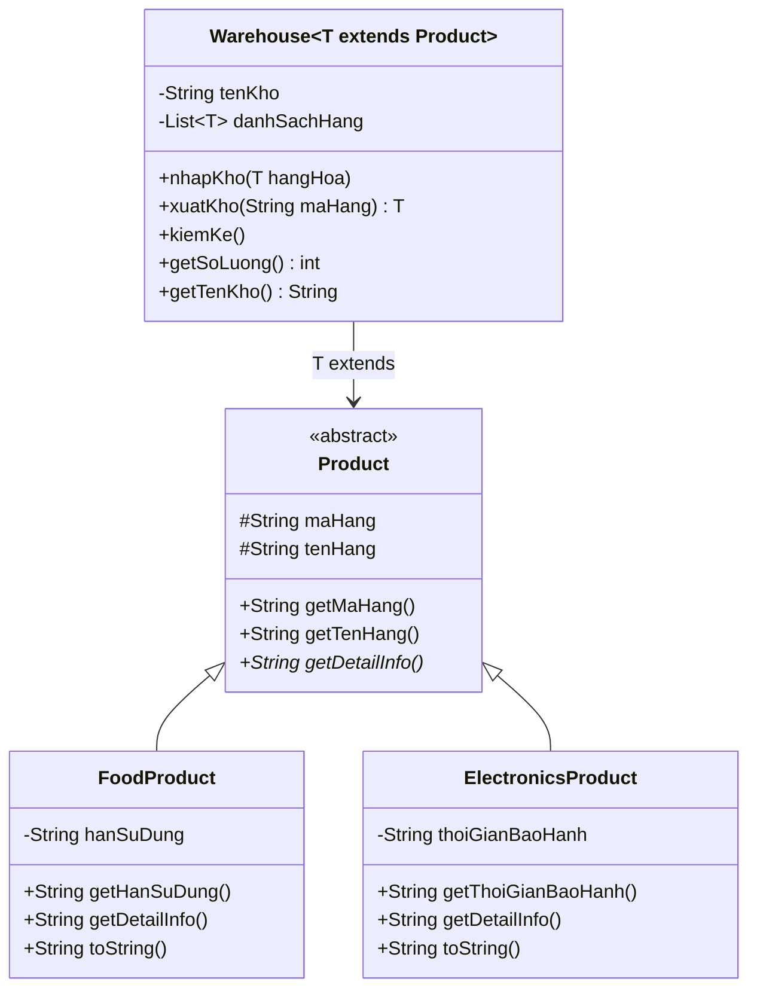

# Bài 9: Kho hàng tổng quát (Generics + Bounded Type Parameters)

## Ý tưởng chính

- Sử dụng **Generics** `<T extends Product>` để tạo lớp `Warehouse<T>` quản lý kho tổng quát.
- **Bounded Type Parameters** đảm bảo kho chỉ chứa đối tượng là `Product` (hoặc lớp con), không nhận `String`, `Integer` hay bất kỳ kiểu linh tinh nào — kiểm tra tại **compile-time**.
- Lớp trừu tượng `Product` định nghĩa giao diện chung (`maHang`, `tenHang`, `getDetailInfo()`), các lớp con (`FoodProduct`, `ElectronicsProduct`) override `toString()` để in thông tin kiểm kê riêng biệt.

## Lý do chọn hướng tiếp cận này

| Thay thế | Nhược điểm | Generics ưu điểm |
|---|---|---|
| `ArrayList<Object>` | Không kiểm tra kiểu, cast sai → runtime error | Compile-time type safety |
| Tạo `FoodWarehouse`, `ElectronicsWarehouse` riêng | Lặp code, khó mở rộng | Viết 1 lần, dùng cho mọi loại hàng |
| `instanceof` check trong `nhapKho` | Chống chỉ định OOP, lỗi runtime | Compiler chặn hoàn toàn |

## Sơ đồ lớp (Mermaid)



## Cách chạy chương trình

1. Cấp quyền thực thi cho script:
```
chmod +x run.sh
```
2. Chạy chương trình:
```
./run.sh
```

## Kết quả chạy

```
Da nhap: TP01 - Sua tuoi vao Kho Thuc Pham
Da nhap: TP02 - Banh quy vao Kho Thuc Pham
Da nhap: TP03 - Ga dong lanh vao Kho Thuc Pham

Da nhap: DT01 - Tivi Samsung vao Kho Dien Tu
Da nhap: DT02 - Laptop Dell vao Kho Dien Tu
Da nhap: DT03 - Dien thoai iPhone vao Kho Dien Tu

=== Kiem ke Kho Thuc Pham ===
Sua tuoi - 31/12/2026
Banh quy - 15/06/2026
Ga dong lanh - 01/03/2027
Tong so luong: 3

=== Kiem ke Kho Dien Tu ===
Tivi Samsung - 24 thang
Laptop Dell - 12 thang
Dien thoai iPhone - 12 thang
Tong so luong: 3

--- Xuat kho ---
Da xuat: TP02 - Banh quy khoi Kho Thuc Pham
Da xuat: DT01 - Tivi Samsung khoi Kho Dien Tu

=== Kiem ke Kho Thuc Pham ===
Sua tuoi - 31/12/2026
Ga dong lanh - 01/03/2027
Tong so luong: 2

=== Kiem ke Kho Dien Tu ===
Laptop Dell - 12 thang
Dien thoai iPhone - 12 thang
Tong so luong: 2
```
