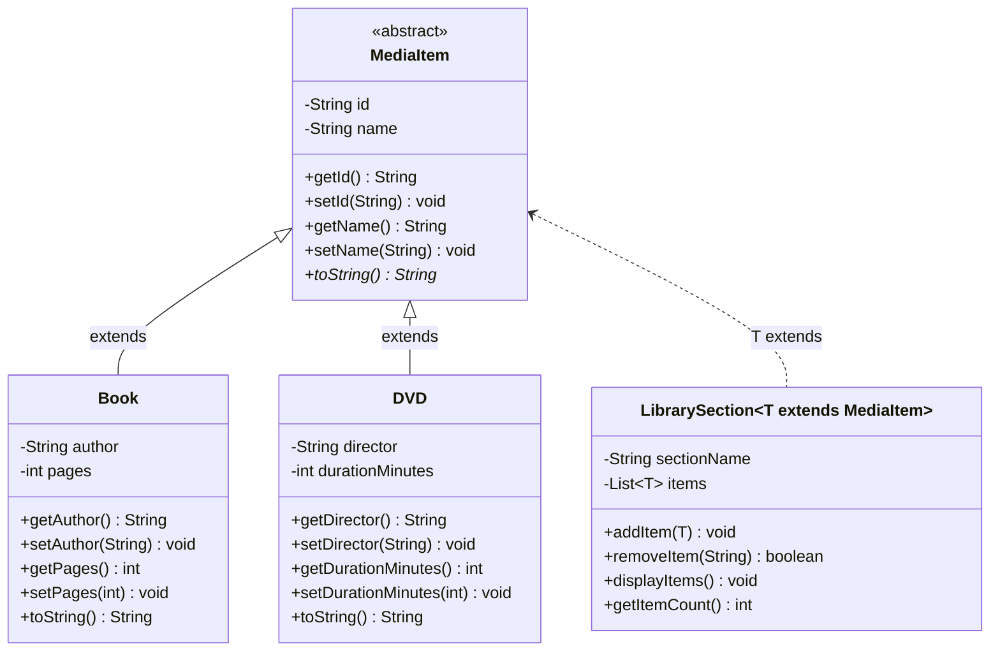

# Bài 10: Hệ thống Quản lý Thư viện Đa phương tiện

## Tóm tắt ý tưởng chính

Bài toán yêu cầu xây dựng hệ thống quản lý thư viện với các loại tài liệu khác nhau (Book, DVD) sử dụng **Abstract Class**, **Generics với Bounded Type Parameters** và **Tính đa hình**.

Giải pháp gồm các thành phần:

- `MediaItem` (Abstract Class): Lớp trừu tượng gốc chứa `id`, `name` và phương thức abstract `toString()` — mọi tài liệu đều phải kế thừa từ đây.
- `Book`: Kế thừa `MediaItem`, bổ sung `author`, `pages`. Override `toString()` in "Tên sách - Tác giả - Số trang".
- `DVD`: Kế thừa `MediaItem`, bổ sung `director`, `durationMinutes`. Override `toString()` in "Tên đĩa - Đạo diễn - Thời lượng (phút)".
- `LibrarySection<T extends MediaItem>`: Generic class quản lý một khu vực, chỉ chấp nhận đúng 1 loại tài liệu, cung cấp `addItem()`, `removeItem()`, `displayItems()`.

## Lý do chọn hướng tiếp cận này

| Cách tiếp cận | Ưu điểm |
|---|---|
| **Abstract class `MediaItem`** | Ép buộc mọi tài liệu phải có `id`, `name`, đồng thời khai báo `toString()` abstract để mỗi subclass tự định nghĩa format hiển thị — thể hiện đúng tính **đa hình**. |
| **Generic `<T extends MediaItem>`** | Compile-time guarantee: khu vực sách `LibrarySection<Book>` không thể nhận DVD và ngược lại. Không cần runtime check, tránh lỗi logic ngay từ khi biên dịch. |
| **Dùng `ArrayList<T>`** | Lưu trữ động, hỗ trợ thêm/xóa nhanh theo index. |

So với cách dùng `ArrayList<Object>` rồi cast kiểu khi hiển thị, cách này **an toàn về kiểu** (type-safe), **ngăn lỗi compile-time**, và code rõ ràng hơn.

## Cách chạy chương trình

1. Cấp quyền thực thi cho script:
```bash
chmod +x run.sh
```

2. Chạy chương trình:
```bash
./run.sh
```

## Sơ đồ lớp (Class Diagram) — Mermaid



## Trả lời câu hỏi trong bài

**Vì sao dùng Abstract Class mà không dùng Interface?**

`MediaItem` cần chứa **state** (`id`, `name`) và constructor — Interface trong Java không thể có instance field hay constructor. Abstract class cho phép khai báo chung thuộc tính + ép buộc subclass override `toString()`, phù hợp bài này.

**Vì sao Generic lại cần `extends MediaItem`?**

Bounded type parameter `<T extends MediaItem>` đảm bảo `LibrarySection` chỉ nhận các lớp con của `MediaItem`. Nếu thử tạo `LibrarySection<String>`, compiler sẽ báo lỗi ngay — đảm bảo **type safety** ở compile-time.
