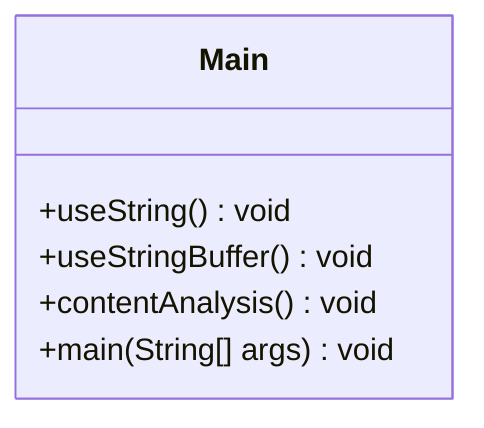

# Bài 1: String vs StringBuffer

## 1. Tóm tắt ý tưởng chính của lời giải

Bài toán yêu cầu:

- So sánh hiệu năng giữa `String` và `StringBuffer` khi thực hiện nối chuỗi nhiều lần.
- Phân tích một đoạn văn bản để:
  - Đếm số lượng câu dựa trên các dấu kết thúc câu `.`, `?`, `!`
  - Tìm và thay thế tất cả từ `"Java"` thành `"Python"`

Giải pháp được xây dựng dựa trên các nguyên tắc:

- Tách bài toán thành các hàm riêng biệt cho từng chức năng
- So sánh trực tiếp hai cách nối chuỗi:
  - `String` với phép cộng chuỗi `+=`
  - `StringBuffer` với phương thức `append()`
- Sử dụng `StringBuffer` để xử lý nội dung văn bản và thay thế chuỗi hiệu quả hơn

---

## 2. Thiết kế hệ thống

### Lớp Main

```java
public class Main {
    public static void useString() { ... }
    public static void useStringBuffer() { ... }
    public static void contentAnalysis() { ... }
    public static void main(String[] args) { ... }
}
```

#### Thuộc tính

- Chương trình không có thuộc tính cấp lớp
- Dữ liệu được xử lý thông qua các biến cục bộ trong từng hàm

#### Vai trò

- Điều phối toàn bộ chương trình
- Chứa các hàm tương ứng với từng yêu cầu của bài toán
- Thực hiện chạy và in kết quả ra màn hình

---

### Hàm `useString()`

- Tạo một chuỗi rỗng bằng `String`
- Dùng vòng lặp `for` chạy 100000 lần
- Mỗi lần nối thêm chuỗi `"Hello"`
- Đo thời gian thực hiện bằng `System.currentTimeMillis()`

#### Logic xử lý

```text
Khởi tạo s = ""
Lặp 100000 lần:
    s = s + "Hello"
Tính thời gian thực hiện
In độ dài chuỗi và thời gian chạy
```

---

### Hàm `useStringBuffer()`

- Tạo một đối tượng `StringBuffer`
- Dùng vòng lặp `for` chạy 100000 lần
- Mỗi lần thêm `"Hello"` bằng `append()`
- Đo thời gian thực hiện

#### Logic xử lý

```text
Khởi tạo sb = new StringBuffer()
Lặp 100000 lần:
    sb.append("Hello")
Tính thời gian thực hiện
In độ dài chuỗi và thời gian chạy
```

---

### Hàm `contentAnalysis()`

- Tạo một đoạn văn bản bằng `StringBuffer`
- Duyệt từng ký tự để đếm số câu
- Tìm và thay thế tất cả từ `"Java"` thành `"Python"`

#### Logic xử lý

```text
Khởi tạo đoạn văn bản text

Đếm số câu:
    Duyệt từng ký tự
    Nếu gặp '.', '?', '!' thì tăng biến đếm

Thay thế từ:
    Trong khi còn xuất hiện "Java":
        Tìm vị trí của "Java"
        Thay bằng "Python"

In kết quả
```

---

## Sơ đồ lớp



---

## 3. Lý do lựa chọn hướng tiếp cận và ưu điểm

### Hướng tiếp cận

- Chia bài toán thành 3 phần rõ ràng:
  - Nối chuỗi bằng `String`
  - Nối chuỗi bằng `StringBuffer`
  - Phân tích và thay thế nội dung văn bản
- Tách logic theo từng hàm để dễ đọc, dễ kiểm tra và dễ bảo trì
- Dùng cấu trúc đơn giản, phù hợp với mục tiêu bài tập về xử lý chuỗi trong Java

### Ưu điểm

- Dễ hiểu và dễ cài đặt
- Dễ kiểm tra từng chức năng
- Thể hiện rõ sự khác nhau giữa `String` và `StringBuffer`
- Thuận tiện mở rộng thêm các chức năng xử lý văn bản
- Code gọn và ít lặp logic

### Kiến thức rút ra

- `String` là immutable nên nối chuỗi nhiều lần sẽ kém hiệu quả hơn
- `StringBuffer` cho phép thay đổi nội dung trực tiếp nên phù hợp với các thao tác nối chuỗi lặp lại
- Có thể xử lý văn bản bằng cách duyệt từng ký tự hoặc tìm kiếm chuỗi con
- `System.currentTimeMillis()` giúp đo thời gian thực thi chương trình

---

## 4. Ví dụ

### Input

```text
Không có input từ người dùng
```

### Output

```text
String length: 500000 | Time: ...ms
StringBuffer length: 500000 | Time: ...ms
Number of sentences: 5
Replaced text: Python is a powerful language. Do you like Python? I think Python is widely used! However, learning Python requires practice. Python, Python, and more Python!
```

---

## 5. Kết luận

- Bài toán được giải bằng cách sử dụng `String` và `StringBuffer` để so sánh hiệu quả nối chuỗi
- Thiết kế đơn giản, phù hợp với mục tiêu học tập về xử lý chuỗi trong Java
- Có thể mở rộng thêm:
  - Nhập văn bản từ bàn phím
  - Đếm số từ
  - Đếm số lần xuất hiện của từng từ
  - Hỗ trợ thay thế không phân biệt chữ hoa chữ thường

---

## 6. Cách chạy chương trình

1. Cấp quyền thực thi cho script:
  ```bash
  chmod +x run.sh
  ```

2. Chạy chương trình:
  ```bash
  ./run.sh
  ```
