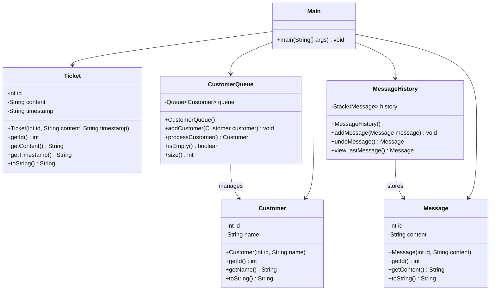

# Bài 2: Customer Support System

## 1. Tóm tắt ý tưởng chính của lời giải

Bài toán yêu cầu:

- Xây dựng mô phỏng một hệ thống hỗ trợ khách hàng.
- Áp dụng cơ chế **FIFO (Queue)** để quản lý thứ tự khách chờ.
- Áp dụng cơ chế **LIFO (Stack)** để quản lý lịch sử tin nhắn trả lời của nhân viên.
- Thực hiện mô phỏng quá trình:
  - Khách A đến
  - Khách B đến
  - Xử lý khách A
  - Gõ 3 tin nhắn trả lời
  - Undo 1 tin nhắn
  - Xử lý khách B

Giải pháp được xây dựng dựa trên các nguyên tắc:

- Tách bài toán thành nhiều lớp riêng biệt để dễ quản lý.
- Dùng `Queue<Customer>` để mô phỏng hàng đợi khách hàng theo nguyên tắc đến trước xử lý trước.
- Dùng `Stack<Message>` để mô phỏng lịch sử tin nhắn theo nguyên tắc vào sau ra trước.
- Tổ chức chương trình theo hướng đối tượng với các lớp `Customer`, `Message`, `Ticket`, `CustomerQueue`, `MessageHistory` và `Main`.

---

## 2. Thiết kế hệ thống

### Lớp `Customer`

```java
public class Customer {
    private int id;
    private String name;
}
```

#### Thuộc tính

- `id`: mã khách hàng
- `name`: tên khách hàng

#### Vai trò

- Biểu diễn một khách hàng trong hệ thống
- Được đưa vào hàng đợi chờ xử lý

---

### Lớp `Message`

```java
public class Message {
    private int id;
    private String content;
}
```

#### Thuộc tính

- `id`: mã tin nhắn
- `content`: nội dung tin nhắn

#### Vai trò

- Biểu diễn một tin nhắn trả lời của nhân viên
- Được lưu vào lịch sử tin nhắn để hỗ trợ undo và xem tin nhắn gần nhất

---

### Lớp `Ticket`

```java
public class Ticket {
    private int id;
    private String content;
    private String timestamp;
}
```

#### Thuộc tính

- `id`: mã phiếu hỗ trợ
- `content`: nội dung yêu cầu hỗ trợ
- `timestamp`: thời điểm tạo phiếu

#### Vai trò

- Biểu diễn một yêu cầu hỗ trợ của khách hàng
- Được xây dựng theo yêu cầu đề bài
- Trong phiên bản hiện tại, lớp này đã được tạo nhưng chưa tích hợp trực tiếp vào luồng xử lý chính

---

### Lớp `CustomerQueue`

```java
public class CustomerQueue {
    private Queue<Customer> queue;
}
```

#### Thuộc tính

- `queue`: hàng đợi khách hàng, cài đặt bằng `LinkedList`

#### Vai trò

- Quản lý danh sách khách hàng đang chờ
- Đảm bảo khách đến trước được xử lý trước

#### Logic xử lý

```text
Thêm khách:
    queue.offer(customer)

Xử lý khách:
    Nếu hàng đợi rỗng:
        thông báo không còn khách
    Ngược lại:
        lấy khách đầu hàng đợi bằng queue.poll()
```

---

### Lớp `MessageHistory`

```java
public class MessageHistory {
    private Stack<Message> history;
}
```

#### Thuộc tính

- `history`: ngăn xếp lưu lịch sử tin nhắn

#### Vai trò

- Lưu các tin nhắn nhân viên đã nhập
- Hỗ trợ chức năng undo
- Hỗ trợ xem tin nhắn gần nhất

#### Logic xử lý

```text
Thêm tin nhắn:
    history.push(message)

Undo:
    Nếu stack rỗng:
        thông báo không có tin nhắn
    Ngược lại:
        history.pop()

Xem tin nhắn gần nhất:
    Nếu stack rỗng:
        thông báo không có lịch sử
    Ngược lại:
        history.peek()
```

---

### Lớp `Main`

```java
public class Main {
    public static void main(String[] args) { ... }
}
```

#### Vai trò

- Khởi tạo dữ liệu mô phỏng
- Thêm khách A và B vào hàng đợi
- Xử lý khách A trước
- Tạo lịch sử tin nhắn cho khách A
- Thực hiện thao tác xem tin nhắn gần nhất và undo
- Tiếp tục xử lý khách B
- Kiểm tra trường hợp hàng đợi rỗng

---

## Sơ đồ lớp



---

## 3. Lý do lựa chọn hướng tiếp cận và ưu điểm

### Hướng tiếp cận

- Sử dụng **Queue** cho hàng đợi khách hàng vì bài toán cần cơ chế **FIFO**
- Sử dụng **Stack** cho lịch sử tin nhắn vì bài toán cần cơ chế **LIFO**
- Tách chức năng thành các lớp riêng biệt để mỗi lớp đảm nhiệm một vai trò rõ ràng
- Mô phỏng luồng xử lý đúng với thực tế của một hệ thống hỗ trợ khách hàng đơn giản

### Ưu điểm

- Thiết kế rõ ràng, dễ hiểu
- Đúng với bản chất của cấu trúc dữ liệu được yêu cầu
- Dễ mở rộng thêm chức năng sau này
- Mỗi lớp có trách nhiệm riêng, giúp code dễ bảo trì
- Thuận tiện kiểm tra từng phần của chương trình

### Kiến thức rút ra

- `Queue` phù hợp với các bài toán xử lý theo thứ tự đến trước ra trước
- `Stack` phù hợp với các thao tác undo hoặc lưu vết hành động gần nhất
- Có thể mô hình hóa một bài toán thực tế bằng các lớp Java đơn giản
- Việc tách lớp giúp chương trình gọn hơn và dễ phát triển hơn

---

## 4. Ví dụ

### Input

```text
Không có input từ người dùng.
Dữ liệu được mô phỏng trực tiếp trong chương trình:
- Khách A đến
- Khách B đến
- Xử lý A
- Gõ 3 tin nhắn
- Undo 1 tin nhắn
- Xử lý B
```

### Output

```text
Added customer: A
Added customer: B

Processing customer: A
Start a chat with A
Message saved: Hello, how can I assist you?
Message saved: Please provide your order number.
Message saved: Thank you, I'm checking the system.
Last message: Thank you, I'm checking the system.
Undo message: Thank you, I'm checking the system.
Last message: Please provide your order number.

Processing customer: B
Start a chat with B

No customers in the queue.
```

---

## 5. Kết luận

- Bài toán được giải bằng cách kết hợp `Queue` và `Stack` để mô phỏng hệ thống hỗ trợ khách hàng
- `CustomerQueue` giúp quản lý khách hàng theo đúng nguyên tắc FIFO
- `MessageHistory` giúp quản lý lịch sử trả lời và hỗ trợ undo theo đúng nguyên tắc LIFO
- Thiết kế hiện tại đơn giản, phù hợp với yêu cầu bài tập
- Có thể mở rộng thêm:
  - Gắn `Ticket` trực tiếp với từng khách hàng
  - Thêm trạng thái xử lý ticket
  - Lưu toàn bộ lịch sử chat của từng khách
  - Nhập dữ liệu từ bàn phím thay vì mô phỏng sẵn

---

## 6. Cách chạy chương trình

1. Cấp quyền thực thi cho script:
  ```bash
  chmod +x run.sh
  ```

2. Chạy chương trình:
  ```bash
  ./run.sh
  ```
