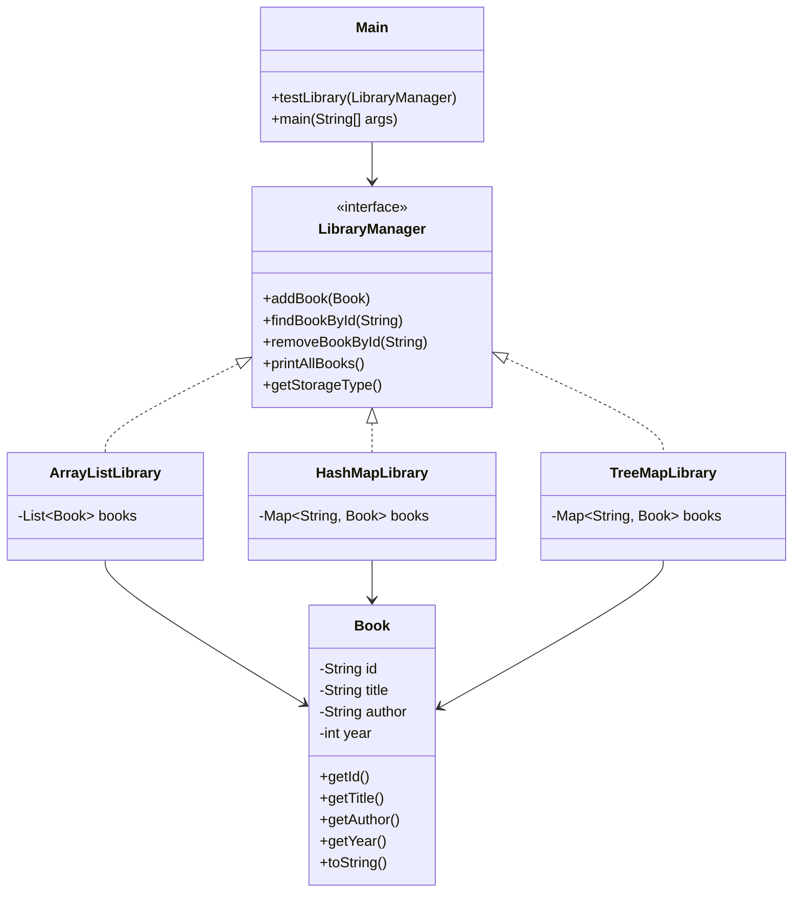

# Bài 5: Library Management System

## 1. Tóm tắt ý tưởng chính của lời giải

Bài toán xây dựng hệ thống quản lý thư viện đơn giản với các chức năng:

- Thêm sách
- Tìm kiếm theo id
- Xóa sách
- In danh sách sách

Hướng tiếp cận:

- Xây dựng lớp dữ liệu `Book`
- Xây dựng interface `LibraryManager`
- Cài đặt 3 cách lưu trữ:
  - ArrayList
  - HashMap
  - TreeMap
- So sánh cách hoạt động và hiệu năng giữa các cấu trúc

---

## 2. Thiết kế hệ thống

### Class: `Book`

```java
public class Book
````

#### Thuộc tính:

* `id` – mã sách duy nhất
* `title` – tên sách
* `author` – tác giả
* `year` – năm xuất bản 

#### Vai trò:

* Đại diện cho một cuốn sách trong hệ thống

---

### Interface: `LibraryManager`

```java
public interface LibraryManager
```

#### Vai trò:

* Định nghĩa các chức năng quản lý chung cho thư viện: thêm, tìm, xóa, in danh sách và lấy loại cấu trúc lưu trữ 

---

### Class: `ArrayListLibrary`

```java
class ArrayListLibrary implements LibraryManager
```

#### Cấu trúc dữ liệu:

* `List<Book> books`

#### Vai trò:

* Lưu danh sách sách bằng `ArrayList`

#### Logic xử lý:

* **Thêm sách**: duyệt toàn bộ danh sách để kiểm tra trùng id, nếu chưa có thì thêm vào
* **Tìm sách theo id**: duyệt tuần tự từng phần tử
* **Xóa sách theo id**: dùng `Iterator` để duyệt và xóa đúng phần tử cần tìm
* **In danh sách**: duyệt toàn bộ danh sách và in từng sách ra màn hình 

---

### Class: `HashMapLibrary`

```java
class HashMapLibrary implements LibraryManager
```

#### Cấu trúc dữ liệu:

* `Map<String, Book> books`

#### Vai trò:

* Lưu sách theo cặp `id -> Book`

#### Logic xử lý:

* **Thêm sách**: kiểm tra `containsKey(id)` rồi `put`
* **Tìm sách theo id**: dùng `get(id)`
* **Xóa sách theo id**: dùng `remove(id)`
* **In danh sách**: duyệt `books.values()` để in toàn bộ sách 

---

### Class: `TreeMapLibrary`

```java
class TreeMapLibrary implements LibraryManager
```

#### Cấu trúc dữ liệu:

* `Map<String, Book> books = new TreeMap<>()`

#### Vai trò:

* Lưu sách theo `id -> Book`, đồng thời tự động sắp xếp theo id

#### Logic xử lý:

* **Thêm sách**: kiểm tra trùng id rồi thêm
* **Tìm sách theo id**: dùng `get(id)`
* **Xóa sách theo id**: dùng `remove(id)`
* **In danh sách**: duyệt `values()` theo thứ tự id đã được sắp xếp 

---

### Class: `Main`

```java
public class Main
```

#### Vai trò:

* Chạy thử hệ thống với cả 3 cách lưu trữ

#### Logic xử lý:

* Tạo 3 đối tượng:

  * `ArrayListLibrary`
  * `HashMapLibrary`
  * `TreeMapLibrary`
* Gọi hàm `testLibrary(...)` cho từng loại
* Trong mỗi lần test:

  * Thêm 5 sách
  * Thử thêm sách trùng id
  * In danh sách
  * Tìm sách theo id
  * Xóa sách theo id
  * In lại danh sách sau khi xóa 

---

## Sơ đồ lớp



---

## 3. Lý do lựa chọn hướng tiếp cận và ưu điểm

### Hướng tiếp cận

* Tách riêng **lớp dữ liệu** (`Book`) và **lớp quản lý**
* Dùng **interface `LibraryManager`** để chuẩn hóa các chức năng chung
* Cài đặt cùng một bài toán bằng 3 cấu trúc dữ liệu khác nhau để so sánh

### Ưu điểm

* Dễ mở rộng thêm cấu trúc lưu trữ mới
* Dễ so sánh hiệu năng giữa các cách cài đặt
* Thể hiện rõ sự khác nhau giữa `List`, `HashMap`, `TreeMap`
* Vận dụng được OOP và cấu trúc dữ liệu trong cùng một bài

### Kiến thức rút ra

* Cách dùng `ArrayList`, `HashMap`, `TreeMap`
* Cách thiết kế bằng interface
* Hiểu vai trò của key trong `Map`
* So sánh độ phức tạp thời gian của từng cấu trúc

---

## 4. Ví dụ

* **Không có input từ người dùng**
* Dữ liệu được mô phỏng trực tiếp trong chương trình

### Các thao tác được thực hiện trong `main`

* Thêm 5 cuốn sách
* Thử thêm 1 sách trùng id
* Tìm sách `B003`
* Tìm sách không tồn tại `B999`
* Xóa sách `B002`
* Xóa sách không tồn tại `B999`
* In lại danh sách sau khi xóa 

### Output (rút gọn)

```text
==============================
Testing with structures:ArrayList
==============================

1. Add books:
Add B001: true
Add B002: true
Add B003: true
Add B004: true
Add B005: true
Add duplicate B003: false

2. Current book list:
Book{id='B001', title='Java Programming', author='James Gosling', year=2020}
Book{id='B002', title='Data Structures', author='Mark Allen', year=2018}
Book{id='B003', title='Algorithms', author='Thomas Cormen', year=2009}
Book{id='B004', title='Database Systems', author='Elmasri', year=2017}
Book{id='B005', title='Operating Systems', author='Silberschatz', year=2015}

3. Search for books by ID:
Found book with ID B003: Book{id='B003', title='Algorithms', author='Thomas Cormen', year=2009}
No books with that ID were found B999

4. Delete book by ID:
Deleted book B002: true
Deleted book B999: false

5. List after deletion:
Book{id='B001', title='Java Programming', author='James Gosling', year=2020}
Book{id='B003', title='Algorithms', author='Thomas Cormen', year=2009}
Book{id='B004', title='Database Systems', author='Elmasri', year=2017}
Book{id='B005', title='Operating Systems', author='Silberschatz', year=2015}
```

Với `HashMap` và `TreeMap`, chương trình cũng thực hiện cùng các thao tác tương tự, chỉ khác ở cách lưu trữ và đặc điểm truy xuất.

---

## 5. Trả lời câu hỏi phân tích

### 5.1. Độ phức tạp khi tìm kiếm trong ArrayList, HashMap và TreeMap

#### ArrayList

* Tìm theo id phải duyệt từng phần tử từ đầu đến cuối
* Độ phức tạp: **O(n)**

#### HashMap

* Tìm theo key bằng cơ chế băm
* Độ phức tạp trung bình: **O(1)**
* Trường hợp xấu có thể chậm hơn khi xảy ra nhiều xung đột băm

#### TreeMap

* Dữ liệu được tổ chức theo cây có thứ tự
* Độ phức tạp tìm kiếm: **O(log n)**

---

### 5.2. Cấu trúc dữ liệu nào phù hợp nhất khi số lượng sách nhỏ?

* **ArrayList** là lựa chọn phù hợp khi số lượng sách nhỏ
* Lý do:

  * Dễ cài đặt
  * Dễ hiểu
  * Không cần cấu trúc ánh xạ phức tạp
  * Với dữ liệu ít, việc duyệt tuyến tính vẫn chấp nhận được

---

### 5.3. Cấu trúc dữ liệu nào phù hợp nhất khi số lượng sách rất lớn?

* **HashMap** là lựa chọn phù hợp nhất
* Lý do:

  * Tìm kiếm, thêm, xóa theo id rất nhanh
  * Đặc biệt hiệu quả khi thao tác nhiều trên tập dữ liệu lớn
  * `id` là khóa duy nhất nên rất phù hợp để làm key trong `HashMap`

---

### 5.4. Cấu trúc dữ liệu nào phù hợp nhất khi cần dữ liệu được sắp xếp theo id?

* **TreeMap** là phù hợp nhất
* Lý do:

  * Tự động sắp xếp theo key
  * Khi in danh sách sách, dữ liệu sẽ ra theo thứ tự id tăng dần
  * Không cần sắp xếp thêm sau khi lưu

---

### 5.5. Vì sao HashMap thường tìm kiếm nhanh hơn ArrayList?

* Với **ArrayList**, muốn tìm một cuốn sách theo id thì phải kiểm tra từng phần tử cho đến khi gặp đúng sách cần tìm
* Với **HashMap**, id được dùng trực tiếp làm key, nên có thể truy cập gần như ngay lập tức thông qua cơ chế băm
* Vì vậy:

  * `ArrayList` thường mất **O(n)**
  * `HashMap` thường mất **O(1)**

Nói ngắn gọn:
**HashMap nhanh hơn vì nó không cần duyệt toàn bộ dữ liệu như ArrayList.**

---

## 6. Kết luận

Chương trình đã xây dựng thành công hệ thống quản lý thư viện bằng 3 cấu trúc dữ liệu khác nhau.

Qua bài này có thể rút ra:

* **ArrayList**: phù hợp khi dữ liệu nhỏ, đơn giản
* **HashMap**: phù hợp khi cần truy xuất nhanh theo id
* **TreeMap**: phù hợp khi vừa cần quản lý theo id, vừa cần dữ liệu có thứ tự

Bài làm không chỉ đáp ứng yêu cầu chức năng mà còn giúp so sánh rõ ràng giữa các cấu trúc dữ liệu trong thực tế.

---

## 7. Cách chạy chương trình

1. Cấp quyền thực thi cho script:
  ```bash
  chmod +x run.sh
  ```

2. Chạy chương trình:
  ```bash
  ./run.sh
  ```
