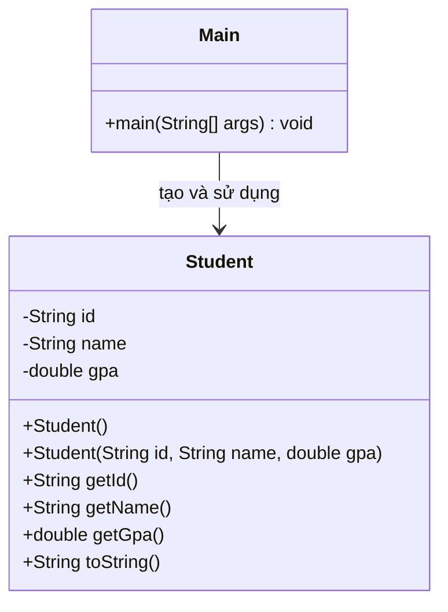

# Bài 4: Danh sách sinh viên

## 1. Tóm tắt ý tưởng chính của lời giải

Chương trình xây dựng một lớp `Student` để biểu diễn thông tin sinh viên gồm mã sinh viên, tên và điểm GPA. Danh sách sinh viên được nhập từ bàn phím cho đến khi người dùng nhập `END` ở phần mã sinh viên.

Sau khi nhập xong, chương trình ghi từng đối tượng `Student` vào tệp `students.dat` bằng `ObjectOutputStream`. Tiếp đó, chương trình đọc lại các đối tượng từ tệp bằng `ObjectInputStream` và in danh sách ra màn hình cho đến khi gặp cuối tệp.

Giải pháp tập trung vào cơ chế **serialization** trong Java để lưu trữ và khôi phục đối tượng.

## 2. Thiết kế hệ thống

### 2.1. Lớp `Student`

**Khai báo ngắn:**
Lớp dữ liệu dùng để biểu diễn một sinh viên và hỗ trợ ghi/đọc đối tượng xuống tệp.

**Thuộc tính:**

* `id: String` — mã sinh viên
* `name: String` — họ tên sinh viên
* `gpa: double` — điểm trung bình

**Thành phần chính:**

* Constructor rỗng `Student()`
* Constructor đầy đủ tham số `Student(String id, String name, double gpa)`
* Các phương thức getter:

  * `getId()`
  * `getName()`
  * `getGpa()`
* Ghi đè `toString()` để hiển thị thông tin sinh viên khi in ra màn hình

**Vai trò:**

* Là lớp thực thể chính của bài toán
* Cài đặt `Serializable` để phục vụ việc ghi và đọc đối tượng bằng luồng đối tượng

---

### 2.2. Lớp `Main`

**Khai báo ngắn:**
Lớp chứa hàm `main`, điều phối toàn bộ luồng xử lý của chương trình.

**Biến chính trong chương trình:**

* `Scanner sc` — đọc dữ liệu từ bàn phím
* `ArrayList<Student> list` — lưu danh sách sinh viên trong bộ nhớ
* `String fileName = "students.dat"` — tên tệp dùng để lưu dữ liệu

**Vai trò:**

* Nhập danh sách sinh viên từ bàn phím
* Ghi danh sách sinh viên ra tệp
* Đọc lại dữ liệu từ tệp
* In danh sách sinh viên ra màn hình
* Bắt và xử lý các ngoại lệ theo yêu cầu đề bài

**Logic xử lý:**

1. **Nhập danh sách sinh viên**

   * Chương trình yêu cầu nhập `id`
   * Nếu `id` là `END` thì dừng
   * Nếu không, tiếp tục nhập `name` và `gpa`
   * Tạo đối tượng `Student` rồi thêm vào `ArrayList<Student>`

2. **Ghi dữ liệu ra tệp**

   * Dùng `ObjectOutputStream` kết hợp với `FileOutputStream`
   * Ghi lần lượt từng đối tượng `Student` trong danh sách vào tệp `students.dat`

3. **Đọc dữ liệu từ tệp**

   * Dùng `ObjectInputStream` kết hợp với `FileInputStream`
   * Đọc liên tục từng đối tượng `Student`
   * In từng sinh viên ra màn hình
   * Khi đọc đến cuối tệp thì phát sinh `EOFException` và kết thúc quá trình đọc

4. **Xử lý ngoại lệ**

   * `FileNotFoundException`
   * `IOException`
   * `ClassNotFoundException`
   * `EOFException`

## Sơ đồ lớp



## 3. Lý do lựa chọn hướng tiếp cận và ưu điểm

### Hướng tiếp cận

Bài làm sử dụng hướng tiếp cận đơn giản và phù hợp với yêu cầu đề bài:

* Tách riêng lớp `Student` để biểu diễn dữ liệu sinh viên
* Dùng `ArrayList<Student>` để lưu danh sách trong bộ nhớ
* Dùng `ObjectOutputStream` và `ObjectInputStream` để ghi/đọc trực tiếp đối tượng
* Dùng cơ chế bắt ngoại lệ để xử lý các lỗi phát sinh khi thao tác với tệp

### Ưu điểm

* Cấu trúc rõ ràng, dễ hiểu
* Đúng với yêu cầu của đề về `Serializable`
* Ghi và đọc lại được trực tiếp đối tượng `Student`
* Dễ mở rộng nếu sau này muốn bổ sung thêm thuộc tính cho sinh viên
* Việc dùng `toString()` giúp in danh sách thuận tiện và gọn

### Kiến thức rút ra

* Cách cài đặt `Serializable` cho lớp dữ liệu
* Cách sử dụng `ObjectOutputStream` để ghi object xuống file
* Cách sử dụng `ObjectInputStream` để đọc object từ file
* Cách sử dụng `EOFException` để xác định đã đọc hết tệp
* Cách tổ chức chương trình Java thành lớp dữ liệu và lớp điều khiển chính

## 4. Ví dụ

### Input mẫu

```text
Nhap danh sach sinh vien (nhap ID = END de dung):
Nhap id: SV01
Nhap ten: Nguyen Van A
Nhap gpa: 3.5
Nhap id: SV02
Nhap ten: Tran Thi B
Nhap gpa: 3.8
Nhap id: END
```

### Output mong đợi

```text
Da ghi danh sach sinh vien vao tep.

Danh sach sinh vien doc tu tep:
Student{id='SV01', name='Nguyen Van A', gpa=3.5}
Student{id='SV02', name='Tran Thi B', gpa=3.8}
Da doc het file.
```

## 5. Kết luận

Bài toán đã được giải bằng cách xây dựng lớp `Student` có khả năng tuần tự hóa, nhập danh sách sinh viên từ bàn phím, ghi danh sách vào tệp nhị phân và đọc lại để hiển thị ra màn hình.

Chương trình đáp ứng đúng các yêu cầu cốt lõi của đề bài, đồng thời thể hiện rõ cách làm việc với object stream và xử lý ngoại lệ trong Java.

## 6. Cách chạy chương trình

1. Cấp quyền thực thi cho script:
  ```bash
  chmod +x run.sh
  ```

2. Chạy chương trình:
  ```bash
  ./run.sh
  ```
