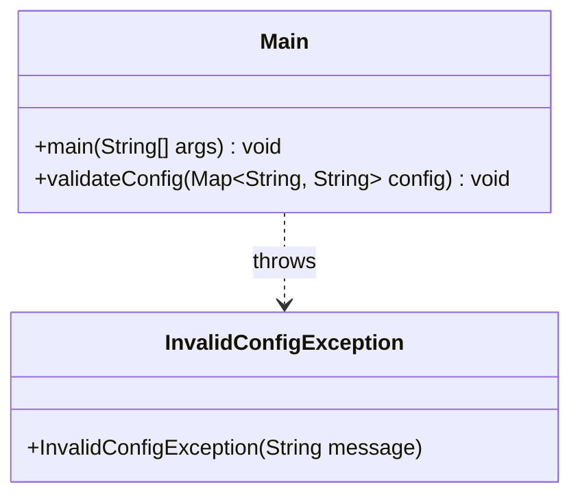

# Bài 5: Đọc cấu hình + kiểm tra dữ liệu (Custom Exception)

## 1. Tóm tắt ý tưởng chính của lời giải

Chương trình đọc đường dẫn file cấu hình từ bàn phím bằng `Scanner`, sau đó mở file bằng `FileReader` kết hợp `BufferedReader` để đọc lần lượt từng dòng. Mỗi dòng hợp lệ có dạng `key=value` sẽ được tách thành khóa và giá trị rồi lưu vào `Map<String, String>` để tiện tra cứu và kiểm tra dữ liệu.

Sau khi đọc xong, chương trình kiểm tra tính hợp lệ của cấu hình:
- Bắt buộc phải có `username` và `timeout`
- `timeout` phải là số nguyên và lớn hơn `0`
- Nếu có `maxConnections` thì giá trị này phải là số nguyên và lớn hơn hoặc bằng `1`

Nếu dữ liệu không hợp lệ, chương trình sử dụng ngoại lệ tự định nghĩa `InvalidConfigException` để thông báo lỗi rõ ràng.

## 2. Thiết kế hệ thống

### 2.1. Lớp `Main`

```java
public class Main
````

#### Vai trò

Đây là lớp điều khiển toàn bộ luồng xử lý của chương trình:

* Nhập đường dẫn file config
* Đọc file cấu hình
* Tách dữ liệu `key=value`
* Lưu dữ liệu vào `Map<String, String>`
* Kiểm tra tính hợp lệ của cấu hình
* Xử lý ngoại lệ và đảm bảo đóng file trong `finally`

#### Logic xử lý chính

* Sử dụng `Scanner` để nhập đường dẫn file từ người dùng.
* Sử dụng `BufferedReader` để đọc file từng dòng.
* Bỏ qua dòng rỗng.
* Với mỗi dòng có chứa dấu `=` hợp lệ:

  * lấy phần bên trái làm `key`
  * lấy phần bên phải làm `value`
  * lưu vào `Map<String, String>`
* Gọi hàm `validateConfig(...)` để kiểm tra dữ liệu.
* Nếu hợp lệ, in ra thông báo `Config loaded successfully.` và toàn bộ cấu hình đã đọc được.
* Dù xảy ra lỗi hay không, chương trình vẫn luôn in `Program finished.`

#### Phương thức nổi bật

##### `main(String[] args)`

Là điểm bắt đầu chương trình, chịu trách nhiệm thực hiện toàn bộ quá trình đọc và xử lý file cấu hình.

##### `validateConfig(Map<String, String> config)`

Thực hiện kiểm tra dữ liệu cấu hình:

* kiểm tra sự tồn tại của `username`
* kiểm tra sự tồn tại của `timeout`
* ép kiểu `timeout` sang số nguyên
* kiểm tra `timeout > 0`
* nếu có `maxConnections` thì ép kiểu sang số nguyên và kiểm tra `maxConnections >= 1`

### 2.2. Lớp `InvalidConfigException`

```java
public class InvalidConfigException extends Exception
```

#### Vai trò

Đây là lớp ngoại lệ tự định nghĩa, được dùng để biểu diễn các lỗi liên quan đến cấu hình không hợp lệ theo đúng yêu cầu đề bài.

#### Ý nghĩa sử dụng

Việc tách riêng ngoại lệ này giúp chương trình:

* phân biệt lỗi cấu hình với lỗi đọc file hoặc lỗi định dạng số
* thông báo lỗi rõ ràng hơn
* dễ mở rộng kiểm tra dữ liệu về sau

## Sơ đồ lớp



## 3. Lý do lựa chọn hướng tiếp cận và ưu điểm

### Hướng tiếp cận

Bài làm chọn cách đọc file cấu hình theo từng dòng và lưu dữ liệu vào `Map<String, String>`. Đây là cách phù hợp vì file cấu hình có dạng đơn giản `key=value`, dữ liệu cần truy xuất theo tên khóa, và việc kiểm tra tính hợp lệ sau khi đọc xong cũng trở nên dễ thực hiện.

Ngoài ra, bài làm sử dụng ngoại lệ tự định nghĩa `InvalidConfigException` để tách riêng nhóm lỗi nghiệp vụ khỏi các lỗi hệ thống như không tìm thấy file hay lỗi I/O.

### Ưu điểm

* Cấu trúc chương trình rõ ràng, dễ theo dõi
* Phân biệt được nhiều loại lỗi khác nhau
* Dễ mở rộng thêm các tham số cấu hình mới
* Sử dụng `finally` để đảm bảo đóng file đúng yêu cầu
* Dùng `Map` giúp việc kiểm tra sự tồn tại của khóa nhanh và gọn

### Kiến thức rút ra

Qua bài này có thể rèn luyện các nội dung quan trọng sau:

* Đọc file text bằng `FileReader` và `BufferedReader`
* Tách chuỗi theo cấu trúc `key=value`
* Sử dụng `Map<String, String>` để quản lý dữ liệu cấu hình
* Tạo và sử dụng custom exception trong Java
* Xử lý nhiều loại ngoại lệ khác nhau bằng `try-catch-finally`

## 4. Ví dụ

### Input

Chương trình có nhận input từ người dùng:

* người dùng nhập đường dẫn tới file config từ bàn phím

Ví dụ nội dung file config hợp lệ:

```txt
username=admin
timeout=30
maxConnections=5
```

### Output mong đợi

```txt
Nhap duong dan file config: <duong_dan_file>
Config loaded successfully.
username = admin
timeout = 30
maxConnections = 5
Program finished.
```

### Ví dụ khi thiếu `username`

```txt
Invalid config: missing username
Program finished.
```

### Ví dụ khi `timeout` không phải số nguyên

```txt
Invalid number format.
Program finished.
```

### Ví dụ khi không tìm thấy file

```txt
Config file not found.
Program finished.
```

## 5. Kết luận

Bài toán được giải bằng cách đọc file cấu hình dạng text, lưu các cặp `key=value` vào `Map`, sau đó kiểm tra tính hợp lệ của các tham số bằng hàm riêng. Chương trình cũng xử lý đầy đủ các ngoại lệ quan trọng như không tìm thấy file, lỗi I/O, lỗi định dạng số và lỗi cấu hình không hợp lệ thông qua custom exception.

Cách tổ chức này phù hợp với các bài xử lý file cấu hình cơ bản và có thể mở rộng thêm nhiều quy tắc kiểm tra dữ liệu khác trong tương lai.

## 6. Cách chạy chương trình

1. Cấp quyền thực thi cho script:
  ```bash
  chmod +x run.sh
  ```

2. Chạy chương trình:
  ```bash
  ./run.sh
  ```
