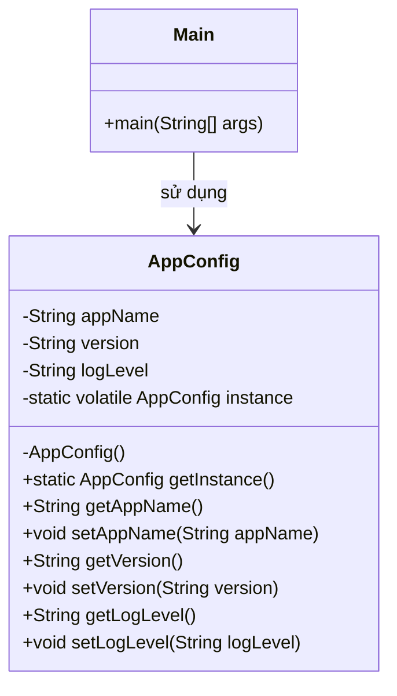

# Bài 1: Quản lý cấu hình ứng dụng

## 1. Tóm tắt ý tưởng chính của lời giải

Bài toán yêu cầu xây dựng lớp `AppConfig` để quản lý cấu hình ứng dụng theo mẫu thiết kế **Singleton**.

Giải pháp sử dụng:
- **Constructor private** để ngăn tạo đối tượng từ bên ngoài.
- **Biến tĩnh `instance`** để lưu thể hiện duy nhất.
- **Phương thức `getInstance()` khởi tạo lười (lazy initialization)**, chỉ tạo đối tượng khi cần dùng lần đầu.
- **Double-checked locking kết hợp `volatile`** để đảm bảo an toàn đa luồng.

Ngoài ra, chương trình có lớp `Main` tạo 2 luồng, mỗi luồng gọi `AppConfig.getInstance()` và in ra `hashCode()` để kiểm tra rằng toàn bộ chương trình chỉ dùng chung một đối tượng cấu hình.

## 2. Thiết kế hệ thống

### 2.1. Lớp `AppConfig`

**Khai báo ngắn:**  
Lớp quản lý cấu hình ứng dụng theo mẫu Singleton.

**Thuộc tính:**
- `appName`: tên ứng dụng
- `version`: phiên bản ứng dụng
- `logLevel`: mức log
- `instance`: thể hiện duy nhất của lớp `AppConfig`

**Vai trò:**
- Lưu trữ các thông tin cấu hình dùng chung trong toàn bộ chương trình.
- Đảm bảo chỉ có đúng một đối tượng cấu hình được tạo ra.
- Cung cấp điểm truy cập toàn cục thông qua `getInstance()`.

### 2.2. Lớp `Main`

**Khai báo ngắn:**  
Lớp chạy chương trình để kiểm tra hoạt động của Singleton trong môi trường đa luồng.

**Vai trò:**
- Tạo 2 luồng song song.
- Trong mỗi luồng, lấy đối tượng `AppConfig` bằng `getInstance()`.
- In `hashCode()` của đối tượng để xác minh cả hai luồng cùng nhận một instance.

## Sơ đồ lớp



## 3. Lý do lựa chọn hướng tiếp cận và ưu điểm

### Hướng tiếp cận

Bài giải sử dụng mẫu thiết kế **Singleton** vì đề bài yêu cầu lớp `AppConfig` chỉ có một thể hiện duy nhất trong toàn chương trình.

Để đáp ứng đủ yêu cầu:
- Dùng **lazy initialization** để chỉ khởi tạo khi thật sự cần.
- Dùng **`synchronized`** kết hợp **double-check locking** để tránh tạo nhiều đối tượng trong môi trường đa luồng.
- Dùng **`volatile`** để đảm bảo tính nhất quán của biến `instance` giữa các luồng.

### Ưu điểm

- Đảm bảo đúng yêu cầu: chỉ có một đối tượng `AppConfig`.
- Tiết kiệm tài nguyên vì đối tượng chỉ được tạo khi cần.
- Hoạt động an toàn trong môi trường đa luồng.
- Dễ dùng vì mọi nơi trong chương trình đều truy cập qua `AppConfig.getInstance()`.

### Kiến thức rút ra

- Hiểu cách áp dụng mẫu thiết kế **Singleton** vào bài toán thực tế.
- Biết sự khác nhau giữa Singleton cơ bản và Singleton an toàn đa luồng.
- Nắm được vai trò của `volatile`, `synchronized` và double-checked locking trong Java.

## 4. Ví dụ

**Không có input từ người dùng.**  
Dữ liệu được mô phỏng trực tiếp trong chương trình.

Ví dụ kết quả khi chạy:

```text
Thread-1 - hashCode: 1450495309
Thread-2 - hashCode: 1450495309
```

Hoặc thứ tự in có thể thay đổi:

```text
Thread-2 - hashCode: 1450495309
Thread-1 - hashCode: 1450495309
```

Điểm quan trọng là **hai dòng có cùng `hashCode()`**, chứng tỏ chỉ có **một đối tượng `AppConfig` duy nhất** được sử dụng.

## 5. Kết luận

Bài toán đã được giải bằng mẫu thiết kế **Singleton** với cơ chế **khởi tạo lười** và **an toàn đa luồng**.  
Lớp `AppConfig` phù hợp để quản lý cấu hình dùng chung trong ứng dụng, đồng thời chương trình kiểm chứng rõ rằng nhiều luồng vẫn chỉ truy cập cùng một instance.

Trong tương lai, lớp này có thể mở rộng thêm:
- đọc cấu hình từ file,
- ghi log theo `logLevel`,
- cập nhật cấu hình động trong ứng dụng.

## 6. Cách chạy chương trình

1. Cấp quyền thực thi cho script:
  ```bash
  chmod +x run.sh
  ```

2. Chạy chương trình:
  ```bash
  ./run.sh
  ```
