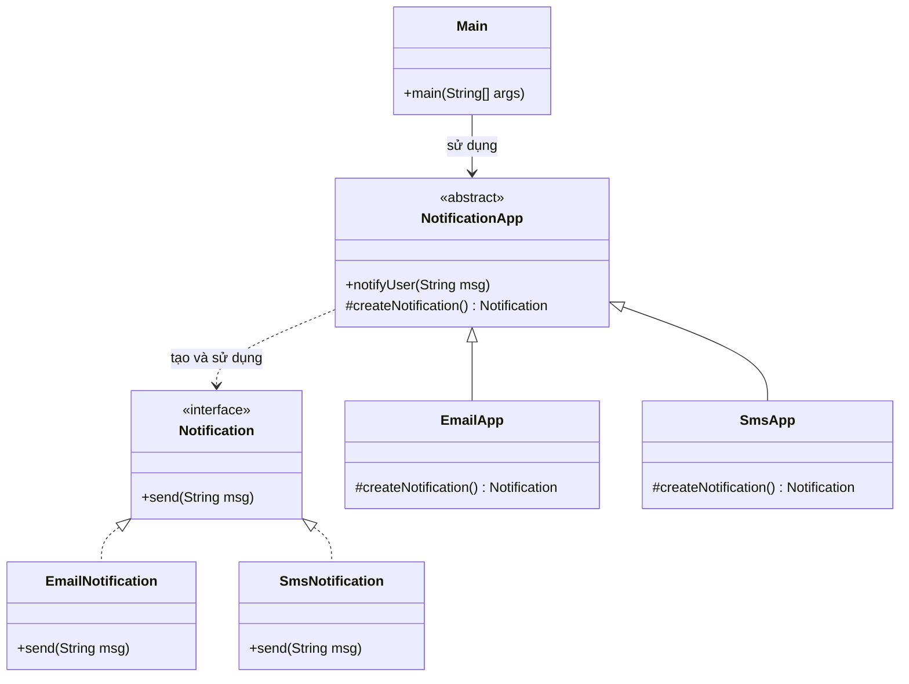

# Bài 2: Hệ thống gửi thông báo

## 1. Tóm tắt ý tưởng chính của lời giải

Bài toán yêu cầu thiết kế hệ thống gửi thông báo hỗ trợ nhiều kênh, trong đó:
- Có giao diện `Notification` với phương thức `send(String msg)`.
- Có ít nhất hai loại thông báo cụ thể: `EmailNotification` và `SmsNotification`.
- Có lớp trừu tượng `NotificationApp` chứa logic gửi thông báo qua phương thức `notifyUser(String msg)`.
- Việc tạo đối tượng thông báo không thực hiện trực tiếp trong `notifyUser()`, mà được ủy quyền cho phương thức `createNotification()`.

Giải pháp phù hợp là sử dụng mẫu thiết kế **Factory Method**:
- Lớp cha `NotificationApp` định nghĩa quy trình chung để gửi thông báo.
- Các lớp con như `EmailApp`, `SmsApp` quyết định loại `Notification` cụ thể được tạo ra.

Cách làm này giúp tách biệt **phần sử dụng đối tượng** và **phần tạo đối tượng**, đồng thời dễ mở rộng thêm các kênh gửi mới.

## 2. Thiết kế hệ thống

### 2.1. Giao diện `Notification`

**Khai báo ngắn:**  
Giao diện chung cho các loại thông báo.

**Phương thức:**
- `send(String msg)`: gửi nội dung thông báo.

**Vai trò:**
- Đóng vai trò abstraction cho các loại thông báo.
- Giúp chương trình làm việc với kiểu chung thay vì phụ thuộc trực tiếp vào từng lớp cụ thể.

### 2.2. Lớp `EmailNotification`

**Khai báo ngắn:**  
Lớp cài đặt giao diện `Notification` để gửi thông báo qua email.

**Vai trò:**
- Hiện thực phương thức `send(String msg)`.
- In ra nội dung thông báo email.

### 2.3. Lớp `SmsNotification`

**Khai báo ngắn:**  
Lớp cài đặt giao diện `Notification` để gửi thông báo qua SMS.

**Vai trò:**
- Hiện thực phương thức `send(String msg)`.
- In ra nội dung thông báo SMS.

### 2.4. Lớp trừu tượng `NotificationApp`

**Khai báo ngắn:**  
Lớp cha chứa logic gửi thông báo dùng chung.

**Phương thức:**
- `notifyUser(String msg)`: thực hiện quy trình gửi thông báo.
- `createNotification()`: factory method trả về một đối tượng `Notification`.

**Vai trò:**
- Xử lý phần logic chung của ứng dụng gửi thông báo.
- Không khởi tạo trực tiếp `EmailNotification` hay `SmsNotification`.
- Giao việc quyết định loại thông báo cụ thể cho các lớp con.

### 2.5. Lớp `EmailApp`

**Khai báo ngắn:**  
Lớp con của `NotificationApp` dùng để tạo thông báo email.

**Vai trò:**
- Cài đặt `createNotification()`.
- Trả về đối tượng `EmailNotification`.

### 2.6. Lớp `SmsApp`

**Khai báo ngắn:**  
Lớp con của `NotificationApp` dùng để tạo thông báo SMS.

**Vai trò:**
- Cài đặt `createNotification()`.
- Trả về đối tượng `SmsNotification`.

### 2.7. Lớp `Main`

**Khai báo ngắn:**  
Lớp chạy chương trình.

**Vai trò:**
- Chọn một ứng dụng cụ thể như `EmailApp` hoặc `SmsApp`.
- Gọi `notifyUser(String msg)` để gửi thông báo.
- Minh họa cách Factory Method hoạt động trong thực tế.

## Sơ đồ lớp



## 3. Lý do lựa chọn hướng tiếp cận và ưu điểm

### Hướng tiếp cận

Bài giải sử dụng **Factory Method** vì đề bài yêu cầu:
- lớp cha có logic gửi thông báo chung,
- nhưng không được tạo trực tiếp đối tượng cụ thể trong phương thức `notifyUser()`,
- và lớp con phải quyết định loại thông báo nào sẽ được sử dụng.

Thay vì viết:

```java
Notification notification = new EmailNotification();
```

trực tiếp trong lớp cha, chương trình dùng:

```java
Notification notification = createNotification();
```

Sau đó để `EmailApp` và `SmsApp` override phương thức này.

### Ưu điểm

- Tách biệt rõ phần **khởi tạo đối tượng** và **sử dụng đối tượng**.
- Dễ mở rộng thêm loại thông báo mới như `PushNotification`, `ZaloNotification`.
- Giảm phụ thuộc giữa lớp cha và lớp thông báo cụ thể.
- Tuân theo nguyên lý **Open/Closed Principle**: có thể mở rộng bằng cách thêm lớp mới mà không cần sửa logic cũ.

### Kiến thức rút ra

- Hiểu cách áp dụng mẫu thiết kế **Factory Method** trong Java.
- Biết cách dùng interface để biểu diễn nhóm đối tượng cùng hành vi.
- Nắm được vai trò của lớp trừu tượng trong việc tổ chức luồng xử lý chung.
- Thấy được lợi ích của việc thiết kế hướng mở rộng thay vì viết cứng từng loại đối tượng.

## 4. Ví dụ

**Không có input từ người dùng.**  
Dữ liệu được mô phỏng trực tiếp trong chương trình.

Ví dụ khi chạy:

```text
Send Email: Hello, this is an email notification!
Send SMS: Hello, this is an SMS notification!
```

Diễn giải:
- Khi dùng `EmailApp`, phương thức `createNotification()` tạo ra `EmailNotification`.
- Khi dùng `SmsApp`, phương thức `createNotification()` tạo ra `SmsNotification`.

## 5. Kết luận

Bài toán đã được giải bằng mẫu thiết kế **Factory Method**.  
Lớp `NotificationApp` giữ phần logic chung, còn các lớp con quyết định loại thông báo cụ thể cần tạo. Thiết kế này giúp hệ thống rõ ràng, dễ hiểu, dễ mở rộng và phù hợp với yêu cầu hỗ trợ nhiều kênh gửi thông báo.

Trong tương lai, hệ thống có thể mở rộng thêm:
- thông báo qua Push Notification,
- thông báo qua Zalo hoặc Telegram,
- cấu hình chọn kênh gửi động từ người dùng.

## 6. Cách chạy chương trình

1. Cấp quyền thực thi cho script:
  ```bash
  chmod +x run.sh
  ```

2. Chạy chương trình:
  ```bash
  ./run.sh
  ```
