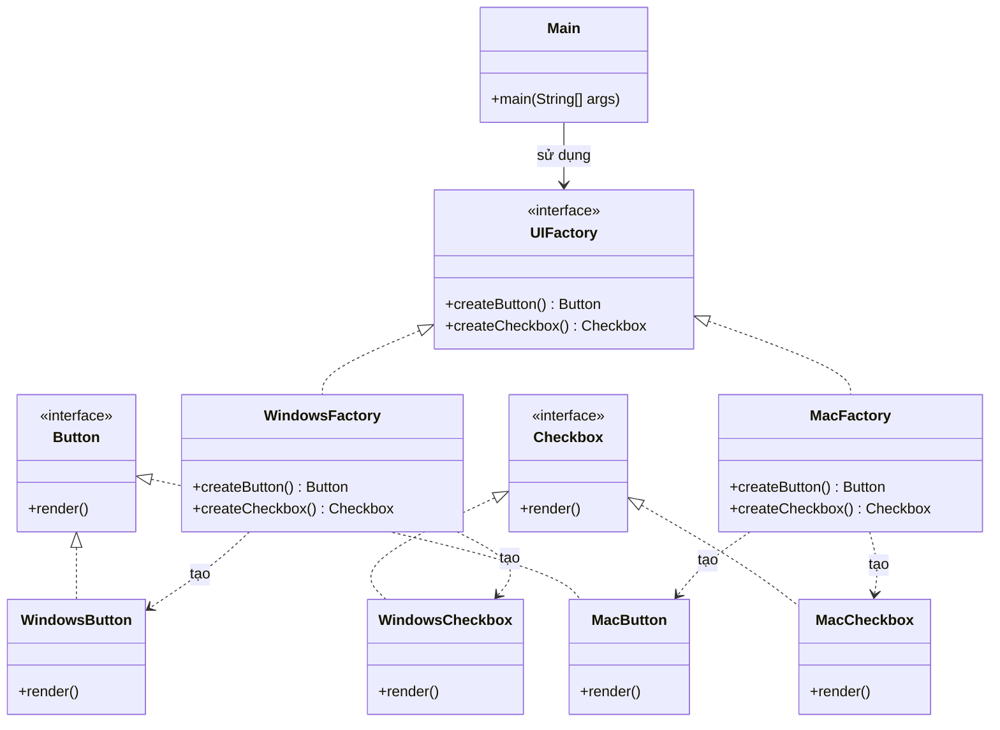

# Bài 3: Bộ giao diện người dùng

## 1. Tóm tắt ý tưởng chính của lời giải

Bài toán yêu cầu thiết kế một bộ giao diện người dùng gồm hai thành phần:
- `Button`
- `Checkbox`

Hệ thống phải hỗ trợ ít nhất hai dòng sản phẩm:
- Windows
- Mac

Mỗi dòng sản phẩm cần tạo ra đầy đủ các thành phần giao diện tương ứng.  
Giải pháp phù hợp là sử dụng mẫu thiết kế **Abstract Factory**.

Cách tiếp cận:
- Tạo các interface sản phẩm là `Button` và `Checkbox`.
- Tạo interface `UIFactory` với hai phương thức:
  - `createButton()`
  - `createCheckbox()`
- Cài đặt hai factory cụ thể:
  - `WindowsFactory`
  - `MacFactory`
- Trong `main`, dựa vào cấu hình `"win"` hoặc `"mac"` để chọn factory phù hợp, sau đó tạo và render các thành phần giao diện.

Thiết kế này giúp đảm bảo các thành phần được tạo ra luôn thuộc cùng một họ sản phẩm, tránh việc trộn lẫn giao diện Windows và Mac.

## 2. Thiết kế hệ thống

### 2.1. Interface `Button`

**Khai báo ngắn:**  
Interface biểu diễn thành phần nút bấm trong giao diện.

**Phương thức:**
- `render()`: hiển thị nút bấm.

**Vai trò:**
- Là abstraction cho các loại button cụ thể.
- Giúp chương trình làm việc với kiểu chung thay vì phụ thuộc vào từng nền tảng cụ thể.

### 2.2. Interface `Checkbox`

**Khai báo ngắn:**  
Interface biểu diễn thành phần checkbox trong giao diện.

**Phương thức:**
- `render()`: hiển thị checkbox.

**Vai trò:**
- Là abstraction cho các loại checkbox cụ thể.
- Giúp phần client không cần biết đang dùng checkbox của Windows hay Mac.

### 2.3. Interface `UIFactory`

**Khai báo ngắn:**  
Factory chung để tạo các thành phần giao diện.

**Phương thức:**
- `createButton()`
- `createCheckbox()`

**Vai trò:**
- Định nghĩa cách tạo ra một họ sản phẩm giao diện.
- Đảm bảo client chỉ làm việc với factory trừu tượng.

### 2.4. Lớp `WindowsButton`

**Khai báo ngắn:**  
Lớp cài đặt `Button` cho giao diện Windows.

**Vai trò:**
- Hiện thực phương thức `render()` theo phong cách Windows.

### 2.5. Lớp `WindowsCheckbox`

**Khai báo ngắn:**  
Lớp cài đặt `Checkbox` cho giao diện Windows.

**Vai trò:**
- Hiện thực phương thức `render()` theo phong cách Windows.

### 2.6. Lớp `MacButton`

**Khai báo ngắn:**  
Lớp cài đặt `Button` cho giao diện Mac.

**Vai trò:**
- Hiện thực phương thức `render()` theo phong cách Mac.

### 2.7. Lớp `MacCheckbox`

**Khai báo ngắn:**  
Lớp cài đặt `Checkbox` cho giao diện Mac.

**Vai trò:**
- Hiện thực phương thức `render()` theo phong cách Mac.

### 2.8. Lớp `WindowsFactory`

**Khai báo ngắn:**  
Factory cụ thể dùng để tạo các thành phần giao diện thuộc họ Windows.

**Vai trò:**
- Tạo `WindowsButton`
- Tạo `WindowsCheckbox`

### 2.9. Lớp `MacFactory`

**Khai báo ngắn:**  
Factory cụ thể dùng để tạo các thành phần giao diện thuộc họ Mac.

**Vai trò:**
- Tạo `MacButton`
- Tạo `MacCheckbox`

### 2.10. Lớp `Main`

**Khai báo ngắn:**  
Lớp chạy chương trình.

**Vai trò:**
- Nhận cấu hình `"win"` hoặc `"mac"`.
- Chọn factory tương ứng.
- Tạo `Button` và `Checkbox`.
- Gọi `render()` để hiển thị các thành phần.

## Sơ đồ lớp



## 3. Lý do lựa chọn hướng tiếp cận và ưu điểm

### Hướng tiếp cận

Bài giải sử dụng **Abstract Factory** vì đề bài không chỉ tạo một đối tượng đơn lẻ, mà cần tạo ra **một họ sản phẩm liên quan** gồm:
- `Button`
- `Checkbox`

Mỗi họ sản phẩm tương ứng với một nền tảng giao diện:
- Windows
- Mac

Thay vì để `main` tự tạo trực tiếp từng class cụ thể như:

```java
Button button = new WindowsButton();
Checkbox checkbox = new WindowsCheckbox();
```

chương trình chỉ làm việc với factory chung:

```java
UIFactory factory = new WindowsFactory();
Button button = factory.createButton();
Checkbox checkbox = factory.createCheckbox();
```

Nhờ vậy, code phía client không cần phụ thuộc vào các lớp cụ thể.

### Ưu điểm

- Tạo ra các thành phần giao diện đồng bộ theo cùng một họ sản phẩm.
- Tránh trộn lẫn các thành phần Windows và Mac trong cùng một bộ giao diện.
- Dễ mở rộng thêm dòng sản phẩm mới như Linux.
- Giảm phụ thuộc giữa phần client và các lớp cụ thể.
- Thiết kế rõ ràng, đúng tinh thần lập trình hướng đối tượng.

### Kiến thức rút ra

- Hiểu sự khác nhau giữa **Factory Method** và **Abstract Factory**.
- Biết cách tổ chức các họ sản phẩm liên quan trong cùng một factory.
- Thấy được lợi ích của abstraction trong thiết kế hệ thống dễ mở rộng.
- Nắm được cách chọn factory theo cấu hình trong chương trình Java.

## 4. Ví dụ

**Không có input trực tiếp từ bàn phím nếu cấu hình được gán sẵn trong code.**  
Dữ liệu được mô phỏng trực tiếp trong chương trình bằng biến cấu hình như `"win"` hoặc `"mac"`.

Ví dụ với cấu hình:

```text
win
```

Kết quả mong đợi:

```text
Render Windows Button
Render Windows Checkbox
```

Ví dụ với cấu hình:

```text
mac
```

Kết quả mong đợi:

```text
Render Mac Button
Render Mac Checkbox
```

Điểm quan trọng là khi chọn một factory, toàn bộ thành phần được tạo ra đều thuộc cùng một dòng sản phẩm.

## 5. Kết luận

Bài toán đã được giải bằng mẫu thiết kế **Abstract Factory**.  
Cách thiết kế này phù hợp khi hệ thống cần tạo ra nhiều đối tượng liên quan theo từng họ sản phẩm, chẳng hạn giao diện Windows và Mac.

Nhờ sử dụng `UIFactory`, chương trình trở nên dễ mở rộng, dễ bảo trì và giảm phụ thuộc vào các lớp cụ thể. Trong tương lai, có thể mở rộng thêm các dòng giao diện khác như Linux mà không cần sửa nhiều phần logic cũ.

## 6. Cách chạy chương trình

1. Cấp quyền thực thi cho script:
  ```bash
  chmod +x run.sh
  ```

2. Chạy chương trình:
  ```bash
  ./run.sh
  ```
