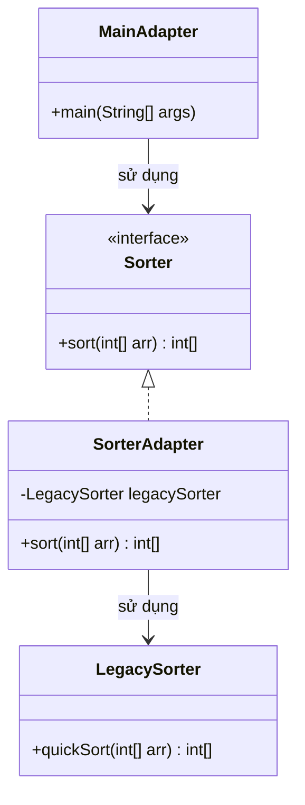
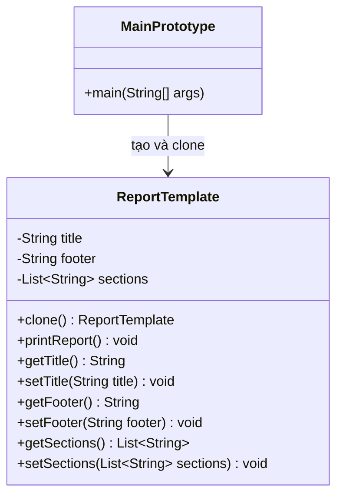

# Bài 4: Adapter + Prototype

## 1. Tóm tắt ý tưởng chính của lời giải

Bài 4 gồm hai phần độc lập, mỗi phần áp dụng một mẫu thiết kế khác nhau:

### Phần (a) Adapter

Hệ thống yêu cầu làm việc với interface `Sorter` có phương thức:

```java
int[] sort(int[] arr);
```

Tuy nhiên, thư viện cũ chỉ cung cấp lớp `LegacySorter` với phương thức:

```java
int[] quickSort(int[] arr);
```

Do interface không tương thích, lời giải sử dụng mẫu thiết kế **Adapter**:
- Tạo lớp `SorterAdapter` implements `Sorter`
- Bên trong sử dụng `LegacySorter`
- Chuyển lời gọi `sort()` thành `quickSort()`

Nhờ đó, hệ thống mới có thể dùng thư viện cũ mà không cần chỉnh sửa lớp `LegacySorter`.

### Phần (b) Prototype

Bài toán yêu cầu xây dựng lớp `ReportTemplate` gồm:
- `title`
- `footer`
- `sections`

Sau đó cài đặt cơ chế `clone()` để tạo bản sao từ template gốc.

Lời giải sử dụng mẫu thiết kế **Prototype**:
- `ReportTemplate` implements `Cloneable`
- Phương thức `clone()` tạo ra object mới từ object mẫu
- Danh sách `sections` được sao chép sang một `ArrayList` mới để tránh ảnh hưởng qua lại giữa bản gốc và bản sao

Thiết kế này cho phép tạo nhanh nhiều báo cáo từ một mẫu có sẵn, đồng thời vẫn đảm bảo mỗi bản sao có thể chỉnh sửa độc lập.

## 2. Thiết kế hệ thống

# Phần (a) Adapter

### 2.1. Interface `Sorter`

**Khai báo ngắn:**  
Interface mà hệ thống hiện tại yêu cầu để sắp xếp mảng số nguyên.

**Phương thức:**
- `sort(int[] arr)`

**Vai trò:**
- Là giao diện chuẩn mà phần client sử dụng.
- Đóng vai trò **Target** trong Adapter Pattern.

### 2.2. Lớp `LegacySorter`

**Khai báo ngắn:**  
Lớp thư viện cũ không thể chỉnh sửa, cung cấp phương thức `quickSort(int[] arr)`.

**Vai trò:**
- Thực hiện việc sắp xếp mảng.
- Không tương thích trực tiếp với interface `Sorter`.
- Đóng vai trò **Adaptee** trong Adapter Pattern.

### 2.3. Lớp `SorterAdapter`

**Khai báo ngắn:**  
Lớp trung gian giúp `LegacySorter` tương thích với interface `Sorter`.

**Vai trò:**
- Implements `Sorter`
- Bên trong chứa một đối tượng `LegacySorter`
- Khi gọi `sort(int[] arr)`, adapter chuyển tiếp sang `legacySorter.quickSort(arr)`

**Logic xử lý:**
- Nhận mảng từ hệ thống mới
- Gọi thư viện cũ để sắp xếp
- Trả kết quả đúng theo interface mong muốn

### 2.4. Lớp `MainAdapter`

**Khai báo ngắn:**  
Lớp chạy thử phần Adapter.

**Vai trò:**
- Tạo mảng mẫu
- Tạo đối tượng `Sorter` dưới dạng `SorterAdapter`
- Gọi `sort()` và in kết quả sắp xếp

# Phần (b) Prototype

### 2.5. Lớp `ReportTemplate`

**Khai báo ngắn:**  
Lớp biểu diễn một mẫu báo cáo có thể sao chép.

**Thuộc tính:**
- `title`: tiêu đề báo cáo
- `footer`: chân trang báo cáo
- `sections`: danh sách các mục nội dung

**Vai trò:**
- Là đối tượng mẫu để sinh ra các bản sao
- Cung cấp phương thức `clone()` để tạo báo cáo mới từ template sẵn có
- Hỗ trợ chỉnh sửa từng bản sao mà không làm thay đổi template gốc

**Logic xử lý:**
- `clone()` gọi `super.clone()` để tạo bản sao cơ bản
- Sau đó tạo một danh sách `sections` mới bằng:
  - `new ArrayList<>(this.sections)`
- Việc này giúp bản sao có dữ liệu riêng, tránh chia sẻ cùng một danh sách với bản gốc

### 2.6. Lớp `MainPrototype`

**Khai báo ngắn:**  
Lớp chạy thử phần Prototype.

**Vai trò:**
- Tạo một template gốc
- Clone ra 2 bản sao
- Chỉnh sửa tiêu đề của từng bản sao
- In ra 3 báo cáo để kiểm tra template gốc không bị thay đổi

## Sơ đồ lớp

### Sơ đồ lớp phần Adapter



### Sơ đồ lớp phần Prototype



## 3. Lý do lựa chọn hướng tiếp cận và ưu điểm

### Hướng tiếp cận

Bài giải chia thành hai hướng tiếp cận tương ứng với hai bài toán khác nhau.

#### Với Adapter
Khi hệ thống mới cần interface `Sorter` nhưng thư viện cũ chỉ có `LegacySorter`, không thể sửa trực tiếp lớp cũ. Vì vậy cần một lớp trung gian để "dịch" giữa hai interface.

#### Với Prototype
Khi cần tạo nhiều báo cáo có cấu trúc gần giống nhau từ một mẫu ban đầu, việc clone từ template có sẵn giúp tiết kiệm công tạo object mới và giữ được cấu trúc chung của báo cáo.

### Ưu điểm

#### Adapter
- Tái sử dụng được thư viện cũ mà không sửa code gốc
- Tách biệt rõ hệ thống mới và lớp cũ
- Làm cho code client chỉ phụ thuộc vào interface chuẩn `Sorter`

#### Prototype
- Tạo nhanh nhiều đối tượng từ một mẫu
- Giảm lặp lại khi khởi tạo dữ liệu giống nhau
- Dễ tùy biến từng bản sao sau khi clone
- Giữ template gốc không bị ảnh hưởng nếu clone đúng cách

### Kiến thức rút ra

- Hiểu khi nào nên dùng **Adapter**: khi có hai interface không tương thích
- Hiểu khi nào nên dùng **Prototype**: khi muốn sinh object mới bằng cách sao chép object mẫu
- Biết sự khác nhau giữa sao chép nông và sao chép cần tách dữ liệu tham chiếu
- Nắm được cách tổ chức chương trình Java theo từng mẫu thiết kế cụ thể

## 4. Ví dụ

### Phần Adapter

**Không có input từ người dùng.**  
Dữ liệu được mô phỏng trực tiếp trong chương trình.

Ví dụ:

```text
Mảng ban đầu: [5, 2, 9, 1, 7]
Mảng sau sắp xếp: [1, 2, 5, 7, 9]
```

Ý nghĩa:
- `MainAdapter` gọi `sort()` thông qua interface `Sorter`
- `SorterAdapter` chuyển tiếp sang `LegacySorter.quickSort()`
- Kết quả trả về đúng định dạng hệ thống yêu cầu

### Phần Prototype

**Không có input từ người dùng.**  
Dữ liệu được mô phỏng trực tiếp trong chương trình.

Ví dụ kết quả:

```text
Template gốc:
Title: Báo cáo gốc
Footer: © 2025 Company
Sections: [Giới thiệu, Nội dung chính, Kết luận]
-------------------------
Bản sao 1:
Title: Báo cáo phòng Kinh doanh
Footer: © 2025 Company
Sections: [Giới thiệu, Nội dung chính, Kết luận]
-------------------------
Bản sao 2:
Title: Báo cáo phòng Kỹ thuật
Footer: © 2025 Company
Sections: [Giới thiệu, Nội dung chính, Kết luận]
-------------------------
```

Điểm cần kiểm tra:
- Hai bản sao có tiêu đề khác nhau
- Template gốc vẫn giữ nguyên tiêu đề ban đầu
- Điều này chứng tỏ việc clone hoạt động đúng mục đích

## 5. Kết luận

Bài 4 minh họa hai mẫu thiết kế quan trọng trong lập trình hướng đối tượng:

- **Adapter** giúp kết nối hệ thống mới với thư viện cũ có interface không tương thích
- **Prototype** giúp tạo nhanh nhiều đối tượng mới từ một mẫu có sẵn

Cả hai cách tiếp cận đều làm tăng khả năng tái sử dụng code, giảm phụ thuộc trực tiếp và giúp hệ thống dễ mở rộng hơn. Đây là những mẫu rất hữu ích trong các tình huống tích hợp hệ thống và sinh đối tượng từ khuôn mẫu.

## 6. Cách chạy chương trình

1. Biên dịch toàn bộ chương trình:

```bash
javac Sorter.java LegacySorter.java SorterAdapter.java MainAdapter.java ReportTemplate.java MainPrototype.java
```

2. Chạy phần Adapter:

```bash
java MainAdapter
```

3. Chạy phần Prototype:

```bash
java MainPrototype
```
