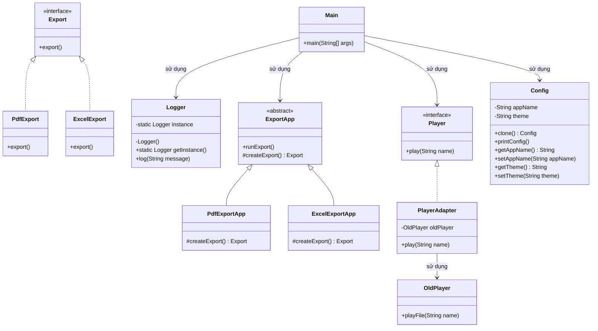

# Bài 5: Chọn và áp dụng mẫu thiết kế phù hợp

## 1. Tóm tắt ý tưởng chính của lời giải

Bài toán yêu cầu chọn đúng mẫu thiết kế cho từng tình huống cụ thể trong các mẫu đã học: **Singleton, Factory Method, Adapter, Prototype**.

Lời giải được chia thành 4 phần tương ứng:

1. **Logger**  
   Dùng **Singleton** để đảm bảo toàn chương trình chỉ có một đối tượng `Logger`.

2. **Export hệ thống**  
   Dùng **Factory Method** để tạo các đối tượng `PdfExport` và `ExcelExport` mà không khởi tạo trực tiếp bằng `new` trong `main`.

3. **Tương thích lớp cũ `OldPlayer` với hệ thống mới**  
   Dùng **Adapter** để chuyển interface cũ `playFile(String name)` sang interface mới `play(String name)` mà không sửa lớp cũ.

4. **Tạo bản sao cấu hình**  
   Dùng **Prototype** để clone một đối tượng cấu hình, chỉnh sửa bản sao mà không làm thay đổi bản gốc.

Cách làm này giúp mỗi yêu cầu được giải quyết đúng với bài toán thiết kế tương ứng, đồng thời minh họa rõ cách kết hợp nhiều design pattern trong cùng một chương trình.

## 2. Thiết kế hệ thống

### 2.1. Lớp `Logger`

**Khai báo ngắn:**  
Lớp ghi log dùng chung cho toàn chương trình.

**Vai trò:**
- Chỉ cho phép tạo duy nhất một đối tượng.
- Cung cấp phương thức `getInstance()` để truy cập thể hiện duy nhất.
- Cung cấp phương thức `log(String message)` để ghi log.

**Mẫu thiết kế áp dụng:**  
Singleton

---

### 2.2. Interface `Export`

**Khai báo ngắn:**  
Giao diện chung cho các loại đối tượng xuất dữ liệu.

**Phương thức:**
- `export()`

**Vai trò:**
- Định nghĩa hành vi chung cho các loại export.
- Là abstraction cho `PdfExport` và `ExcelExport`.

---

### 2.3. Lớp `PdfExport`

**Khai báo ngắn:**  
Lớp cài đặt `Export` để xuất file PDF.

**Vai trò:**
- Hiện thực phương thức `export()`.
- Đại diện cho một loại export cụ thể.

---

### 2.4. Lớp `ExcelExport`

**Khai báo ngắn:**  
Lớp cài đặt `Export` để xuất file Excel.

**Vai trò:**
- Hiện thực phương thức `export()`.
- Đại diện cho một loại export cụ thể.

---

### 2.5. Lớp trừu tượng `ExportApp`

**Khai báo ngắn:**  
Lớp cha chứa logic xuất dữ liệu dùng chung.

**Phương thức:**
- `runExport()`
- `createExport()`

**Vai trò:**
- Chứa quy trình chung để export.
- Không tạo trực tiếp `PdfExport` hay `ExcelExport`.
- Để lớp con quyết định loại export cụ thể thông qua `createExport()`.

**Mẫu thiết kế áp dụng:**  
Factory Method

---

### 2.6. Lớp `PdfExportApp`

**Khai báo ngắn:**  
Lớp con của `ExportApp` dùng để tạo đối tượng `PdfExport`.

**Vai trò:**
- Ghi đè `createExport()`.
- Trả về `PdfExport`.

---

### 2.7. Lớp `ExcelExportApp`

**Khai báo ngắn:**  
Lớp con của `ExportApp` dùng để tạo đối tượng `ExcelExport`.

**Vai trò:**
- Ghi đè `createExport()`.
- Trả về `ExcelExport`.

---

### 2.8. Interface `Player`

**Khai báo ngắn:**  
Giao diện mới mà hệ thống hiện tại yêu cầu.

**Phương thức:**
- `play(String name)`

**Vai trò:**
- Định nghĩa chuẩn mới cho chức năng phát file.
- Được sử dụng bởi phần client.

---

### 2.9. Lớp `OldPlayer`

**Khai báo ngắn:**  
Lớp cũ có sẵn trong hệ thống, không được phép sửa.

**Phương thức:**
- `playFile(String name)`

**Vai trò:**
- Thực hiện phát file theo cách cũ.
- Không tương thích trực tiếp với interface `Player`.

---

### 2.10. Lớp `PlayerAdapter`

**Khai báo ngắn:**  
Lớp trung gian giúp `OldPlayer` tương thích với `Player`.

**Vai trò:**
- Implements `Player`.
- Bên trong sử dụng một đối tượng `OldPlayer`.
- Chuyển lời gọi `play(name)` thành `oldPlayer.playFile(name)`.

**Mẫu thiết kế áp dụng:**  
Adapter

---

### 2.11. Lớp `Config`

**Khai báo ngắn:**  
Lớp biểu diễn cấu hình ứng dụng có thể sao chép.

**Thuộc tính:**
- `appName`
- `theme`

**Vai trò:**
- Là đối tượng cấu hình gốc.
- Cung cấp phương thức `clone()` để tạo bản sao.
- Cho phép chỉnh sửa bản sao mà không làm ảnh hưởng bản gốc.

**Mẫu thiết kế áp dụng:**  
Prototype

---

### 2.12. Lớp `Main`

**Khai báo ngắn:**  
Lớp chạy chương trình để kiểm tra toàn bộ các pattern.

**Vai trò:**
- Kiểm tra Singleton bằng cách lấy 2 `Logger` và in `hashCode()`.
- Kiểm tra Factory Method bằng cách export PDF và Excel.
- Kiểm tra Adapter bằng cách phát file qua `PlayerAdapter`.
- Kiểm tra Prototype bằng cách clone `Config` rồi sửa bản sao.

## Sơ đồ lớp



## 3. Lý do lựa chọn hướng tiếp cận và ưu điểm

### Hướng tiếp cận

Bài giải không dùng một pattern duy nhất cho toàn bộ chương trình, mà chọn **đúng pattern theo từng tình huống**:

- Khi cần một đối tượng duy nhất dùng chung, dùng **Singleton**
- Khi cần tạo đối tượng mà không để `main` phụ thuộc trực tiếp lớp cụ thể, dùng **Factory Method**
- Khi cần dùng lại lớp cũ nhưng interface không khớp, dùng **Adapter**
- Khi cần tạo bản sao độc lập từ object có sẵn, dùng **Prototype**

Cách tiếp cận này phù hợp với đúng bản chất của từng yêu cầu và giúp chương trình có cấu trúc rõ ràng hơn.

### Ưu điểm

- Mỗi bài toán được giải bằng mẫu thiết kế phù hợp nhất.
- Code dễ mở rộng hơn so với cách viết cứng.
- Giảm phụ thuộc trực tiếp giữa các lớp.
- Tăng khả năng tái sử dụng code.
- Dễ kiểm thử vì `Main` có thể minh họa riêng từng phần chức năng.

### Kiến thức rút ra

- Biết cách nhận diện tình huống để chọn đúng design pattern.
- Hiểu được sự khác nhau giữa các mẫu tạo đối tượng, thích nghi interface và sao chép object.
- Thấy được cách kết hợp nhiều design pattern trong cùng một chương trình Java.
- Củng cố tư duy thiết kế hướng đối tượng thay vì chỉ viết code theo chức năng.

## 4. Ví dụ

**Không có input từ người dùng.**  
Dữ liệu được mô phỏng trực tiếp trong chương trình.

Ví dụ kết quả chạy:

```text
[LOG] Kiểm tra Singleton
Logger1 hashCode: 1995265320
Logger2 hashCode: 1995265320

Xuất file PDF
Xuất file Excel

OldPlayer đang phát file: music.mp3

Cấu hình gốc:
appName = MyApp, theme = Light
Cấu hình bản sao:
appName = MyApp, theme = Dark
```

Giải thích:
- Hai `Logger` có cùng `hashCode()` nên đúng là chỉ có một đối tượng.
- PDF và Excel được tạo thông qua `ExportApp`, không khởi tạo trực tiếp trong `main`.
- `PlayerAdapter` giúp hệ thống mới dùng được `OldPlayer`.
- `Config` sau khi clone có thể sửa bản sao mà không làm thay đổi cấu hình gốc.

## 5. Kết luận

Bài 5 là một bài tổng hợp rất tốt để luyện kỹ năng **chọn đúng mẫu thiết kế theo yêu cầu thực tế**.  
Chương trình đã áp dụng thành công:

- **Singleton** cho `Logger`
- **Factory Method** cho hệ thống `Export`
- **Adapter** cho `OldPlayer`
- **Prototype** cho `Config`

Thiết kế này giúp chương trình rõ ràng, dễ hiểu và bám sát tinh thần của các design pattern đã học. Trong tương lai, có thể tiếp tục mở rộng thêm các loại export, player mới hoặc các cấu hình phức tạp hơn mà không cần thay đổi quá nhiều phần code hiện có.

## 6. Cách chạy chương trình

1. Cấp quyền thực thi cho script:
  ```bash
  chmod +x run.sh
  ```

2. Chạy chương trình:
  ```bash
  ./run.sh
  ```
