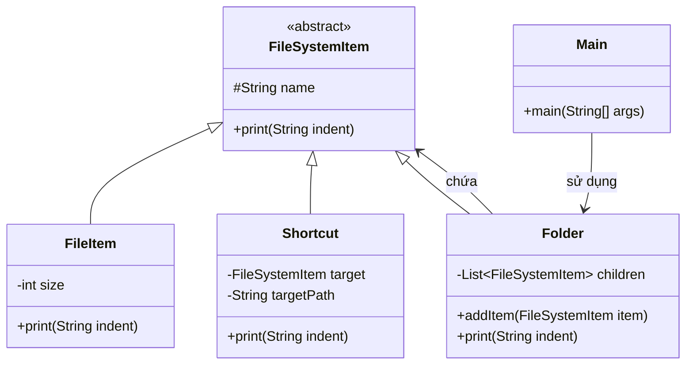

# Bài 1: Quản lý hệ thống file đơn giản

## 1. Tóm tắt ý tưởng chính của lời giải

Bài toán yêu cầu xây dựng công cụ quản lý hệ thống file với ba loại phần tử:
- `FileItem`
- `Shortcut`
- `Folder`

Tất cả các phần tử đều cần có khả năng in ra thông tin thông qua phương thức `print(String indent)`.

Giải pháp phù hợp là sử dụng mẫu thiết kế **Composite**:
- Tạo lớp trừu tượng `FileSystemItem` làm kiểu chung cho mọi phần tử.
- `FileItem` và `Shortcut` là các phần tử lá.
- `Folder` là phần tử tổng hợp, có thể chứa danh sách các `FileSystemItem` con.
- Khi gọi `print("")` trên thư mục gốc, toàn bộ cây thư mục sẽ được in ra theo cấu trúc phân cấp với thụt lề tăng dần.

Cách thiết kế này giúp xử lý đồng nhất giữa phần tử đơn và phần tử chứa nhiều phần tử khác, rất phù hợp với mô hình cây thư mục.

## 2. Thiết kế hệ thống

### 2.1. Lớp trừu tượng `FileSystemItem`

**Khai báo ngắn:**  
Lớp cha chung cho mọi phần tử trong hệ thống file.

**Thuộc tính:**
- `name`: tên phần tử

**Phương thức:**
- `print(String indent)`

**Vai trò:**
- Định nghĩa hành vi chung cho tất cả các phần tử.
- Là kiểu dữ liệu thống nhất để `Folder` có thể chứa cả file, shortcut và folder con.

### 2.2. Lớp `FileItem`

**Khai báo ngắn:**  
Lớp biểu diễn một file thông thường.

**Thuộc tính:**
- `name`
- `size` tính theo KB

**Vai trò:**
- Lưu thông tin tên file và kích thước file.
- Khi in ra, hiển thị theo mẫu:

```text
File: <name> (<size>KB)
```

### 2.3. Lớp `Shortcut`

**Khai báo ngắn:**  
Lớp biểu diễn một shortcut tới phần tử khác trong hệ thống file.

**Thuộc tính:**
- `name`
- `target`: tham chiếu tới `FileSystemItem`
- `targetPath`: đường dẫn logic của phần tử đích

**Vai trò:**
- Biểu diễn lối tắt đến một file hoặc một phần tử khác.
- Khi in ra, hiển thị theo mẫu:

```text
Shortcut: <name> -> <targetPath>
```

### 2.4. Lớp `Folder`

**Khai báo ngắn:**  
Lớp biểu diễn thư mục có thể chứa các phần tử con.

**Thuộc tính:**
- `name`
- danh sách `FileSystemItem` con

**Vai trò:**
- Chứa các `FileItem`, `Shortcut`, hoặc `Folder` khác.
- Khi in ra:
  - in tên folder trước
  - sau đó duyệt toàn bộ phần tử con
  - mỗi phần tử con được in với `indent` tăng thêm

**Logic xử lý:**
- Sử dụng đệ quy để in toàn bộ cây thư mục.
- Không cần phân biệt phần tử con là file, shortcut hay folder, vì tất cả đều dùng chung `print(String indent)`.

### 2.5. Lớp `Main`

**Khai báo ngắn:**  
Lớp chạy chương trình để minh họa hoạt động của mô hình hệ thống file.

**Vai trò:**
- Tạo cây thư mục có ít nhất 2 cấp.
- Tạo đủ cả 3 loại phần tử: `FileItem`, `Shortcut`, `Folder`.
- Gọi `print("")` trên thư mục gốc để in toàn bộ cấu trúc.

## Sơ đồ lớp



## 3. Lý do lựa chọn hướng tiếp cận và ưu điểm

### Hướng tiếp cận

Bài giải sử dụng **Composite Pattern** vì hệ thống file có cấu trúc dạng cây:
- `FileItem` và `Shortcut` là phần tử đơn
- `Folder` là phần tử có thể chứa các phần tử khác

Thay vì viết nhiều nhánh `if-else` để kiểm tra từng loại phần tử, chương trình gom tất cả về kiểu chung `FileSystemItem` và cho phép mọi đối tượng tự cài đặt cách in của mình.

Khi đó:
- `Folder` chỉ cần duyệt danh sách con và gọi `print(indent)` trên từng phần tử
- không cần biết phần tử con thuộc lớp cụ thể nào

### Ưu điểm

- Xử lý thống nhất cả phần tử đơn và phần tử tổng hợp.
- Dễ mở rộng thêm loại phần tử mới nếu cần.
- Cấu trúc chương trình rõ ràng, phù hợp với mô hình cây thư mục.
- Tránh việc phải kiểm tra kiểu thủ công trong quá trình in dữ liệu.
- Dễ cài đặt đệ quy để duyệt cây.

### Kiến thức rút ra

- Hiểu khi nào nên dùng **Composite Pattern**.
- Biết cách mô hình hóa cấu trúc cây trong Java bằng lớp cha chung.
- Thấy được lợi ích của việc đa hình trong xử lý danh sách phần tử hỗn hợp.
- Nắm được cách dùng `indent` để biểu diễn cấu trúc phân cấp khi in ra màn hình.

## 4. Ví dụ

**Không có input từ người dùng.**  
Dữ liệu được mô phỏng trực tiếp trong chương trình.

Ví dụ kết quả chạy:

```text
Folder: root
    Folder: docs
        File: a.txt (12KB)
        File: b.txt (8KB)
        Shortcut: a-shortcut -> /root/docs/a.txt
    File: readme.md (4KB)
```

Giải thích:
- `root` là thư mục gốc
- `docs` là thư mục con nằm trong `root`
- trong `docs` có hai file và một shortcut
- `readme.md` là file nằm trực tiếp trong `root`

Kết quả này cho thấy phương thức `print("")` đã duyệt đúng toàn bộ cây thư mục và in theo cấu trúc thụt lề.

## 5. Kết luận

Bài toán đã được giải bằng mẫu thiết kế **Composite**, rất phù hợp với mô hình hệ thống file có dạng cây.  
Thiết kế này cho phép biểu diễn thống nhất các phần tử `FileItem`, `Shortcut`, `Folder` và hỗ trợ in toàn bộ cấu trúc thư mục một cách tự nhiên bằng đệ quy.

Trong tương lai, hệ thống có thể mở rộng thêm:
- xóa phần tử khỏi folder,
- tính tổng kích thước thư mục,
- tìm kiếm file theo tên,
- thêm các loại phần tử mới như image file hoặc executable file.

## 6. Cách chạy chương trình

1. Cấp quyền thực thi cho script:
  ```bash
  chmod +x run.sh
  ```

2. Chạy chương trình:
  ```bash
  ./run.sh
  ```
