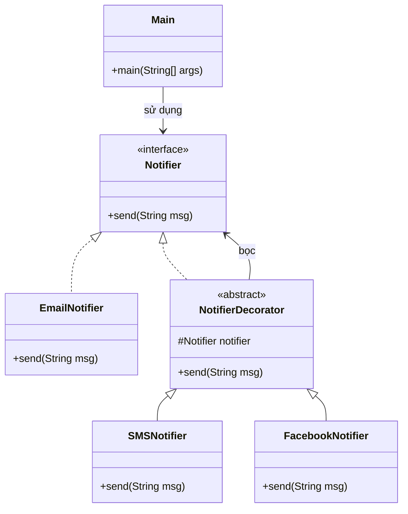

# Bài 2: Hệ thống gửi thông báo đa kênh

## 1. Tóm tắt ý tưởng chính của lời giải

Bài toán yêu cầu xây dựng hệ thống gửi thông báo theo mẫu thiết kế **Decorator**, trong đó:
- Có interface `Notifier` với phương thức `send(String msg)`.
- `EmailNotifier` là kênh gửi mặc định.
- Có lớp trừu tượng `NotifierDecorator` giữ một đối tượng `Notifier` và chuyển tiếp lời gọi `send()`.
- Có ít nhất hai decorator như `SMSNotifier` và `FacebookNotifier`, mỗi lớp bổ sung thêm một kênh gửi.
- Trong `main`, có thể kết hợp nhiều decorator để gửi cùng một thông điệp qua nhiều kênh.

Giải pháp sử dụng **Decorator Pattern** vì bài toán cần:
- một đối tượng gốc là `EmailNotifier`,
- sau đó bọc thêm các chức năng mở rộng như gửi SMS, gửi Facebook,
- và có thể kết hợp linh hoạt nhiều kênh mà không phải tạo quá nhiều lớp con cố định.

Ví dụ:
- chỉ gửi Email,
- Email + Facebook,
- Email + Facebook + SMS.

Thiết kế này giúp mở rộng hệ thống dễ dàng và tránh hiện tượng bùng nổ số lượng lớp khi số lượng cách kết hợp kênh tăng lên.

## 2. Thiết kế hệ thống

### 2.1. Interface `Notifier`

**Khai báo ngắn:**  
Giao diện chung cho mọi loại đối tượng gửi thông báo.

**Phương thức:**
- `send(String msg)`

**Vai trò:**
- Định nghĩa hành vi chung của hệ thống gửi thông báo.
- Là abstraction để mọi notifier và decorator cùng làm việc trên một kiểu chung.

### 2.2. Lớp `EmailNotifier`

**Khai báo ngắn:**  
Lớp gửi thông báo mặc định qua email.

**Vai trò:**
- Cài đặt interface `Notifier`.
- Đóng vai trò là kênh gửi cơ bản ban đầu.
- Là đối tượng gốc để các decorator bọc thêm chức năng.

### 2.3. Lớp trừu tượng `NotifierDecorator`

**Khai báo ngắn:**  
Lớp decorator trừu tượng giữ một đối tượng `Notifier`.

**Thuộc tính:**
- `notifier`: đối tượng được bọc bên trong

**Vai trò:**
- Implements `Notifier`
- Chuyển tiếp lời gọi `send(msg)` cho đối tượng đang được giữ
- Là nền tảng chung để các decorator cụ thể mở rộng hành vi gửi

**Logic xử lý:**
- Khi `send(msg)` được gọi, lớp này chỉ chuyển tiếp sang `notifier.send(msg)`.
- Các lớp con sẽ kế thừa logic đó rồi bổ sung thêm hành vi riêng.

### 2.4. Lớp `SMSNotifier`

**Khai báo ngắn:**  
Decorator bổ sung khả năng gửi thông báo qua SMS.

**Vai trò:**
- Kế thừa `NotifierDecorator`
- Gọi `super.send(msg)` để thực hiện các kênh cũ trước
- Sau đó gửi thêm thông báo SMS

### 2.5. Lớp `FacebookNotifier`

**Khai báo ngắn:**  
Decorator bổ sung khả năng gửi thông báo qua Facebook.

**Vai trò:**
- Kế thừa `NotifierDecorator`
- Gọi `super.send(msg)` để thực hiện các kênh cũ trước
- Sau đó gửi thêm thông báo qua Facebook

### 2.6. Lớp `Main`

**Khai báo ngắn:**  
Lớp chạy chương trình.

**Vai trò:**
- Tạo một `Notifier` gốc là `EmailNotifier`
- Bọc thêm các decorator như `FacebookNotifier` và `SMSNotifier`
- Gọi `send(msg)` để kiểm tra toàn bộ các kênh được kích hoạt đúng thứ tự

## Sơ đồ lớp



## 3. Lý do lựa chọn hướng tiếp cận và ưu điểm

### Hướng tiếp cận

Bài giải sử dụng **Decorator Pattern** vì đề bài yêu cầu gắn thêm các kênh gửi một cách linh hoạt lên một hệ thống gửi thông báo cơ bản.

Thay vì tạo các lớp như:
- `EmailAndSMSNotifier`
- `EmailAndFacebookNotifier`
- `EmailAndFacebookAndSMSNotifier`

chương trình chỉ cần:
- một `EmailNotifier` gốc,
- các decorator riêng cho từng kênh,
- rồi kết hợp chúng tại thời điểm chạy.

Ví dụ:

```java
Notifier notifier = new EmailNotifier();
notifier = new FacebookNotifier(notifier);
notifier = new SMSNotifier(notifier);
```

Cách này đúng tinh thần của Decorator: **bọc thêm hành vi mà không sửa lớp gốc**.

### Ưu điểm

- Dễ mở rộng thêm kênh mới như `SlackNotifier`, `ZaloNotifier`.
- Tránh bùng nổ số lượng lớp con do nhiều cách kết hợp khác nhau.
- Có thể linh hoạt thay đổi số lượng và thứ tự kênh gửi trong lúc chạy.
- Không cần sửa code của `EmailNotifier` khi thêm chức năng mới.
- Tăng tính tái sử dụng của từng decorator riêng lẻ.

### Kiến thức rút ra

- Hiểu khi nào nên dùng **Decorator Pattern**.
- Biết cách tổ chức lớp gốc, decorator trừu tượng và decorator cụ thể.
- Thấy được sự khác nhau giữa kế thừa trực tiếp và mở rộng hành vi bằng cách bọc đối tượng.
- Nắm được lợi ích của việc thêm chức năng động trong hệ thống hướng đối tượng.

## 4. Ví dụ

**Không có input từ người dùng.**  
Dữ liệu được mô phỏng trực tiếp trong chương trình.

Ví dụ trong `main`, cấu hình:

```text
Email + Facebook + SMS
```

Kết quả chạy:

```text
Gửi Email: Hệ thống sẽ bảo trì lúc 22:00
Gửi Facebook: Hệ thống sẽ bảo trì lúc 22:00
Gửi SMS: Hệ thống sẽ bảo trì lúc 22:00
```

Giải thích:
- `EmailNotifier` gửi trước
- `FacebookNotifier` gọi tiếp sau khi kênh trước hoàn tất
- `SMSNotifier` gọi sau cùng

Điều này cho thấy lời gọi `send(msg)` đã đi qua toàn bộ chuỗi decorator và thực hiện đầy đủ các kênh đã gắn.

## 5. Kết luận

Bài toán đã được giải bằng mẫu thiết kế **Decorator**, rất phù hợp với yêu cầu mở rộng nhiều kênh gửi thông báo trên cùng một hệ thống cơ bản.

Thiết kế này giúp chương trình:
- dễ mở rộng,
- dễ kết hợp các chức năng,
- giảm số lượng lớp không cần thiết,
- và bám sát nguyên lý mở rộng mà không sửa đổi lớp cũ.

Trong tương lai, hệ thống có thể bổ sung thêm:
- gửi qua Slack,
- gửi qua Zalo,
- gửi qua Telegram,
- hoặc thêm cơ chế log/tracking cho từng kênh gửi.

## 6. Cách chạy chương trình

1. Cấp quyền thực thi cho script:
  ```bash
  chmod +x run.sh
  ```

2. Chạy chương trình:
  ```bash
  ./run.sh
  ```
