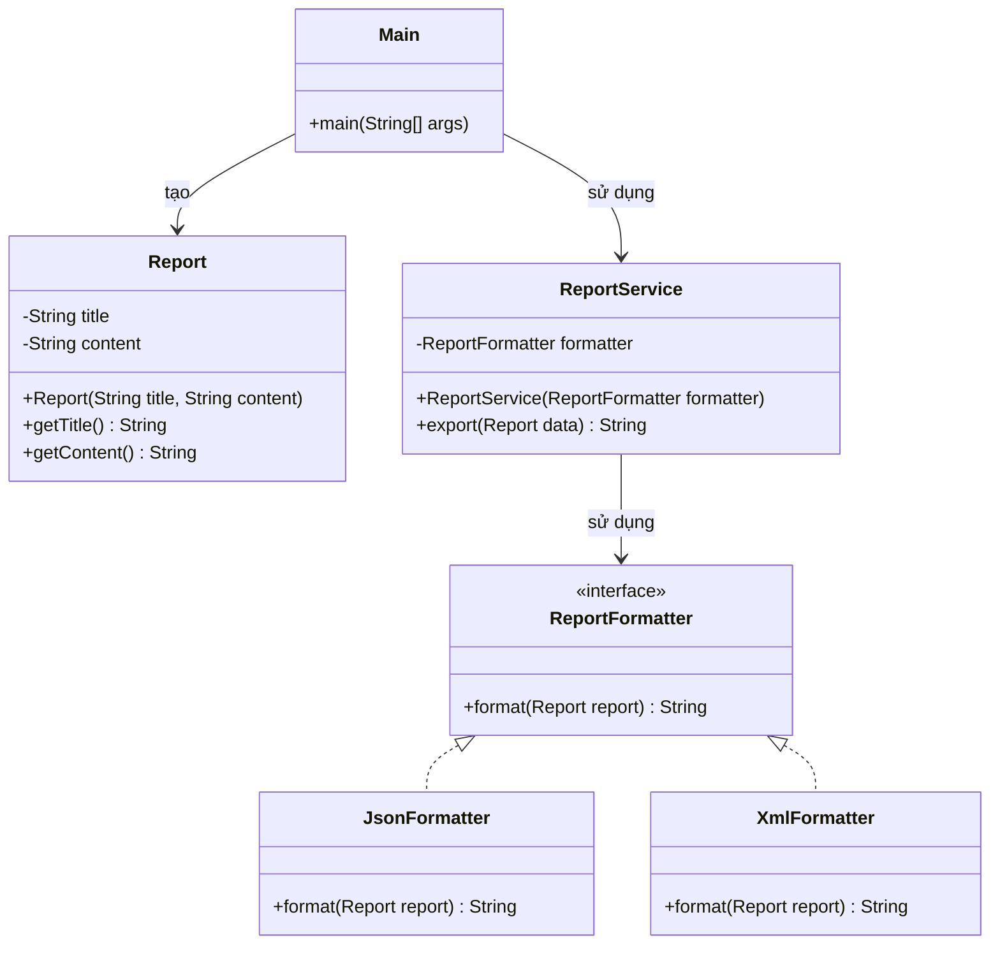

# Bài 3: Hệ thống định dạng báo cáo

## 1. Tóm tắt ý tưởng chính của lời giải

Bài toán yêu cầu thiết kế lại hệ thống xuất báo cáo để không vi phạm hai nguyên lý thiết kế quan trọng:

- **SRP (Single Responsibility Principle)**: mỗi lớp chỉ nên có một trách nhiệm chính.
- **OCP (Open/Closed Principle)**: hệ thống có thể mở rộng thêm định dạng mới mà không cần sửa lớp cũ.

Đoạn mã ban đầu dùng nhiều nhánh `if-else` trong `ReportService` để xử lý từng định dạng như JSON, XML. Cách này làm cho `ReportService` vừa chịu trách nhiệm điều phối export, vừa ôm luôn chi tiết định dạng, nên vi phạm SRP. Đồng thời, mỗi khi thêm định dạng mới, phải sửa lại `ReportService`, nên vi phạm OCP.

Giải pháp là:
- Tạo lớp `Report` để giữ dữ liệu báo cáo.
- Tạo interface `ReportFormatter` để chuẩn hóa cách định dạng.
- Tạo các lớp `JsonFormatter`, `XmlFormatter` để cài đặt từng định dạng cụ thể.
- `ReportService` nhận một `ReportFormatter` qua constructor và chỉ gọi `formatter.format(report)` khi export.

Thiết kế này giúp `ReportService` không biết chi tiết định dạng cụ thể, đồng thời cho phép thêm formatter mới mà không cần sửa code cũ.

## 2. Thiết kế hệ thống

### 2.1. Lớp `Report`

**Khai báo ngắn:**  
Lớp biểu diễn dữ liệu báo cáo.

**Thuộc tính:**
- `title`
- `content`

**Vai trò:**
- Lưu dữ liệu đầu vào của báo cáo.
- Chỉ chịu trách nhiệm giữ thông tin, không xử lý định dạng.

### 2.2. Interface `ReportFormatter`

**Khai báo ngắn:**  
Interface chung cho mọi cách định dạng báo cáo.

**Phương thức:**
- `format(Report report)`

**Vai trò:**
- Định nghĩa chuẩn chung cho các formatter.
- Giúp `ReportService` chỉ phụ thuộc vào abstraction thay vì lớp cụ thể.

### 2.3. Lớp `JsonFormatter`

**Khai báo ngắn:**  
Lớp cài đặt `ReportFormatter` để định dạng báo cáo theo JSON.

**Vai trò:**
- Chỉ chịu trách nhiệm chuyển dữ liệu `Report` thành chuỗi JSON.

### 2.4. Lớp `XmlFormatter`

**Khai báo ngắn:**  
Lớp cài đặt `ReportFormatter` để định dạng báo cáo theo XML.

**Vai trò:**
- Chỉ chịu trách nhiệm chuyển dữ liệu `Report` thành chuỗi XML.

### 2.5. Lớp `ReportService`

**Khai báo ngắn:**  
Lớp dịch vụ xuất báo cáo.

**Thuộc tính:**
- `formatter`: đối tượng `ReportFormatter`

**Phương thức:**
- `export(Report data)`

**Vai trò:**
- Điều phối việc export báo cáo.
- Không chứa logic JSON hay XML cụ thể.
- Sử dụng formatter được truyền vào qua constructor để xử lý định dạng.

### 2.6. Lớp `Main`

**Khai báo ngắn:**  
Lớp chạy chương trình.

**Vai trò:**
- Tạo `Report`
- Chọn formatter phù hợp
- Tạo `ReportService`
- Gọi `export()` và in kết quả

## Sơ đồ lớp



## 3. Lý do lựa chọn hướng tiếp cận và ưu điểm

### Hướng tiếp cận

Thay vì để `ReportService` tự kiểm tra chuỗi `"JSON"` hay `"XML"` rồi xử lý bằng `if-else`, bài giải tách riêng từng cách định dạng thành các lớp formatter độc lập.

`ReportService` nhận formatter từ bên ngoài thông qua constructor:

```java
ReportService service = new ReportService(new JsonFormatter());
```

hoặc:

```java
ReportService service = new ReportService(new XmlFormatter());
```

Nhờ vậy, `ReportService` chỉ tập trung vào việc export, còn định dạng được giao cho đúng lớp chuyên trách.

### Ưu điểm

- Đúng **SRP**: mỗi lớp có một nhiệm vụ rõ ràng.
- Đúng **OCP**: thêm định dạng mới chỉ cần thêm class mới implements `ReportFormatter`.
- Không cần sửa `ReportService` khi mở rộng hệ thống.
- Giảm phụ thuộc giữa service và các định dạng cụ thể.
- Dễ kiểm thử từng formatter riêng biệt.

### Kiến thức rút ra

- Nhận ra dấu hiệu vi phạm SRP và OCP khi thấy nhiều nhánh `if-else` theo loại đối tượng hoặc loại xử lý.
- Biết cách tách abstraction và implementation.
- Hiểu cách dùng interface để thay đổi hành vi mà không sửa lớp sử dụng.
- Củng cố tư duy thiết kế hướng đối tượng theo hướng dễ mở rộng.

## 4. Ví dụ

**Không có input từ người dùng.**  
Dữ liệu được mô phỏng trực tiếp trong chương trình.

Ví dụ tạo báo cáo:

```text
title = Báo cáo tháng
content = Doanh thu tăng 20%
```

Kết quả khi dùng `JsonFormatter`:

```text
JSON Output:
{ "title": "Báo cáo tháng", "content": "Doanh thu tăng 20%" }
```

Kết quả khi dùng `XmlFormatter`:

```text
XML Output:
<report><title>Báo cáo tháng</title><content>Doanh thu tăng 20%</content></report>
```

Điều này cho thấy cùng một `Report`, ta có thể thay đổi cách xuất chỉ bằng cách thay formatter.

## 5. Kết luận

Bài toán đã được giải theo hướng tách trách nhiệm rõ ràng và hỗ trợ mở rộng tốt hơn so với thiết kế ban đầu.  
`ReportService` không còn biết chi tiết định dạng, còn các formatter đảm nhiệm riêng việc biểu diễn dữ liệu báo cáo.

Thiết kế này vừa đúng với **SRP**, vừa đúng với **OCP**, và cũng rất gần với cách tổ chức của **Strategy Pattern** trong thực tế.

Trong tương lai, có thể mở rộng thêm:
- `CsvFormatter`
- `HtmlFormatter`
- `PdfFormatter`

mà không cần sửa lại `ReportService`.

## 6. Cách chạy chương trình

1. Cấp quyền thực thi cho script:
  ```bash
  chmod +x run.sh
  ```

2. Chạy chương trình:
  ```bash
  ./run.sh
  ```
