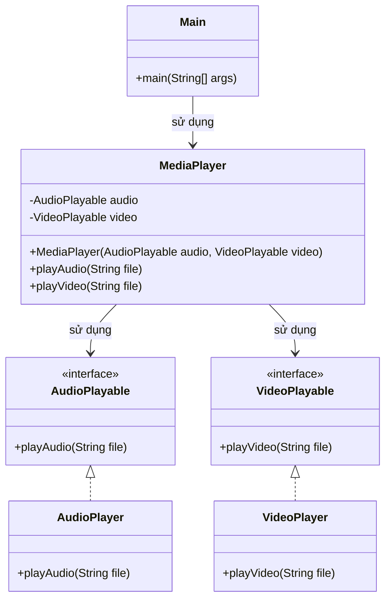

# Bài 4: Trình phát đa phương tiện

## 1. Tóm tắt ý tưởng chính của lời giải

Bài toán yêu cầu xây dựng hệ thống phát media áp dụng hai nguyên lý thiết kế:

- **ISP (Interface Segregation Principle)**: tách interface lớn thành các interface nhỏ theo từng chức năng riêng.
- **DIP (Dependency Inversion Principle)**: lớp `MediaPlayer` không phụ thuộc trực tiếp vào các lớp cụ thể như `AudioPlayer` hay `VideoPlayer`, mà phụ thuộc vào abstraction.

Giải pháp được thiết kế như sau:
- Tạo interface `AudioPlayable` với phương thức `playAudio(String file)`.
- Tạo interface `VideoPlayable` với phương thức `playVideo(String file)`.
- `AudioPlayer` chỉ implement `AudioPlayable`.
- `VideoPlayer` chỉ implement `VideoPlayable`.
- `MediaPlayer` nhận hai dependency qua constructor:
  - `AudioPlayable audio`
  - `VideoPlayable video`

Nhờ đó:
- mỗi lớp chỉ cài đặt đúng chức năng của nó,
- `MediaPlayer` có thể làm việc với bất kỳ đối tượng nào miễn là tuân theo interface tương ứng,
- hệ thống dễ mở rộng và đúng tinh thần thiết kế hướng đối tượng.

## 2. Thiết kế hệ thống

### 2.1. Interface `AudioPlayable`

**Khai báo ngắn:**  
Interface biểu diễn khả năng phát âm thanh.

**Phương thức:**
- `playAudio(String file)`

**Vai trò:**
- Là abstraction cho các lớp có khả năng phát audio.
- Tách riêng chức năng âm thanh khỏi các chức năng khác.

### 2.2. Interface `VideoPlayable`

**Khai báo ngắn:**  
Interface biểu diễn khả năng phát video.

**Phương thức:**
- `playVideo(String file)`

**Vai trò:**
- Là abstraction cho các lớp có khả năng phát video.
- Tách riêng chức năng video khỏi các chức năng khác.

### 2.3. Lớp `AudioPlayer`

**Khai báo ngắn:**  
Lớp phát âm thanh.

**Vai trò:**
- Chỉ implement `AudioPlayable`.
- Chỉ chịu trách nhiệm phát file audio.
- Không bị ép phải cài đặt chức năng video.

### 2.4. Lớp `VideoPlayer`

**Khai báo ngắn:**  
Lớp phát video.

**Vai trò:**
- Chỉ implement `VideoPlayable`.
- Chỉ chịu trách nhiệm phát file video.
- Không bị ép phải cài đặt chức năng audio.

### 2.5. Lớp `MediaPlayer`

**Khai báo ngắn:**  
Lớp phối hợp các thành phần phát media.

**Thuộc tính:**
- `audio`: đối tượng kiểu `AudioPlayable`
- `video`: đối tượng kiểu `VideoPlayable`

**Vai trò:**
- Nhận dependency từ bên ngoài thông qua constructor.
- Chuyển tiếp lời gọi phát audio/video đến đúng đối tượng phù hợp.
- Không tự tạo `new AudioPlayer()` hoặc `new VideoPlayer()` bên trong.

**Logic xử lý:**
- Khi gọi `playAudio(file)`, lớp này gọi `audio.playAudio(file)`.
- Khi gọi `playVideo(file)`, lớp này gọi `video.playVideo(file)`.

### 2.6. Lớp `Main`

**Khai báo ngắn:**  
Lớp chạy chương trình.

**Vai trò:**
- Tạo `AudioPlayer` và `VideoPlayer`
- Truyền vào `MediaPlayer` qua constructor
- Gọi `playAudio()` và `playVideo()` để kiểm tra hệ thống

## Sơ đồ lớp



## 3. Lý do lựa chọn hướng tiếp cận và ưu điểm

### Hướng tiếp cận

Bài giải áp dụng đồng thời hai nguyên lý thiết kế.

#### Áp dụng ISP
Thay vì tạo một interface lớn chứa cả hai phương thức `playAudio()` và `playVideo()`, hệ thống tách thành hai interface nhỏ:
- `AudioPlayable`
- `VideoPlayable`

Nhờ đó:
- `AudioPlayer` chỉ cần cài đặt phần audio
- `VideoPlayer` chỉ cần cài đặt phần video

Không có lớp nào bị ép phải cài đặt phương thức không liên quan đến nhiệm vụ của nó.

#### Áp dụng DIP
`MediaPlayer` không phụ thuộc trực tiếp vào lớp cụ thể như:

```java
AudioPlayer
VideoPlayer
```

mà phụ thuộc vào abstraction:

```java
AudioPlayable
VideoPlayable
```

Các dependency được truyền từ bên ngoài qua constructor, giúp lớp `MediaPlayer` linh hoạt hơn và giảm phụ thuộc cứng.

### Ưu điểm

- Đúng nguyên lý **ISP**: chia nhỏ interface theo chức năng.
- Đúng nguyên lý **DIP**: lớp mức cao phụ thuộc vào abstraction.
- Dễ mở rộng thêm loại player mới mà không cần sửa `MediaPlayer`.
- Dễ kiểm thử hơn vì có thể truyền mock object hoặc implementation khác vào constructor.
- Thiết kế rõ ràng, trách nhiệm từng lớp tách biệt.

### Kiến thức rút ra

- Hiểu vì sao không nên tạo interface quá lớn.
- Biết cách tách chức năng audio và video thành các abstraction riêng.
- Biết cách truyền dependency qua constructor thay vì khởi tạo cứng trong lớp.
- Củng cố tư duy thiết kế linh hoạt, dễ thay thế và dễ mở rộng.

## 4. Ví dụ

**Không có input từ người dùng.**  
Dữ liệu được mô phỏng trực tiếp trong chương trình.

Ví dụ khi chạy:

```text
Đang phát audio: music.mp3
Đang phát video: movie.mp4
```

Giải thích:
- `Main` tạo `AudioPlayer` và `VideoPlayer`
- Truyền hai đối tượng đó vào `MediaPlayer`
- `MediaPlayer` gọi đúng phương thức trên dependency tương ứng

Điều này cho thấy hệ thống hoạt động đúng mà không cần `MediaPlayer` biết chi tiết lớp cụ thể bên trong.

## 5. Kết luận

Bài toán đã được giải bằng cách áp dụng đúng hai nguyên lý thiết kế quan trọng là **ISP** và **DIP**.

- `AudioPlayer` và `VideoPlayer` chỉ cài đặt đúng chức năng của mình
- `MediaPlayer` chỉ làm việc với abstraction và nhận dependency từ bên ngoài

Thiết kế này giúp chương trình rõ ràng, dễ bảo trì và dễ mở rộng. Trong tương lai, có thể thêm các lớp như `AdvancedAudioPlayer`, `HDVideoPlayer` hoặc các mock player để test mà không cần chỉnh sửa `MediaPlayer`.

## 6. Cách chạy chương trình

1. Cấp quyền thực thi cho script:
  ```bash
  chmod +x run.sh
  ```

2. Chạy chương trình:
  ```bash
  ./run.sh
  ```
