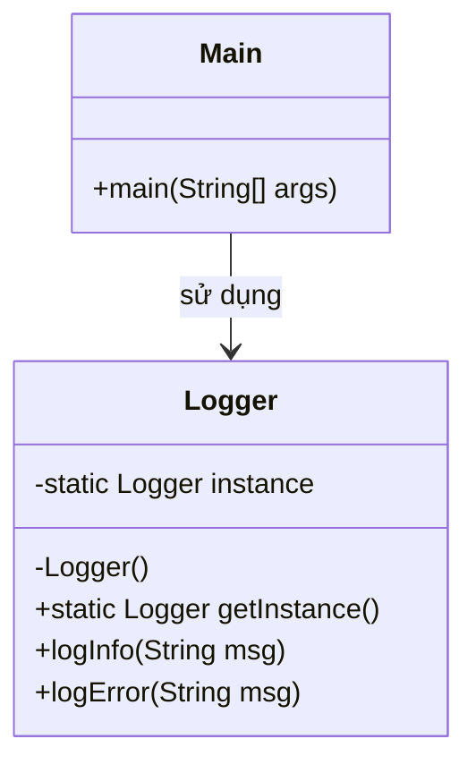

# Bài 5: Hệ thống ghi log – áp dụng Singleton Pattern

## 1. Tóm tắt ý tưởng chính của lời giải

Bài toán yêu cầu thiết kế một hệ thống ghi log sao cho trong toàn bộ chương trình chỉ tồn tại **một đối tượng `Logger` duy nhất**. Đồng thời, đối tượng này phải được tạo theo kiểu **lazy initialization**, tức là chỉ khởi tạo khi thật sự cần.

Giải pháp phù hợp là sử dụng mẫu thiết kế **Singleton**:
- Thuộc tính `private static Logger instance` dùng để lưu thể hiện duy nhất.
- Constructor của lớp `Logger` được đặt là `private` để ngăn việc tạo đối tượng bằng `new Logger()` từ bên ngoài.
- Phương thức `public static Logger getInstance()` dùng để trả về đối tượng duy nhất.
- Nếu `instance` chưa tồn tại thì tạo mới, ngược lại trả về đối tượng đã có.

Ngoài ra, lớp `Logger` cung cấp hai phương thức:
- `logInfo(String msg)`
- `logError(String msg)`

Trong `main`, chương trình gọi `Logger.getInstance()` ở nhiều nơi, kiểm tra hai biến logger có cùng địa chỉ hay không, sau đó ghi nhiều log khác nhau để chứng minh toàn bộ chương trình đang dùng chung một instance.

## 2. Thiết kế hệ thống

### 2.1. Lớp `Logger`

**Khai báo ngắn:**  
Lớp ghi log dùng chung cho toàn chương trình.

**Thuộc tính:**
- `instance`: biến tĩnh lưu đối tượng `Logger` duy nhất

**Phương thức:**
- `getInstance()`: trả về đối tượng duy nhất
- `logInfo(String msg)`: ghi log mức thông tin
- `logError(String msg)`: ghi log mức lỗi

**Vai trò:**
- Đảm bảo chỉ tồn tại một đối tượng logger trong toàn bộ chương trình.
- Cung cấp điểm truy cập toàn cục tới logger.
- Ghi log theo format:
  - `[INFO] message`
  - `[ERROR] message`

**Logic xử lý:**
- Khi `getInstance()` được gọi lần đầu, nếu `instance == null` thì tạo mới `Logger`.
- Các lần gọi sau chỉ trả về lại đối tượng đã tồn tại.
- Nhờ constructor là `private`, bên ngoài không thể tự tạo thêm logger mới.

### 2.2. Lớp `Main`

**Khai báo ngắn:**  
Lớp chạy chương trình.

**Vai trò:**
- Gọi `Logger.getInstance()` ở nhiều vị trí.
- So sánh hai biến logger bằng `==` để kiểm tra chúng có cùng tham chiếu hay không.
- Ghi các log thông tin và log lỗi để minh họa hoạt động của `Logger`.

## Sơ đồ lớp



## 3. Lý do lựa chọn hướng tiếp cận và ưu điểm

### Hướng tiếp cận

Bài giải sử dụng **Singleton Pattern** vì đề bài yêu cầu rất rõ rằng hệ thống chỉ được có **một logger duy nhất** trong toàn bộ chương trình.

Thiết kế được xây dựng theo đúng cấu trúc chuẩn của Singleton:
- biến tĩnh giữ instance,
- constructor private,
- phương thức tĩnh `getInstance()`.

Cách này giúp mọi nơi trong chương trình đều lấy logger thông qua cùng một điểm truy cập chung mà không thể tự ý tạo thêm đối tượng mới.

### Ưu điểm

- Đảm bảo chỉ có một đối tượng `Logger`.
- Dễ kiểm soát việc ghi log tập trung.
- Tiết kiệm tài nguyên vì không tạo nhiều logger không cần thiết.
- Lazy initialization giúp chỉ tạo đối tượng khi thật sự dùng đến.
- Dễ mở rộng về sau, ví dụ thêm timestamp, ghi ra file, hoặc thêm nhiều mức log khác.

### Kiến thức rút ra

- Hiểu rõ cấu trúc chuẩn của **Singleton Pattern**.
- Biết vai trò của `private constructor`.
- Hiểu cách dùng biến `static` để lưu thể hiện chung của lớp.
- Biết cách kiểm tra hai biến có cùng tham chiếu object bằng toán tử `==`.
- Thấy được cách tổ chức một lớp tiện ích dùng chung trong toàn hệ thống.

## 4. Ví dụ

**Không có input từ người dùng.**  
Dữ liệu được mô phỏng trực tiếp trong chương trình.

Ví dụ kết quả chạy:

```text
Logger instances equal: true

[INFO] Application started
[INFO] Processing data...
[ERROR] Something went wrong
```

Giải thích:
- Dòng `Logger instances equal: true` cho thấy `logger1` và `logger2` cùng trỏ tới một đối tượng `Logger`.
- Các lời gọi `logInfo()` và `logError()` in ra đúng định dạng yêu cầu.
- Dù gọi từ nhiều biến khác nhau, thực chất chương trình vẫn sử dụng cùng một logger duy nhất.

## 5. Kết luận

Bài toán đã được giải bằng mẫu thiết kế **Singleton**, rất phù hợp với yêu cầu đảm bảo chỉ có một hệ thống ghi log chung cho toàn chương trình.

Thiết kế này rõ ràng, dễ hiểu và đúng tinh thần của Singleton:
- ngăn tạo object từ bên ngoài,
- chỉ cung cấp một instance dùng chung,
- hỗ trợ truy cập toàn cục thông qua `getInstance()`.

Trong tương lai, lớp `Logger` có thể được mở rộng thêm:
- ghi log ra file,
- thêm thời gian ghi log,
- bổ sung các mức log như `DEBUG`, `WARN`, `FATAL`,
- hoặc nâng cấp thành phiên bản an toàn đa luồng.

## 6. Cách chạy chương trình

1. Cấp quyền thực thi cho script:
  ```bash
  chmod +x run.sh
  ```

2. Chạy chương trình:
  ```bash
  ./run.sh
  ```
