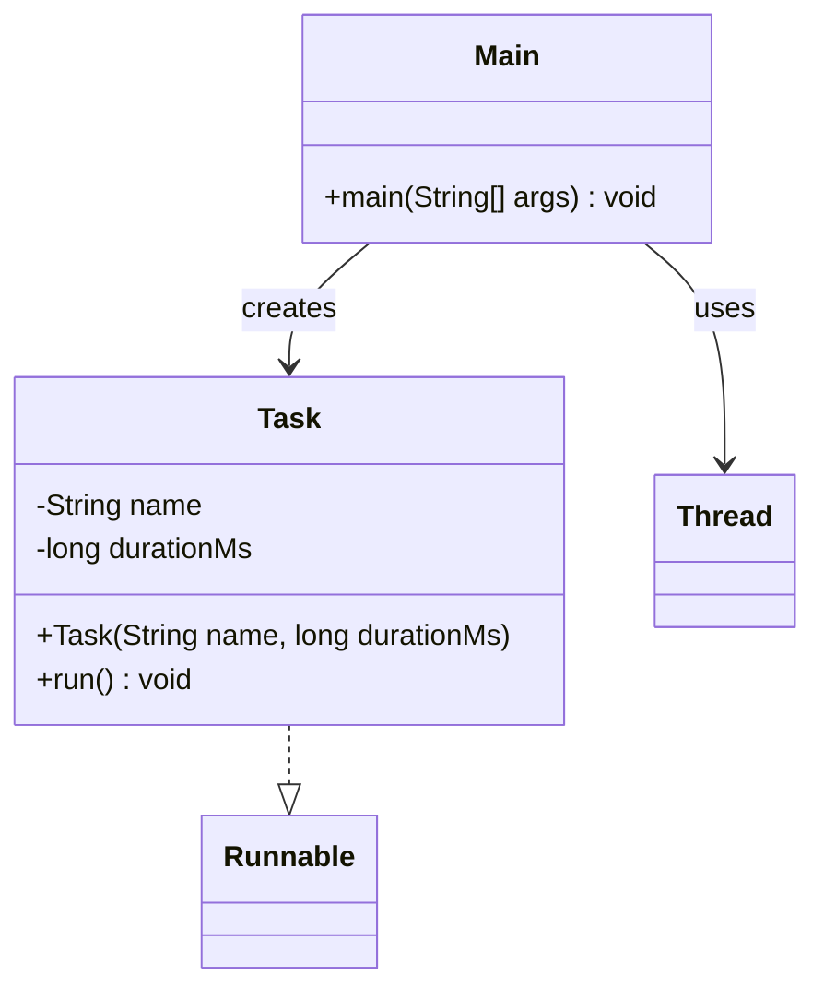

# Bài 1: Tác vụ song song

## 1. Tóm tắt ý tưởng chính của lời giải

Bài toán yêu cầu mô phỏng hai tác vụ chạy song song bằng đa luồng trong Java.  
Lời giải xây dựng một lớp `Task` cài đặt `Runnable`, trong đó mỗi đối tượng biểu diễn một tác vụ với tên và thời gian thực thi giả lập bằng `sleep()`.

Trong `Main`, chương trình tạo hai đối tượng `Task`, bọc chúng trong hai `Thread`, gọi `start()` cho cả hai để chạy đồng thời, sau đó dùng `join()` để chờ cả hai hoàn thành trước khi in ra thông báo kết thúc.

## 2. Thiết kế hệ thống

### 2.1. Lớp `Task`
**Khai báo:** `public class Task implements Runnable`

#### Thuộc tính
- `name` (`String`): tên của tác vụ.
- `durationMs` (`long`): thời gian ngủ mô phỏng thời gian thực thi của tác vụ.

#### Vai trò
Lớp này biểu diễn một công việc có thể được thực thi bởi một luồng riêng.

#### Logic xử lý
Trong phương thức `run()`:
1. In ra thông báo bắt đầu tác vụ theo dạng `Start <name>`.
2. Tạm dừng luồng bằng `Thread.sleep(durationMs)`.
3. Nếu bị ngắt, khôi phục trạng thái interrupt và in thông báo `<name> was interrupted`.
4. In ra thông báo kết thúc tác vụ theo dạng `End <name>`.

### 2.2. Lớp `Main`
**Khai báo:** `public class Main`

#### Vai trò
Lớp điều phối chương trình, chứa `main()` để tạo và chạy các tác vụ song song.

#### Logic xử lý
1. Tạo hai đối tượng `Task` với tên và thời gian chạy khác nhau.
2. Tạo hai đối tượng `Thread` từ hai `Task`.
3. Gọi `start()` cho cả hai luồng để chạy song song.
4. Gọi `join()` cho từng luồng để chờ hoàn thành.
5. Sau khi cả hai luồng kết thúc, in `All tasks done.`

## Sơ đồ lớp



## 3. Lý do lựa chọn hướng tiếp cận và ưu điểm

### Hướng tiếp cận
Bài làm sử dụng `Runnable` để mô tả công việc và `Thread` để thực thi công việc đó trên các luồng riêng biệt. Đây là cách tiếp cận cơ bản, đúng với mục tiêu bài tập nhập môn về đa luồng.

### Ưu điểm
- Tách riêng phần **mô tả công việc** (`Task`) và phần **điều phối chạy luồng** (`Main`).
- Dễ quan sát luồng thực thi thông qua các câu lệnh `println`.
- Sử dụng `join()` giúp chương trình chính chỉ kết thúc khi tất cả tác vụ đã hoàn thành.
- Có xử lý `InterruptedException` theo hướng an toàn hơn bằng cách gọi `Thread.currentThread().interrupt()`.

### Kiến thức rút ra
- Cách cài đặt `Runnable`.
- Cách tạo `Thread` từ một đối tượng `Runnable`.
- Sự khác nhau giữa `start()` và `run()`.
- Vai trò của `join()` trong việc chờ các luồng hoàn thành.
- Cách mô phỏng thời gian xử lý bằng `Thread.sleep()`.

## 4. Ví dụ

Không có input từ người dùng.  
Dữ liệu được mô phỏng trực tiếp trong chương trình.

Ví dụ chương trình tạo:
- `Task-1` với thời gian chạy `2000 ms`
- `Task-2` với thời gian chạy `3000 ms`

Output mong đợi gần đúng:

```text
Start Task-1
Start Task-2
End Task-1
End Task-2
All tasks done.
```

Lưu ý: do hai luồng chạy song song, thứ tự hai dòng bắt đầu hoặc kết thúc có thể thay đổi tùy thời điểm hệ điều hành cấp CPU cho từng luồng.

## 5. Kết luận

Bài tập đã mô phỏng thành công hai tác vụ chạy song song trong Java bằng cách kết hợp `Runnable`, `Thread`, `sleep()` và `join()`.  
Đây là nền tảng quan trọng để tiếp cận các chủ đề sâu hơn như `ExecutorService`, đồng bộ hóa luồng và xử lý tài nguyên dùng chung.

## 6. Cách chạy chương trình

1. Đảm bảo hai file nguồn nằm cùng thư mục:
   - `Task.java`
   - `Main.java`

2. Biên dịch chương trình:
   ```bash
   javac Main.java Task.java
   ```

3. Chạy chương trình:
   ```bash
   java Main
   ```
