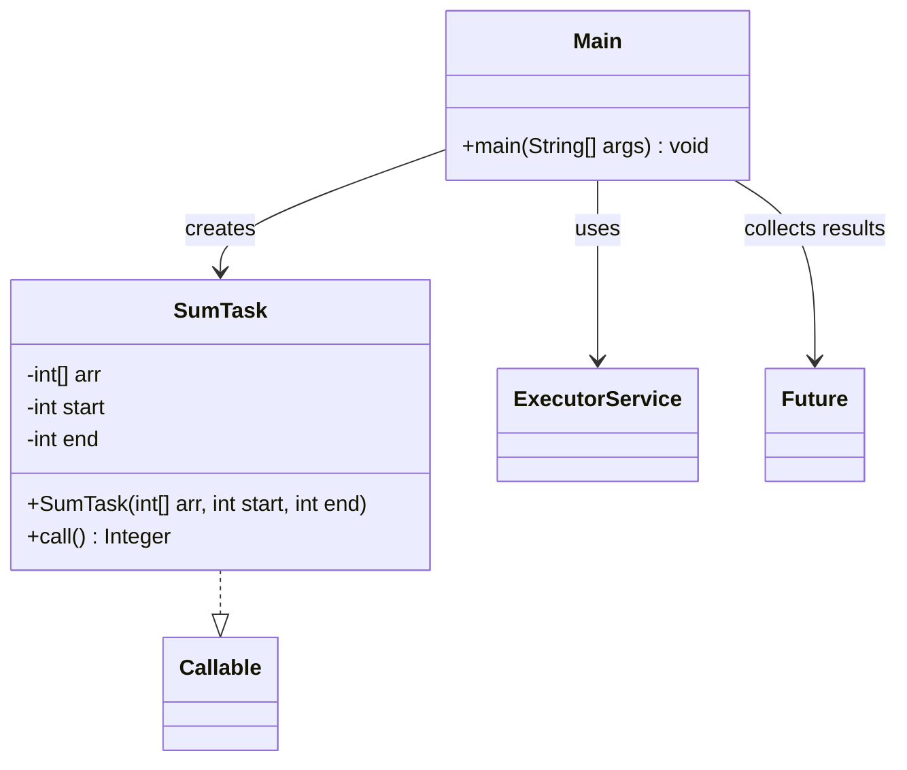

# Bài 2: Tổng của mảng

## 1. Tóm tắt ý tưởng chính của lời giải

Bài toán yêu cầu tính tổng các phần tử của một mảng số nguyên bằng cách sử dụng thread pool trong Java.

Lời giải thực hiện theo hướng chia mảng thành nhiều đoạn nhỏ, với mỗi đoạn được xử lý bởi một tác vụ `Callable<Integer>`. Mỗi tác vụ sẽ tính tổng của đoạn mà nó phụ trách và trả về kết quả. Sau đó, chương trình dùng `ExecutorService` để quản lý các luồng, gửi các tác vụ vào thread pool bằng `submit()`, rồi dùng `Future.get()` để lấy kết quả của từng đoạn và cộng lại thành tổng cuối cùng.

## 2. Thiết kế hệ thống

### 2.1. Lớp `SumTask`
**Khai báo:** `public class SumTask implements Callable<Integer>`

#### Thuộc tính
- `arr` (`int[]`): mảng số nguyên cần tính tổng.
- `start` (`int`): chỉ số bắt đầu của đoạn.
- `end` (`int`): chỉ số kết thúc của đoạn, theo kiểu cận trên.

#### Vai trò
Lớp này biểu diễn một tác vụ tính tổng một đoạn của mảng.

#### Logic xử lý
Trong phương thức `call()`:
1. Khởi tạo biến `sum = 0`.
2. Duyệt từ chỉ số `start` đến `end - 1`.
3. Cộng dồn các phần tử vào `sum`.
4. Trả về tổng của đoạn dưới dạng `Integer`.

### 2.2. Lớp `Main`
**Khai báo:** `public class Main`

#### Vai trò
Lớp điều phối toàn bộ chương trình, bao gồm nhập dữ liệu, chia đoạn, tạo thread pool, gửi tác vụ và tổng hợp kết quả.

#### Logic xử lý
1. Nhập `n` từ bàn phím.
2. Kiểm tra `n > 0`. Nếu không hợp lệ thì in thông báo lỗi và kết thúc.
3. Nhập `n` số nguyên vào mảng.
4. Đặt số đoạn xử lý là `k = 4`.
5. Tính `chunkSize = (n + k - 1) / k` để chia mảng gần đều.
6. Tạo `ExecutorService` bằng `Executors.newFixedThreadPool(k)`.
7. Với mỗi đoạn, tạo một `SumTask` và `submit()` vào thread pool.
8. Duyệt qua danh sách `Future<Integer>`, dùng `get()` để lấy tổng từng đoạn và cộng vào `totalSum`.
9. In kết quả cuối cùng.
10. Đóng `ExecutorService` bằng `shutdown()` và `awaitTermination()`.

## Sơ đồ lớp



## 3. Lý do lựa chọn hướng tiếp cận và ưu điểm

### Hướng tiếp cận
Bài làm sử dụng mô hình chia để xử lý: mảng được tách thành nhiều đoạn, mỗi đoạn do một `Callable` phụ trách. Các tác vụ được thực thi song song trong một fixed thread pool để tận dụng đa luồng mà vẫn dễ quản lý.

### Ưu điểm
- Tận dụng được khả năng xử lý song song của nhiều luồng.
- Tách biệt rõ phần công việc tính tổng đoạn (`SumTask`) và phần điều phối chương trình (`Main`).
- `Callable` cho phép trả về kết quả trực tiếp, phù hợp hơn `Runnable` trong bài toán này.
- `ExecutorService` giúp quản lý luồng tốt hơn so với việc tự tạo nhiều `Thread` thủ công.
- `Future.get()` cho phép thu thập kết quả từng tác vụ một cách rõ ràng.

### Kiến thức rút ra
- Cách dùng `Callable<Integer>` để trả về kết quả từ một tác vụ đa luồng.
- Cách tạo fixed thread pool với `ExecutorService`.
- Cách dùng `submit()` để gửi tác vụ vào thread pool.
- Cách dùng `Future.get()` để lấy kết quả từ các tác vụ.
- Cách chia mảng thành nhiều đoạn để xử lý song song.

## 4. Ví dụ

### Input
```text
Enter n: 8
Enter 8 integers:
1 2 3 4 5 6 7 8
```

### Output
```text
Total sum: 36
```

Trong ví dụ trên:
- Mảng gồm 8 phần tử.
- Chương trình chia mảng thành các đoạn nhỏ với `k = 4`.
- Mỗi đoạn được tính tổng bởi một `SumTask`.
- Kết quả cuối cùng là tổng của toàn bộ mảng.

## 5. Kết luận

Bài tập đã giải quyết đúng yêu cầu tính tổng mảng bằng thread pool trong Java. Chương trình sử dụng `Callable`, `Future` và `ExecutorService` để chia công việc thành các phần nhỏ, xử lý song song và tổng hợp lại kết quả cuối cùng.

Cách tiếp cận này là nền tảng quan trọng để phát triển các bài toán đa luồng phức tạp hơn như xử lý dữ liệu lớn, chia nhỏ tác vụ hoặc tối ưu hiệu năng tính toán.

## 6. Cách chạy chương trình

1. Đảm bảo hai file nguồn nằm cùng thư mục:
   - `SumTask.java`
   - `Main.java`

2. Biên dịch chương trình:
   ```bash
   javac Main.java SumTask.java
   ```

3. Chạy chương trình:
   ```bash
   java Main
   ```
