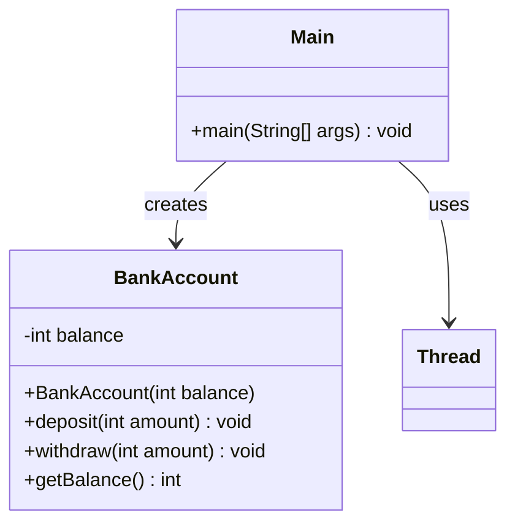

# Bài 3: Đồng bộ hóa

## 1. Tóm tắt ý tưởng chính của lời giải

Bài toán yêu cầu mô phỏng một tài khoản ngân hàng an toàn luồng trong Java. Tài khoản có số dư dùng chung và được hai luồng cùng truy cập: một luồng liên tục nạp tiền, luồng còn lại liên tục rút tiền.

Lời giải xây dựng lớp `BankAccount` chứa thuộc tính `balance` và các phương thức `deposit(int amount)` và `withdraw(int amount)` được khai báo `synchronized` để đảm bảo việc cập nhật số dư là an toàn trong môi trường đa luồng. Trong `Main`, chương trình tạo hai luồng, cho chúng chạy đồng thời, sau đó dùng `join()` để chờ cả hai hoàn thành trước khi in ra số dư cuối cùng.

## 2. Thiết kế hệ thống

### 2.1. Lớp `BankAccount`
**Khai báo:** `public class BankAccount`

#### Thuộc tính
- `balance` (`int`): số dư hiện tại của tài khoản.

#### Vai trò
Lớp này biểu diễn tài khoản ngân hàng và quản lý toàn bộ thao tác cập nhật số dư.

#### Logic xử lý
- `deposit(int amount)`: cộng `amount` vào `balance`.  
- `withdraw(int amount)`: trừ `amount` khỏi `balance`.  
- `getBalance()`: trả về số dư hiện tại.

Hai phương thức `deposit()` và `withdraw()` được khai báo `synchronized` để:
1. Chỉ một luồng được phép cập nhật `balance` tại một thời điểm.
2. Tránh sai lệch dữ liệu do race condition.
3. Đảm bảo kết quả cuối cùng đúng theo logic bài toán.

### 2.2. Lớp `Main`
**Khai báo:** `public class Main`

#### Vai trò
Lớp điều phối chương trình, chứa hàm `main()` để tạo tài khoản, tạo các luồng và chờ các luồng hoàn thành.

#### Logic xử lý
1. Tạo một đối tượng `BankAccount` với số dư ban đầu.
2. Tạo luồng A:
   - lặp 1000 lần
   - mỗi lần gọi `deposit(100)`
3. Tạo luồng B:
   - lặp 1000 lần
   - mỗi lần gọi `withdraw(100)`
4. Gọi `start()` cho cả hai luồng để chạy song song.
5. Gọi `join()` để chờ cả hai luồng hoàn thành.
6. In ra `Final balance`.

## Sơ đồ lớp



## 3. Lý do lựa chọn hướng tiếp cận và ưu điểm

### Hướng tiếp cận
Bài làm sử dụng từ khóa `synchronized` trên các phương thức cập nhật dữ liệu dùng chung. Đây là cách tiếp cận trực tiếp, rõ ràng và phù hợp cho bài toán đồng bộ hóa cơ bản trong Java.

### Ưu điểm
- Đảm bảo an toàn dữ liệu khi nhiều luồng cùng truy cập và cập nhật `balance`.
- Dễ cài đặt, dễ đọc và phù hợp với bài nhập môn về synchronization.
- Kết hợp `join()` giúp chương trình chỉ in kết quả sau khi cả hai luồng đã hoàn thành.
- Mô hình bài toán ngắn gọn nhưng thể hiện rõ tác dụng của đồng bộ hóa.

### Kiến thức rút ra
- Vai trò của dữ liệu dùng chung trong lập trình đa luồng.
- Nguyên nhân gây race condition khi không đồng bộ hóa.
- Cách sử dụng `synchronized` để bảo vệ vùng cập nhật dữ liệu.
- Cách dùng `join()` để chờ các luồng kết thúc trước khi xử lý tiếp.

## 4. Ví dụ

Không có input từ người dùng.  
Dữ liệu được mô phỏng trực tiếp trong chương trình.

### Output mong đợi
```text
Final balance: 0
```

Giải thích:
- Luồng A nạp `100` vào tài khoản `1000` lần, tổng cộng `100000`.
- Luồng B rút `100` khỏi tài khoản `1000` lần, tổng cộng `100000`.
- Hai thao tác đối nghịch nhau nên số dư cuối cùng phải là `0`.

Nếu bỏ `synchronized`, kết quả có thể sai do race condition.

## 5. Kết luận

Bài tập đã mô phỏng thành công một tài khoản ngân hàng an toàn luồng bằng cách sử dụng `synchronized` trong Java. Nhờ đó, số dư được cập nhật chính xác ngay cả khi có nhiều luồng cùng thao tác trên cùng một đối tượng.

Đây là ví dụ nền tảng giúp hiểu rõ bản chất của synchronization trước khi học các cơ chế nâng cao hơn như `Lock`, `ReentrantLock` hoặc các biến nguyên tử.

## 6. Cách chạy chương trình

1. Đảm bảo hai file nguồn nằm cùng thư mục:
   - `BankAccount.java`
   - `Main.java`

2. Biên dịch chương trình:
   ```bash
   javac Main.java BankAccount.java
   ```

3. Chạy chương trình:
   ```bash
   java Main
   ```
