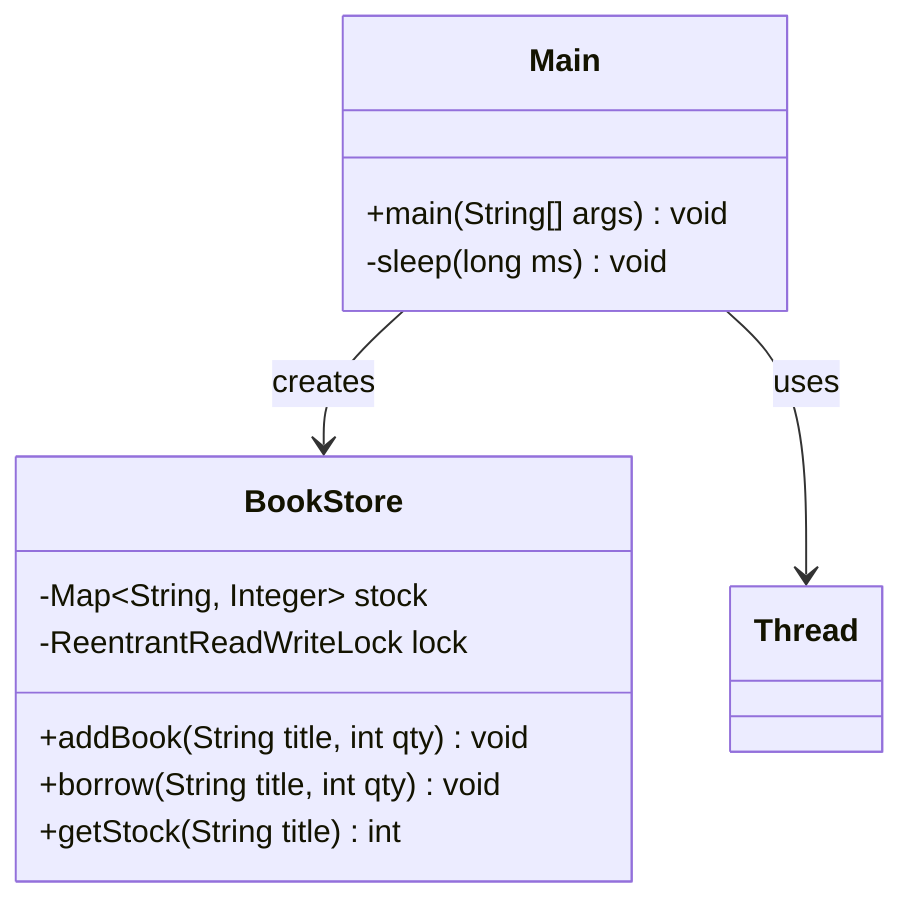

# Bài 4: BookStore với ReentrantReadWriteLock

## 1. Tóm tắt ý tưởng chính của lời giải

Bài toán yêu cầu xây dựng cơ chế quản lý sách cho phép nhiều luồng đọc dữ liệu đồng thời, nhưng phải chặn khi có thao tác ghi dữ liệu. Đây là mô hình điển hình của bài toán nhiều đọc - ít ghi trong lập trình đa luồng.

Lời giải xây dựng lớp `BookStore` để quản lý kho sách bằng `Map<String, Integer>`, trong đó key là tên sách và value là số lượng còn lại. Để đồng bộ hóa truy cập, chương trình sử dụng `ReentrantReadWriteLock`: các thao tác đọc dùng `readLock()`, còn các thao tác thay đổi dữ liệu như thêm sách hoặc mượn sách dùng `writeLock()`.

Trong `Main`, chương trình khởi tạo trước một số đầu sách, sau đó tạo 3 luồng đọc và 2 luồng ghi để chạy đồng thời. Log in ra màn hình giúp quan sát thứ tự thực thi giữa các thao tác đọc và ghi.

## 2. Thiết kế hệ thống

### 2.1. Lớp `BookStore`
**Khai báo:** `public class BookStore`

#### Thuộc tính
- `stock` (`Map<String, Integer>`): lưu số lượng sách theo tên sách.
- `lock` (`ReentrantReadWriteLock`): khóa đọc-ghi dùng để đồng bộ truy cập dữ liệu.

#### Vai trò
Lớp này quản lý toàn bộ kho sách và cung cấp các phương thức đọc, thêm sách và mượn sách theo cơ chế an toàn luồng.

#### Logic xử lý

##### Phương thức `addBook(String title, int qty)`
- Dùng `writeLock()` vì có thay đổi dữ liệu.
- Lấy số lượng hiện tại của sách, nếu chưa có thì mặc định là `0`.
- Cộng thêm `qty` và cập nhật lại vào `stock`.
- In log cho biết luồng nào vừa thêm sách và số lượng mới.

##### Phương thức `borrow(String title, int qty)`
- Dùng `writeLock()` vì có thay đổi dữ liệu.
- Kiểm tra số lượng hiện tại của sách.
- Nếu đủ số lượng thì trừ đi `qty`.
- Nếu không đủ thì in thông báo mượn thất bại.
- In log để theo dõi thao tác ghi.

##### Phương thức `getStock(String title)`
- Dùng `readLock()` vì chỉ đọc dữ liệu.
- Lấy số lượng hiện tại của sách.
- In log cho biết luồng nào đang kiểm tra kho.
- Trả về số lượng hiện có.

### 2.2. Lớp `Main`
**Khai báo:** `public class Main`

#### Vai trò
Lớp điều phối chương trình, chứa `main()` để khởi tạo dữ liệu, tạo các luồng đọc/ghi và chờ các luồng hoàn thành.

#### Logic xử lý
1. Tạo đối tượng `BookStore`.
2. Khởi tạo sẵn một số đầu sách như `Java`, `OOP`, `Database`.
3. Tạo 3 luồng đọc:
   - mỗi luồng gọi `getStock(...)` nhiều lần để kiểm tra số lượng sách.
4. Tạo 2 luồng ghi:
   - một luồng mượn sách bằng `borrow(...)`
   - một luồng thêm sách bằng `addBook(...)`
5. Gọi `start()` cho tất cả các luồng để chạy đồng thời.
6. Gọi `join()` để chờ tất cả các luồng hoàn thành.
7. In tồn kho cuối cùng của từng đầu sách.

## Sơ đồ lớp



## 3. Lý do lựa chọn hướng tiếp cận và ưu điểm

### Hướng tiếp cận
Bài làm sử dụng `ReentrantReadWriteLock` thay vì `synchronized` thông thường. Cách này phù hợp với tình huống có nhiều thao tác đọc dữ liệu vì nó cho phép nhiều luồng đọc chạy cùng lúc, trong khi vẫn đảm bảo độc quyền cho thao tác ghi.

### Ưu điểm
- Cho phép nhiều luồng đọc đồng thời, tăng hiệu quả khi hệ thống chủ yếu đọc dữ liệu.
- Thao tác ghi được bảo vệ bằng `writeLock()`, tránh xung đột dữ liệu.
- Cấu trúc lớp rõ ràng: `BookStore` quản lý dữ liệu, `Main` điều phối luồng.
- Log in ra màn hình giúp dễ quan sát và kiểm tra cơ chế đồng bộ.

### Kiến thức rút ra
- Cách sử dụng `ReentrantReadWriteLock` trong Java.
- Sự khác nhau giữa `readLock()` và `writeLock()`.
- Khi nào nên dùng read-write lock thay vì khóa đồng bộ thông thường.
- Cách tổ chức bài toán nhiều đọc, ít ghi trong lập trình đa luồng.

## 4. Ví dụ

Không có input từ người dùng.  
Dữ liệu được mô phỏng trực tiếp trong chương trình.

### Output minh họa
```text
main added 10 copies of Java. New stock: 10
main added 5 copies of OOP. New stock: 5
main added 7 copies of Database. New stock: 7
Reader-1 checked stock of Java: 10
Reader-2 checked stock of OOP: 5
Reader-3 checked stock of Database: 7
Writer-1 borrowed 3 copies of Java. Remaining stock: 7
Writer-2 added 4 copies of Database. New stock: 11
Writer-1 borrowed 2 copies of OOP. Remaining stock: 3
Writer-2 added 2 copies of Java. New stock: 9
Final stock:
Java: 9
OOP: 3
Database: 11
```

Lưu ý: do các luồng chạy đồng thời, thứ tự log thực tế có thể thay đổi giữa các lần chạy. Tuy nhiên, kết quả cuối cùng vẫn phải đúng theo logic cập nhật dữ liệu.

## 5. Kết luận

Bài tập đã xây dựng thành công một hệ thống quản lý sách an toàn luồng bằng `ReentrantReadWriteLock`. Giải pháp này cho phép nhiều luồng đọc hoạt động song song nhưng vẫn đảm bảo tính nhất quán của dữ liệu khi có thao tác ghi.

Đây là ví dụ thực tế và phù hợp để hiểu rõ cách áp dụng read-write lock trong các hệ thống có tần suất đọc cao hơn ghi.

## 6. Cách chạy chương trình

1. Đảm bảo hai file nguồn nằm cùng thư mục:
   - `BookStore.java`
   - `Main.java`

2. Biên dịch chương trình:
   ```bash
   javac Main.java BookStore.java
   ```

3. Chạy chương trình:
   ```bash
   java Main
   ```
