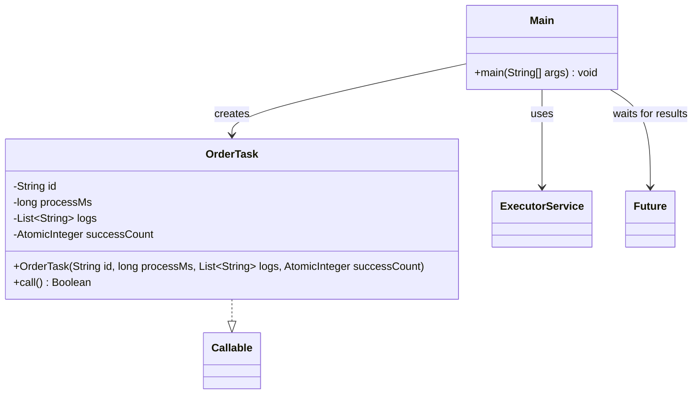

# Bài 5: Hệ thống xử lý đơn hàng

## 1. Tóm tắt ý tưởng chính của lời giải

Bài toán yêu cầu xây dựng một hệ thống xử lý đơn hàng song song trong Java, kết hợp nhiều kiến thức như `ExecutorService`, `Callable/Future`, đồng bộ hóa và `AtomicInteger`.

Mỗi đơn hàng được biểu diễn bằng một tác vụ `Callable<Boolean>`. Khi chạy, tác vụ sẽ in ra trạng thái bắt đầu, tạm dừng theo thời gian xử lý mô phỏng bằng `sleep(processMs)`, sau đó xác định đơn hàng thành công hay thất bại dựa trên điều kiện:
- nếu `processMs > 1500` thì thất bại
- ngược lại thì thành công

Các tác vụ được gửi vào một fixed thread pool để chạy song song. Kết quả hoàn thành của từng đơn được ghi vào danh sách log dùng chung theo thứ tự thực tế hoàn thành. Số đơn thành công được đếm bằng `AtomicInteger`.

## 2. Thiết kế hệ thống

### 2.1. Lớp `OrderTask`
**Khai báo:** `public class OrderTask implements Callable<Boolean>`

#### Thuộc tính
- `id` (`String`): mã đơn hàng.
- `processMs` (`long`): thời gian xử lý đơn hàng.
- `logs` (`List<String>`): danh sách log dùng chung để lưu trạng thái hoàn thành của các đơn.
- `successCount` (`AtomicInteger`): biến đếm số đơn thành công.

#### Vai trò
Lớp này biểu diễn một đơn hàng được xử lý như một tác vụ song song trong thread pool.

#### Logic xử lý
Trong phương thức `call()`:
1. In `Start <id>`.
2. Gọi `Thread.sleep(processMs)` để mô phỏng thời gian xử lý.
3. Nếu bị ngắt trong lúc ngủ:
   - khôi phục trạng thái interrupt
   - ghi `FAIL <id>` vào `logs`
   - trả về `false`
4. Kiểm tra điều kiện thành công:
   - nếu `processMs <= 1500` thì thành công
   - nếu `processMs > 1500` thì thất bại
5. Ghi vào `logs` một trong hai dạng:
   - `DONE <id>`
   - `FAIL <id>`
6. Nếu thành công thì tăng `successCount`.
7. Trả về kết quả `true` hoặc `false`.

Việc ghi vào `logs` được đồng bộ bằng `synchronized (logs)` để tránh race condition khi nhiều luồng cùng ghi.

### 2.2. Lớp `Main`
**Khai báo:** `public class Main`

#### Vai trò
Lớp điều phối toàn bộ chương trình: nhập dữ liệu, tạo thread pool, gửi tác vụ, chờ hoàn thành và in kết quả tổng hợp.

#### Logic xử lý
1. Nhập số lượng đơn hàng `m`.
2. Nhập lần lượt:
   - `id`
   - `processMs`
3. Tạo danh sách `logs` dùng chung.
4. Tạo `AtomicInteger successCount`.
5. Tạo `ExecutorService` bằng `Executors.newFixedThreadPool(4)`.
6. Với mỗi đơn hàng, tạo một `OrderTask` và gửi vào thread pool bằng `submit()`.
7. Lưu các `Future<Boolean>` để theo dõi kết quả.
8. Gọi `Future.get()` cho từng tác vụ để chờ tất cả hoàn thành.
9. In:
   - `Success = <count>`
   - toàn bộ `logs` theo thứ tự hoàn thành thực tế
10. Đóng `ExecutorService`.

## Sơ đồ lớp



## 3. Lý do lựa chọn hướng tiếp cận và ưu điểm

### Hướng tiếp cận
Bài làm sử dụng `Callable<Boolean>` thay vì `Runnable` vì mỗi đơn hàng cần trả về trạng thái thành công hoặc thất bại. Các tác vụ được chạy trong `ExecutorService` để xử lý song song và quản lý luồng hiệu quả hơn so với việc tự tạo nhiều `Thread` thủ công.

### Ưu điểm
- Hỗ trợ xử lý nhiều đơn hàng song song.
- `Callable` cho phép trả về kết quả trực tiếp.
- `Future.get()` giúp chờ và đồng bộ kết quả các tác vụ.
- `AtomicInteger` phù hợp để đếm số đơn thành công trong môi trường đa luồng.
- `logs` được ghi theo thứ tự hoàn thành thực tế của từng đơn hàng.
- Có đồng bộ hóa khi ghi log nên tránh được lỗi tranh chấp dữ liệu.

### Kiến thức rút ra
- Cách dùng `ExecutorService` với fixed thread pool.
- Cách cài đặt `Callable<Boolean>`.
- Cách dùng `Future` để lấy kết quả task.
- Cách dùng `AtomicInteger` cho biến đếm dùng chung.
- Cách đồng bộ thao tác ghi trên tài nguyên chia sẻ bằng `synchronized`.

## 4. Ví dụ

### Input
```text
Enter number of orders: 2
Enter order id: 01
Enter process time (ms): 1000
Enter order id: 02
Enter process time (ms): 2000
```

### Output
```text
Start 02
Start 01
Success = 1
Logs:
DONE 01
FAIL 02
```

### Giải thích
- Đơn `01` có `processMs = 1000`, nên thành công vì `1000 <= 1500`.
- Đơn `02` có `processMs = 2000`, nên thất bại vì `2000 > 1500`.
- `Success = 1` vì chỉ có một đơn thành công.
- Danh sách log được in theo **thứ tự hoàn thành**, không phải thứ tự nhập.
- Thứ tự các dòng `Start ...` có thể thay đổi giữa các lần chạy do các luồng chạy song song.

## 5. Kết luận

Bài tập đã xây dựng thành công một hệ thống xử lý đơn hàng song song bằng Java với các thành phần quan trọng của lập trình đa luồng: `ExecutorService`, `Callable/Future`, đồng bộ hóa và `AtomicInteger`.

Giải pháp này thể hiện rõ cách tổ chức một bài toán xử lý song song có trả về kết quả, có chia sẻ dữ liệu và cần đảm bảo tính đúng đắn khi nhiều luồng cùng hoạt động.

## 6. Cách chạy chương trình

1. Đảm bảo hai file nguồn nằm cùng thư mục:
   - `OrderTask.java`
   - `Main.java`

2. Biên dịch chương trình:
   ```bash
   javac Main.java OrderTask.java
   ```

3. Chạy chương trình:
   ```bash
   java Main
   ```
