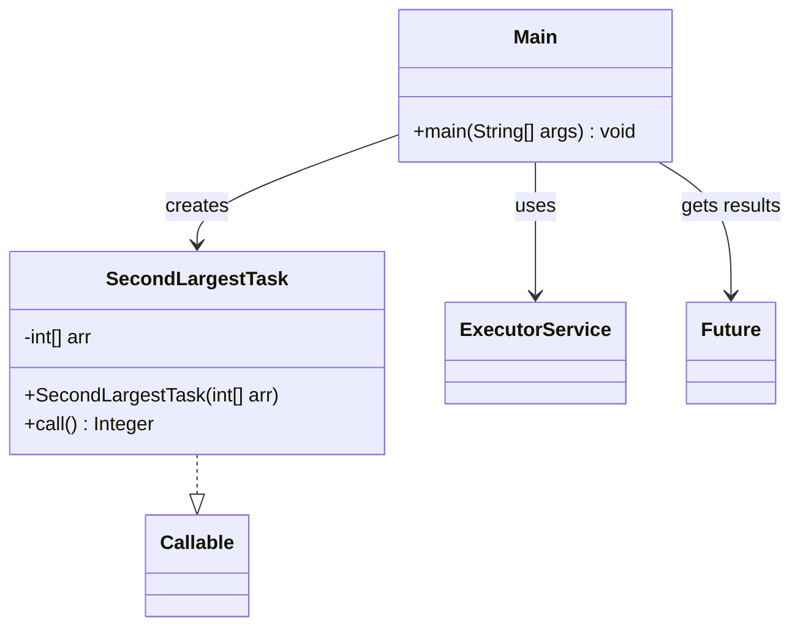

# Bài 6: Tổng số lớn thứ hai

## 1. Tóm tắt ý tưởng chính của lời giải

Bài toán yêu cầu xử lý nhiều mảng số nguyên, trong đó mỗi mảng được giao cho một tác vụ `Callable<Integer>` riêng để tìm số lớn thứ hai phân biệt. Sau khi tất cả tác vụ hoàn thành, chương trình dùng `Future.get()` để lấy kết quả từng mảng và cộng các giá trị hợp lệ lại thành một tổng cuối cùng.

Lời giải sử dụng `ExecutorService` để quản lý việc thực thi song song. Mỗi mảng được xử lý độc lập nên rất phù hợp để tách thành các task riêng. Nếu một mảng không có số lớn thứ hai hợp lệ, task sẽ trả về `null`, chương trình in `Not found` và bỏ qua mảng đó khi tính tổng.

## 2. Thiết kế hệ thống

### 2.1. Lớp `SecondLargestTask`
**Khai báo:** `public class SecondLargestTask implements Callable<Integer>`

#### Thuộc tính
- `arr` (`int[]`): mảng số nguyên cần tìm số lớn thứ hai.

#### Vai trò
Lớp này biểu diễn một tác vụ xử lý độc lập cho một mảng. Nhiệm vụ của task là tìm số lớn thứ hai phân biệt trong mảng và trả về kết quả.

#### Logic xử lý
Trong phương thức `call()`:
1. Nếu mảng `null` hoặc có ít hơn 2 phần tử thì trả về `null`.
2. Duyệt qua từng phần tử của mảng để tìm:
   - số lớn nhất
   - số lớn thứ hai phân biệt
3. Nếu không tìm được số lớn thứ hai hợp lệ thì trả về `null`.
4. Nếu tìm được thì trả về giá trị đó.

Thuật toán đảm bảo:
- xử lý đúng trường hợp có phần tử trùng nhau
- chỉ chấp nhận số lớn thứ hai **phân biệt** với số lớn nhất
- không làm chương trình bị lỗi khi mảng không hợp lệ

### 2.2. Lớp `Main`
**Khai báo:** `public class Main`

#### Vai trò
Lớp điều phối chương trình, phụ trách nhập dữ liệu, tạo các task, gửi task vào `ExecutorService`, lấy kết quả từ `Future` và in kết quả cuối cùng.

#### Logic xử lý
1. Nhập `n` là số mảng.
2. Với mỗi mảng:
   - nhập `m` là số phần tử
   - nhập tiếp `m` số nguyên
   - lưu mảng vào danh sách
3. Tạo `ExecutorService`.
4. Với mỗi mảng, tạo một `SecondLargestTask` và `submit()` vào thread pool.
5. Lưu các `Future<Integer>` để lấy kết quả sau.
6. Duyệt qua từng `Future`:
   - nếu kết quả là `null` thì in `Array i: Not found`
   - nếu có kết quả thì in `Array i: second largest = ...` và cộng vào tổng
7. In `Sum = ...`
8. Đóng `ExecutorService`.

## Sơ đồ lớp



## 3. Lý do lựa chọn hướng tiếp cận và ưu điểm

### Hướng tiếp cận
Bài làm chia mỗi mảng thành một tác vụ `Callable<Integer>` riêng vì các mảng độc lập với nhau. Đây là cách tiếp cận tự nhiên cho bài toán song song hóa: mỗi luồng xử lý một mảng, sau đó chương trình chính tổng hợp kết quả.

### Ưu điểm
- Tận dụng tốt xử lý song song vì các mảng không phụ thuộc nhau.
- `Callable<Integer>` phù hợp do cần trả về giá trị kết quả.
- `Future.get()` giúp lấy kết quả từng task rõ ràng và an toàn.
- Xử lý được trường hợp mảng không có số lớn thứ hai mà không làm chương trình bị crash.
- Output rõ ràng cho từng mảng và tổng cuối cùng.

### Kiến thức rút ra
- Cách dùng `Callable<Integer>` trong Java.
- Cách quản lý nhiều task bằng `ExecutorService`.
- Cách lấy kết quả bằng `Future`.
- Cách xử lý trường hợp không hợp lệ bằng giá trị `null`.
- Cách tìm số lớn thứ hai phân biệt trong một mảng số nguyên.

## 4. Ví dụ

### Input
```text
4
5 3 7 1 9 4
4 5 5 5 5
3 2 8 6
1 10
```

### Output
```text
Array 0: second largest = 7
Array 1: Not found
Array 2: second largest = 6
Array 3: Not found
Sum = 13
```

### Giải thích
- Mảng 0: `3 7 1 9 4` có số lớn nhất là `9`, số lớn thứ hai là `7`.
- Mảng 1: `5 5 5 5` không có số lớn thứ hai phân biệt nên `Not found`.
- Mảng 2: `2 8 6` có số lớn nhất là `8`, số lớn thứ hai là `6`.
- Mảng 3: chỉ có một phần tử nên không có số lớn thứ hai hợp lệ.
- Tổng cuối cùng chỉ cộng các kết quả hợp lệ: `7 + 6 = 13`.

## 5. Kết luận

Bài tập đã giải quyết đúng yêu cầu bằng cách kết hợp `Callable<Integer>`, `ExecutorService` và `Future`. Mỗi mảng được xử lý riêng biệt, kết quả được thu thập an toàn, và các trường hợp không hợp lệ được xử lý mềm mà không làm chương trình dừng đột ngột.

Đây là một ví dụ tốt cho việc áp dụng đa luồng vào bài toán xử lý nhiều tập dữ liệu độc lập.

## 6. Cách chạy chương trình

1. Đảm bảo hai file nguồn nằm cùng thư mục:
   - `SecondLargestTask.java`
   - `Main.java`

2. Biên dịch chương trình:
   ```bash
   javac Main.java SecondLargestTask.java
   ```

3. Chạy chương trình:
   ```bash
   java Main
   ```
