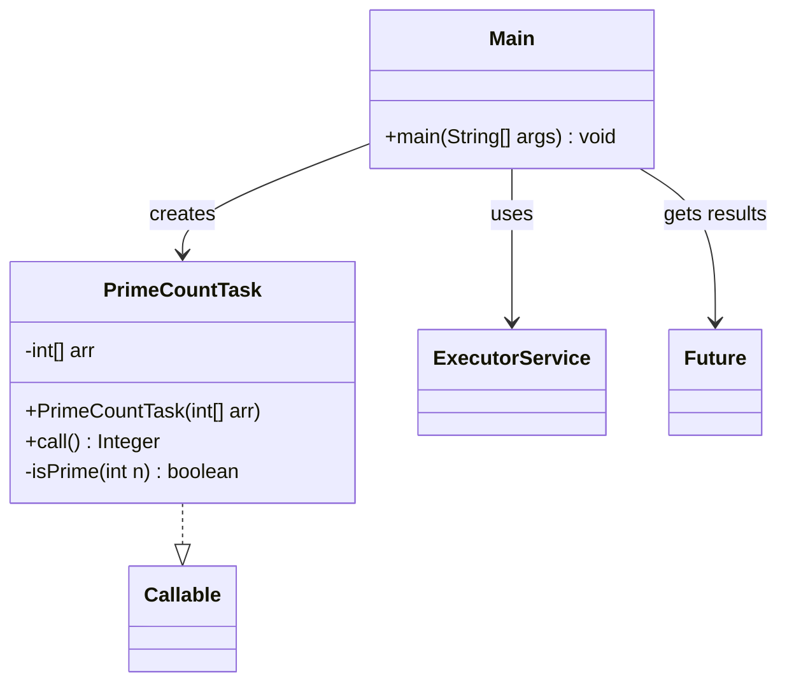

# Bài 7: Đếm số nguyên tố trong n mảng

## 1. Tóm tắt ý tưởng chính của lời giải

Bài toán yêu cầu đếm số lượng số nguyên tố trong từng mảng theo cách đồng thời, sau đó xác định mảng có nhiều số nguyên tố nhất. Nếu có nhiều mảng cùng đạt số lượng lớn nhất thì phải in ra tất cả.

Lời giải sử dụng `ExecutorService` để chạy song song nhiều tác vụ. Mỗi mảng được giao cho một `Callable<Integer>` riêng để đếm số nguyên tố trong mảng đó. Sau khi tất cả task hoàn thành, chương trình dùng `Future.get()` để thu thập kết quả, in số lượng số nguyên tố của từng mảng, rồi tìm giá trị lớn nhất để xác định mảng đứng đầu.

## 2. Thiết kế hệ thống

### 2.1. Lớp `PrimeCountTask`
**Khai báo:** `public class PrimeCountTask implements Callable<Integer>`

#### Thuộc tính
- `arr` (`int[]`): mảng số nguyên cần đếm số nguyên tố.

#### Vai trò
Lớp này biểu diễn một tác vụ xử lý độc lập cho một mảng. Mỗi task có nhiệm vụ đếm xem trong mảng có bao nhiêu số nguyên tố.

#### Logic xử lý
Trong phương thức `call()`:
1. Khởi tạo biến đếm `count = 0`.
2. Duyệt qua từng phần tử trong mảng.
3. Với mỗi phần tử, gọi hàm `isPrime(int n)` để kiểm tra có phải số nguyên tố hay không.
4. Nếu là số nguyên tố thì tăng biến đếm.
5. Trả về tổng số lượng số nguyên tố trong mảng.

#### Hàm `isPrime(int n)`
- Trả về `false` nếu `n < 2`.
- Trả về `true` nếu `n == 2`.
- Loại ngay các số chẵn lớn hơn 2.
- Kiểm tra các ước lẻ từ `3` đến `sqrt(n)`.
- Nếu tìm thấy ước chia hết thì không phải số nguyên tố.

Cách kiểm tra này đúng và hiệu quả hơn so với thử chia từ `2` đến `n - 1`.

### 2.2. Lớp `Main`
**Khai báo:** `public class Main`

#### Vai trò
Lớp điều phối toàn bộ chương trình: nhập dữ liệu, tạo task, gửi task vào thread pool, lấy kết quả và xác định mảng có nhiều số nguyên tố nhất.

#### Logic xử lý
1. Nhập `n` là số mảng.
2. Với mỗi mảng:
   - nhập `m` là số phần tử
   - nhập tiếp `m` số nguyên
   - lưu mảng vào danh sách
3. Tạo `ExecutorService`.
4. Với mỗi mảng, tạo một `PrimeCountTask` và `submit()` vào thread pool.
5. Thu thập các `Future<Integer>`.
6. Dùng `Future.get()` để lấy số lượng số nguyên tố của từng mảng.
7. In kết quả theo dạng:
   - `Array 0: 3`
   - `Array 1: 1`
   - ...
8. Tìm số lượng lớn nhất.
9. Xác định tất cả các mảng có cùng số lượng lớn nhất.
10. In kết luận cuối:
   - nếu chỉ có một mảng đứng đầu: `Most primes: Array i with x primes`
   - nếu có nhiều mảng cùng đứng đầu: in tất cả các mảng đó.

## Sơ đồ lớp



## 3. Lý do lựa chọn hướng tiếp cận và ưu điểm

### Hướng tiếp cận
Mỗi mảng được xử lý độc lập nên việc tách thành các task song song là rất phù hợp. `Callable<Integer>` được chọn vì mỗi task cần trả về số lượng số nguyên tố tìm được trong mảng tương ứng.

### Ưu điểm
- Đúng với yêu cầu xử lý đồng thời nhiều mảng.
- Tận dụng tốt mô hình song song vì các mảng không phụ thuộc nhau.
- `Future.get()` giúp thu thập kết quả rõ ràng và an toàn.
- Dễ mở rộng cho số lượng mảng lớn hơn.
- Có thể xử lý đúng cả trường hợp nhiều mảng cùng có số lượng số nguyên tố lớn nhất.

### Kiến thức rút ra
- Cách dùng `ExecutorService` để chạy đồng thời nhiều task.
- Cách cài đặt `Callable<Integer>`.
- Cách dùng `Future` để nhận kết quả từ các tác vụ.
- Cách kiểm tra số nguyên tố hiệu quả.
- Cách tổng hợp kết quả từ nhiều luồng trước khi đưa ra kết luận cuối cùng.

## 4. Ví dụ

### Input
```text
4
5 2 3 4 5 6
4 7 8 9 10
3 11 12 13
4 2 4 6 8
```

### Output
```text
Array 0: 3
Array 1: 1
Array 2: 2
Array 3: 1
Most primes: Array 0 with 3 primes
```

### Giải thích
- Mảng 0: `2, 3, 5` là số nguyên tố nên có `3`.
- Mảng 1: chỉ có `7` là số nguyên tố nên có `1`.
- Mảng 2: `11, 13` là số nguyên tố nên có `2`.
- Mảng 3: chỉ có `2` là số nguyên tố nên có `1`.
- Mảng có nhiều số nguyên tố nhất là mảng 0 với `3` số nguyên tố.

## 5. Kết luận

Bài tập đã giải quyết đúng yêu cầu bằng cách dùng nhiều task chạy song song để đếm số nguyên tố trong từng mảng, sau đó tổng hợp toàn bộ kết quả để xác định mảng có số lượng số nguyên tố nhiều nhất.

Đây là ví dụ điển hình cho việc áp dụng đa luồng vào bài toán chia nhỏ dữ liệu độc lập và xử lý song song để tăng tính rõ ràng cũng như khả năng mở rộng.

## 6. Cách chạy chương trình

1. Đảm bảo hai file nguồn nằm cùng thư mục:
   - `PrimeCountTask.java`
   - `Main.java`

2. Biên dịch chương trình:
   ```bash
   javac Main.java PrimeCountTask.java
   ```

3. Chạy chương trình:
   ```bash
   java Main
   ```
