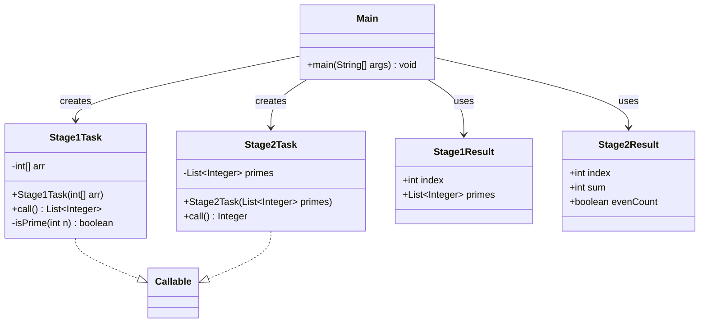

# Bài 8: Xử lý hai giai đoạn

## 1. Tóm tắt ý tưởng chính của lời giải

Bài toán yêu cầu xử lý `n` mảng số nguyên theo hai giai đoạn riêng biệt và cả hai giai đoạn đều phải thực hiện song song.

- **Giai đoạn 1**: với mỗi mảng, lọc ra danh sách các số nguyên tố.
- **Giai đoạn 2**: dựa trên kết quả của Giai đoạn 1:
  - nếu số lượng số nguyên tố là **chẵn** thì tính **tổng bình phương**
  - nếu số lượng số nguyên tố là **lẻ** thì tính **tổng lập phương**

Sau khi tất cả các task hoàn thành, chương trình in tổng tất cả các giá trị tìm được.  
Lời giải sử dụng **hai thread pool riêng biệt**:
- một pool cho Giai đoạn 1
- một pool cho Giai đoạn 2

Để đảm bảo mảng nào hoàn thành Giai đoạn 1 thì in kết quả ngay, và xong Giai đoạn 2 thì cũng in ngay, chương trình dùng `ExecutorCompletionService`.

## 2. Thiết kế hệ thống

### 2.1. Lớp `Stage1Task`
**Khai báo:** `public class Stage1Task implements Callable<List<Integer>>`

#### Thuộc tính
- `arr` (`int[]`): mảng số nguyên đầu vào.

#### Vai trò
Lớp này xử lý Giai đoạn 1 cho một mảng: lọc ra tất cả số nguyên tố có trong mảng.

#### Logic xử lý
Trong phương thức `call()`:
1. Tạo danh sách `primes`.
2. Duyệt từng phần tử trong mảng.
3. Nếu phần tử là số nguyên tố thì thêm vào `primes`.
4. Trả về danh sách số nguyên tố tìm được.

#### Hàm kiểm tra số nguyên tố
`isPrime(int n)`:
- loại các số nhỏ hơn 2
- xử lý riêng số 2
- loại số chẵn
- kiểm tra các ước lẻ từ `3` đến `sqrt(n)`

### 2.2. Lớp `Stage2Task`
**Khai báo:** `public class Stage2Task implements Callable<Integer>`

#### Thuộc tính
- `primes` (`List<Integer>`): danh sách số nguyên tố nhận từ Giai đoạn 1.

#### Vai trò
Lớp này xử lý Giai đoạn 2 cho một mảng dựa trên danh sách số nguyên tố đã lọc được.

#### Logic xử lý
Trong phương thức `call()`:
- Nếu số lượng phần tử trong `primes` là **chẵn**:
  - tính tổng bình phương các phần tử
- Nếu số lượng phần tử trong `primes` là **lẻ**:
  - tính tổng lập phương các phần tử
- Trả về kết quả tính được.

### 2.3. Lớp `Main`
**Khai báo:** `public class Main`

#### Vai trò
Lớp điều phối toàn bộ chương trình:
- nhập dữ liệu
- tạo hai thread pool
- submit các task của Giai đoạn 1
- khi một task Giai đoạn 1 hoàn thành thì in kết quả và chuyển tiếp sang Giai đoạn 2
- thu thập kết quả Giai đoạn 2 và tính tổng cuối cùng

#### Logic xử lý
1. Nhập `n` là số mảng.
2. Với mỗi mảng:
   - nhập `m` là độ dài mảng
   - nhập `m` số nguyên
3. Tạo hai thread pool riêng:
   - `stage1Pool`
   - `stage2Pool`
4. Tạo hai `ExecutorCompletionService` để nhận kết quả theo thứ tự hoàn thành.
5. Submit tất cả task của Giai đoạn 1 vào `stage1Pool`.
6. Mỗi khi một task Giai đoạn 1 hoàn thành:
   - in `Stage 1 - Array i: [...]`
   - submit tiếp task Giai đoạn 2 tương ứng vào `stage2Pool`
7. Mỗi khi một task Giai đoạn 2 hoàn thành:
   - in:
     - `sum of squares` nếu số lượng số nguyên tố chẵn
     - `sum of cubes` nếu số lượng số nguyên tố lẻ
   - cộng kết quả vào tổng chung
8. In `Total = ...`
9. Đóng cả hai thread pool.

### 2.4. Lớp hỗ trợ `Stage1Result`
#### Vai trò
Lưu kết quả của Giai đoạn 1 gồm:
- `index`: chỉ số mảng
- `primes`: danh sách số nguyên tố của mảng đó

### 2.5. Lớp hỗ trợ `Stage2Result`
#### Vai trò
Lưu kết quả của Giai đoạn 2 gồm:
- `index`: chỉ số mảng
- `sum`: giá trị tính được
- `evenCount`: cho biết số lượng số nguyên tố là chẵn hay lẻ để in đúng thông điệp

## Sơ đồ lớp



## 3. Lý do lựa chọn hướng tiếp cận và ưu điểm

### Hướng tiếp cận
Bài làm chọn mô hình pipeline hai giai đoạn:
- Giai đoạn 1 xử lý độc lập từng mảng để lọc số nguyên tố
- Giai đoạn 2 xử lý tiếp trên kết quả của từng mảng

Hai giai đoạn được tách ra bằng **hai thread pool riêng biệt**, đúng với yêu cầu đề bài. `ExecutorCompletionService` được dùng để lấy task theo thứ tự hoàn thành thực tế thay vì theo thứ tự nộp task.

### Ưu điểm
- Đúng yêu cầu có **hai thread pool riêng biệt**.
- Các mảng được xử lý đồng thời ở cả hai giai đoạn.
- Mảng nào xong Giai đoạn 1 sẽ được in kết quả ngay.
- Mảng nào xong Giai đoạn 2 cũng được in kết quả ngay.
- Không cần đợi tất cả Giai đoạn 1 xong mới bắt đầu Giai đoạn 2.
- Dễ quan sát tính song song qua thứ tự output.

### Kiến thức rút ra
- Cách tổ chức bài toán đa giai đoạn trong Java.
- Cách dùng `Callable` với dữ liệu trả về phức tạp hơn.
- Cách sử dụng `ExecutorCompletionService`.
- Cách thiết kế hai thread pool cho hai loại công việc khác nhau.
- Cách xử lý song song theo kiểu pipeline.

## 4. Ví dụ

### Input
```text
3
5 2 3 4 5 6
4 7 8 9 10
3 11 12 13
```

### Output
```text
Stage 1 - Array 0: [2, 3, 5]
Stage 1 - Array 1: [7]
Stage 2 - Array 1: sum of cubes = 343
Stage 1 - Array 2: [11, 13]
Stage 2 - Array 0: sum of cubes = 160
Stage 2 - Array 2: sum of squares = 290
Total = 793
```

### Giải thích
- Mảng 0 có các số nguyên tố `[2, 3, 5]`, số lượng là `3` (lẻ)  
  nên Giai đoạn 2 tính tổng lập phương: `2^3 + 3^3 + 5^3 = 8 + 27 + 125 = 160`.
- Mảng 1 có `[7]`, số lượng là `1` (lẻ)  
  nên tính tổng lập phương: `7^3 = 343`.
- Mảng 2 có `[11, 13]`, số lượng là `2` (chẵn)  
  nên tính tổng bình phương: `11^2 + 13^2 = 121 + 169 = 290`.
- Tổng cuối cùng là `160 + 343 + 290 = 793`.

Lưu ý: thứ tự các dòng output có thể thay đổi giữa các lần chạy vì task nào hoàn thành trước thì được in trước.

## 5. Kết luận

Bài tập đã xây dựng thành công mô hình xử lý song song hai giai đoạn với hai thread pool riêng biệt. Chương trình vừa đảm bảo đúng yêu cầu đồng thời, vừa thể hiện rõ luồng xử lý pipeline từ Giai đoạn 1 sang Giai đoạn 2.

Đây là một ví dụ tốt để học cách thiết kế các hệ thống xử lý nhiều bước trong lập trình đa luồng Java.

## 6. Cách chạy chương trình

1. Đảm bảo ba file nguồn nằm cùng thư mục:
   - `Stage1Task.java`
   - `Stage2Task.java`
   - `Main.java`

2. Biên dịch chương trình:
   ```bash
   javac Main.java Stage1Task.java Stage2Task.java
   ```

3. Chạy chương trình:
   ```bash
   java Main
   ```
