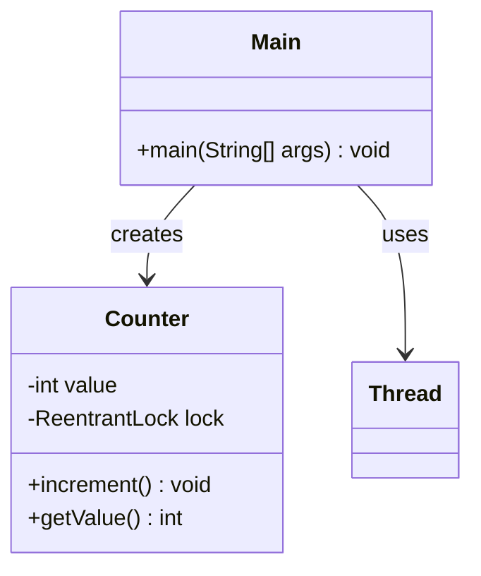

# Bài 9: Counter an toàn với ReentrantLock

## 1. Tóm tắt ý tưởng chính của lời giải

Bài toán yêu cầu mô phỏng một bộ đếm được nhiều luồng cùng cập nhật, trong đó việc tăng giá trị phải được bảo vệ bằng `ReentrantLock`. Ngoài ra, đề còn yêu cầu thử dùng `tryLock()` để tránh chờ vô hạn và in thông báo nếu một luồng không lấy được lock.

Lời giải xây dựng lớp `Counter` với biến `value` và một đối tượng `ReentrantLock`. Trong phương thức `increment()`, chương trình dùng `tryLock()` để thử lấy khóa:
- nếu lấy được thì tăng `value`
- nếu không lấy được thì in thông báo và bỏ qua lần tăng đó

Trong `Main`, chương trình tạo 4 luồng, mỗi luồng gọi `increment()` 10000 lần, sau đó dùng `join()` để chờ tất cả hoàn thành rồi in giá trị cuối cùng của counter.

## 2. Thiết kế hệ thống

### 2.1. Lớp `Counter`
**Khai báo:** `public class Counter`

#### Thuộc tính
- `value` (`int`): giá trị hiện tại của bộ đếm.
- `lock` (`ReentrantLock`): khóa dùng để bảo vệ thao tác tăng giá trị.

#### Vai trò
Lớp này quản lý bộ đếm dùng chung giữa nhiều luồng và đảm bảo thao tác cập nhật diễn ra an toàn khi có cạnh tranh truy cập.

#### Logic xử lý

##### Phương thức `increment()`
1. Gọi `lock.tryLock()` để thử lấy khóa.
2. Nếu lấy được khóa:
   - tăng `value` lên 1
   - giải phóng khóa trong `finally`
3. Nếu không lấy được khóa:
   - in thông báo:
     - `<thread-name> could not acquire the lock`

Với cách làm này, chương trình tránh được việc một luồng phải chờ vô hạn để lấy lock. Tuy nhiên, do có thể có lần không lấy được khóa, nên một số lần tăng sẽ bị bỏ qua.

##### Phương thức `getValue()`
- Trả về giá trị hiện tại của `value`.

### 2.2. Lớp `Main`
**Khai báo:** `public class Main`

#### Vai trò
Lớp điều phối chương trình, tạo đối tượng `Counter`, tạo các luồng cập nhật và chờ toàn bộ luồng hoàn thành.

#### Logic xử lý
1. Tạo một đối tượng `Counter`.
2. Tạo một `Runnable task`:
   - lặp 10000 lần
   - mỗi lần gọi `counter.increment()`
3. Tạo 4 luồng từ cùng một task:
   - `Thread-1`
   - `Thread-2`
   - `Thread-3`
   - `Thread-4`
4. Gọi `start()` cho cả 4 luồng.
5. Gọi `join()` để chờ tất cả hoàn thành.
6. In:
   - `Final counter value: ...`

## Sơ đồ lớp



## 3. Lý do lựa chọn hướng tiếp cận và ưu điểm

### Hướng tiếp cận
Bài làm sử dụng `ReentrantLock` thay cho `synchronized` để minh họa cơ chế khóa linh hoạt hơn trong Java. Đặc biệt, `tryLock()` được dùng đúng với yêu cầu đề bài nhằm tránh việc một luồng phải chờ vô hạn khi lock đang bị giữ bởi luồng khác.

### Ưu điểm
- Đúng với yêu cầu sử dụng `ReentrantLock`.
- Có sử dụng `tryLock()` để tránh chờ vô hạn.
- Hiển thị rõ các lần không lấy được lock thông qua log trên màn hình.
- Thể hiện rõ sự cạnh tranh truy cập giữa nhiều luồng cùng cập nhật một biến dùng chung.
- Có `join()` để đảm bảo chỉ in kết quả sau khi tất cả luồng đã hoàn thành.

### Kiến thức rút ra
- Cách dùng `ReentrantLock` trong Java.
- Sự khác nhau giữa `lock()` và `tryLock()`.
- Tác động của `tryLock()` đến kết quả cuối cùng khi một số lần cập nhật bị bỏ qua.
- Cách phối hợp nhiều luồng cùng cập nhật một tài nguyên chia sẻ.
- Cách dùng `join()` để đồng bộ luồng chính với các luồng con.

## 4. Ví dụ

Không có input từ người dùng.  
Dữ liệu được mô phỏng trực tiếp trong chương trình.

### Output minh họa
```text
Thread-2 could not acquire the lock
Thread-4 could not acquire the lock
Thread-2 could not acquire the lock
Thread-3 could not acquire the lock
...
Final counter value: 39957
```

### Giải thích
- Có tổng cộng 4 luồng, mỗi luồng tăng 10000 lần.
- Giá trị lý tưởng nếu mọi lần tăng đều thành công là `40000`.
- Tuy nhiên, do dùng `tryLock()`, có những thời điểm một luồng không lấy được khóa nên lần tăng đó bị bỏ qua.
- Vì vậy giá trị cuối cùng có thể nhỏ hơn `40000`.
- Trong ví dụ này, giá trị cuối là `39957`, nghĩa là đã có `43` lần tăng không thực hiện được.

Kết quả này là đúng với code hiện tại và đúng tinh thần yêu cầu thử dùng `tryLock()`.

## 5. Kết luận

Bài tập đã mô phỏng thành công một bộ đếm được cập nhật bởi nhiều luồng với cơ chế bảo vệ bằng `ReentrantLock`. Việc dùng `tryLock()` giúp tránh chờ vô hạn nhưng đồng thời làm cho một số lần tăng có thể bị bỏ qua, nên kết quả cuối cùng không nhất thiết luôn bằng giá trị lý tưởng.

Đây là ví dụ rõ ràng để hiểu cách hoạt động của `ReentrantLock` và ảnh hưởng thực tế của `tryLock()` trong lập trình đa luồng.

## 6. Cách chạy chương trình

1. Đảm bảo hai file nguồn nằm cùng thư mục:
   - `Counter.java`
   - `Main.java`

2. Biên dịch chương trình:
   ```bash
   javac Main.java Counter.java
   ```

3. Chạy chương trình:
   ```bash
   java Main
   ```
