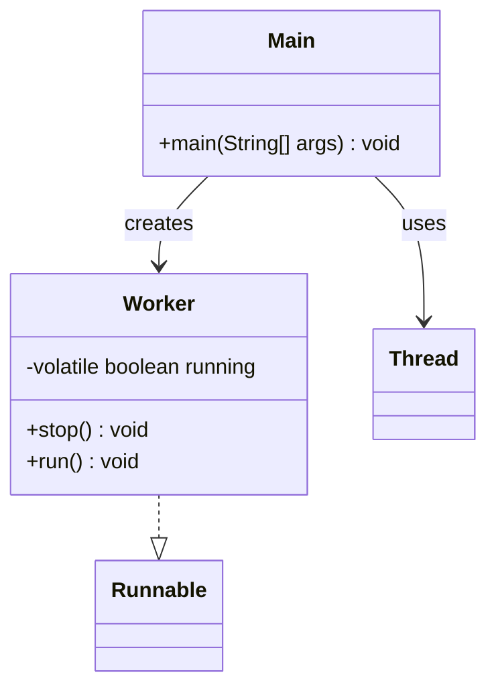

# Bài 10: Dừng luồng bằng biến volatile

## 1. Tóm tắt ý tưởng chính của lời giải

Bài toán yêu cầu mô phỏng một luồng chạy liên tục cho đến khi nhận được tín hiệu dừng từ luồng khác. Điểm quan trọng của bài là biến điều khiển trạng thái chạy phải được khai báo với từ khóa `volatile` để đảm bảo thay đổi của biến này được nhìn thấy ngay giữa các luồng.

Lời giải xây dựng lớp `Worker` cài đặt `Runnable`, trong đó có biến `running` dùng để điều khiển vòng lặp trong `run()`. Luồng chính tạo và chạy `Worker` bằng `Thread`, cho chạy khoảng 1 giây, sau đó gọi `stop()` để đặt `running = false`, rồi dùng `join()` để chờ luồng kết thúc.

## 2. Thiết kế hệ thống

### 2.1. Lớp `Worker`
**Khai báo:** `public class Worker implements Runnable`

#### Thuộc tính
- `running` (`volatile boolean`): biến điều khiển trạng thái hoạt động của luồng, ban đầu bằng `true`.

#### Vai trò
Lớp này biểu diễn một công việc chạy lặp liên tục cho đến khi nhận yêu cầu dừng.

#### Logic xử lý

##### Biến `running`
Biến này được khai báo:
```java
private volatile boolean running = true;
```

Ý nghĩa:
- `main` sẽ ghi giá trị mới vào biến này khi gọi `stop()`
- luồng worker sẽ đọc biến này trong vòng lặp `while (running)`

Từ khóa `volatile` đảm bảo rằng:
- khi một luồng thay đổi giá trị của `running`
- các luồng khác sẽ thấy ngay giá trị mới đó

##### Phương thức `stop()`
- Gán `running = false`
- Mục đích là gửi tín hiệu yêu cầu luồng worker dừng lại

##### Phương thức `run()`
1. Lặp `while (running)`
2. Mỗi vòng lặp in `Working...`
3. Gọi `Thread.sleep(200)` để mô phỏng tiến trình đang hoạt động
4. Nếu bị ngắt:
   - khôi phục trạng thái interrupt
   - in thông báo lỗi
   - thoát vòng lặp
5. Sau khi vòng lặp kết thúc, in `Worker stopped.`

#### Giải thích comment trong code
Trong code có comment ngắn giải thích vì sao cần `volatile`:
- nếu không có `volatile`, luồng worker có thể tiếp tục dùng giá trị cũ của `running`
- khi đó dù `main` đã gọi `stop()`, luồng worker vẫn có thể không dừng

### 2.2. Lớp `Main`
**Khai báo:** `public class Main`

#### Vai trò
Lớp điều phối chương trình, tạo luồng worker, chờ một khoảng thời gian, gửi tín hiệu dừng và chờ worker kết thúc.

#### Logic xử lý
1. Tạo đối tượng `Worker`
2. Tạo đối tượng `Thread` từ `Worker`
3. Gọi `start()` để chạy worker
4. Cho luồng chính ngủ khoảng 1 giây bằng `Thread.sleep(1000)`
5. Gọi `worker.stop()` để yêu cầu dừng luồng worker
6. Gọi `join()` để chờ luồng worker kết thúc hoàn toàn

## Sơ đồ lớp



## 3. Lý do lựa chọn hướng tiếp cận và ưu điểm

### Hướng tiếp cận
Bài làm sử dụng một biến cờ điều khiển (`running`) để quản lý vòng đời của luồng. Đây là cách tiếp cận cơ bản, rõ ràng và rất phổ biến khi cần dừng một luồng đang chạy liên tục.

### Ưu điểm
- Dễ hiểu và đúng mục tiêu bài học về `volatile`.
- Minh họa rõ mối quan hệ giữa hai luồng:
  - một luồng ghi dữ liệu
  - một luồng đọc dữ liệu
- `join()` đảm bảo luồng chính chỉ kết thúc sau khi worker đã dừng hoàn toàn.
- Có comment giải thích ngắn gọn lý do cần `volatile`, đúng yêu cầu đề bài.

### Kiến thức rút ra
- Cách tạo một lớp `Runnable`.
- Cách dùng biến cờ để dừng một luồng.
- Vai trò của `volatile` trong đảm bảo tính nhìn thấy dữ liệu giữa các luồng.
- Cách dùng `Thread.sleep()` và `join()`.
- Vì sao một chương trình đa luồng có thể sai nếu thiếu cơ chế đồng bộ hoặc `volatile`.

## 4. Ví dụ

Không có input từ người dùng.  
Dữ liệu được mô phỏng trực tiếp trong chương trình.

### Output minh họa
```text
Working...
Working...
Working...
Working...
Working...
Worker stopped.
```

### Giải thích
- Trong khoảng 1 giây đầu, luồng worker liên tục in `Working...`
- Sau đó `main` gọi `stop()`
- Biến `running` được đổi thành `false`
- Vì `running` là `volatile`, luồng worker nhìn thấy ngay thay đổi này và thoát khỏi vòng lặp
- Cuối cùng in `Worker stopped.`

## 5. Kết luận

Bài tập đã mô phỏng thành công việc dừng một luồng đang chạy bằng biến điều khiển `volatile`. Chương trình thể hiện rõ lý do cần `volatile` trong giao tiếp giữa các luồng và là ví dụ nền tảng để hiểu sâu hơn về memory visibility trong Java.

Đây là kiến thức quan trọng trước khi học các cơ chế đồng bộ hóa nâng cao hơn như `synchronized`, `Lock` hoặc các lớp trong `java.util.concurrent`.

## 6. Cách chạy chương trình

1. Đảm bảo hai file nguồn nằm cùng thư mục:
   - `Worker.java`
   - `Main.java`

2. Biên dịch chương trình:
   ```bash
   javac Main.java Worker.java
   ```

3. Chạy chương trình:
   ```bash
   java Main
   ```
